## 例子（神奇寶貝屬性預測）

### 分類概念

分類要找一個 $function$ 函數，輸入對象 $x$ 特徵， 輸出是該對象屬於 $n$ 個類別中是屬於哪一個。

- 例子1：比如信用評分【二分類問題】
- 輸入：收入，儲蓄，行業，年齡，金融史…
- 輸出：是否拒絕拒絕貸款
- 例子2：比如醫療診斷【多分類問題】
- 輸入：當前症狀，年齡，性別，醫療史…
- 輸出：患了哪種疾病
- 例子3：比如手寫文字辨識【多分類問題】
- 輸入：手寫的文字
- 輸出：約9353個漢字中輸入哪一個

> 個人總結：我接觸到的分類問題目前還是相對較少。在多分類問題上，如果特徵複雜，類別又多，對機器的計算性能要求也相對較高。

### 神奇寶貝的屬性（水、電、草）預測
這裡再次使用《神奇寶貝》作為例子講解。如下圖，首先認識一下神奇寶貝中的屬性：
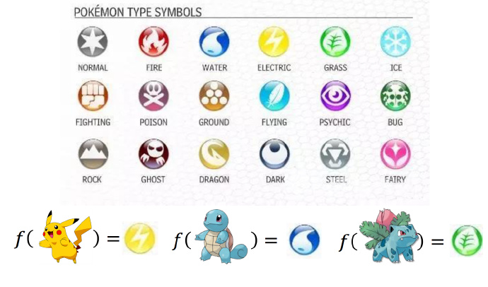

神奇寶貝有很多的屬性，比如電，火，水。要做的就是一個分類的問題：需要找到一個 $function$，

- 輸入：一隻神奇寶貝的特徵（整體強度，生命值，攻擊力，防禦力，特殊攻擊力，特殊防禦力，速度等）
- 輸出：屬於哪一種類型的神奇寶貝

首先將神奇寶貝數值化：以比卡丘為例

- Total：整體強度，大概的表述神奇寶貝有多強，比如皮卡丘是320
- HP：生命值，比如皮卡丘35
- Attack：攻擊力，比如皮卡丘55
- Defense：防禦力，比如皮卡丘40
- SP Atk：特殊攻擊力，比如皮卡丘50
- SP Def：特殊防禦力，比如皮卡丘50
- Speed：速度，比如皮卡丘90
-
所以一隻 《神奇寶貝》可以用一個向量來表示，上述7個數字組成的向量。

因為沒有玩過《神奇寶貝》，我猜測在PK廠可以大概知道一隻神奇寶貝的特徵，但是不知道屬於屬性。因為在戰鬥的時候會有屬性相剋，下面給了張表，只需要知道，戰鬥的時候遇到對面神奇寶貝的特徵，己方不知道屬性的情況會吃虧，所以需要預測它的屬性。

## 回歸模型 vs 概率模型

我們收集當前神奇寶貝的特徵數據和屬性數據，例如：皮卡丘$(x^1,\hat{y}^1)$ 電屬性；傑尼龜$(x^2,\hat{y}^2) $ 水屬性；···；妙蛙草$(x^3,\hat{y}^3)$ 草屬性

#### 回歸模型

假設還不了解怎麼做，但之前已經學過了 $regression$。就把分類當作回歸硬解。
舉一個二分類的例子，假設輸入神奇寶貝的特徵 $x$，判斷屬於類別1或者類別2，把這個當作回歸問題。
- 類別1：相當於target是 $1$。
- 類別2：相當於target是 $-1$。

然後訓練模型：因為是個數值，如果數值比較接近 $1$，就當作類別1，如果數值接近 $-1$，就當做類別2。這樣做遇到什麼問題？

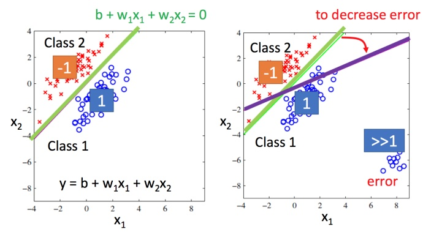

- 左圖：綠色是分界線，紅色叉叉就是 Class2 的類別，藍色圈圈就是 Class1 的類別。
- 右圖：紫色是分界線，紅色叉叉就是 Class2 的類別，藍色圈圈就是 Class1 的類別。訓練集添加有很多的距離遠大於1的數據後，分界線從綠色偏移到紫色

這樣用回歸的方式硬訓練可能會得到紫色的這條。直觀上就是將綠色的線偏移一點到紫色的時候，就能讓右下角的那部分的值不是那麼大了。但實際是綠色的才是比較好的，用回歸硬訓練並不會得到好結果。此時可以得出用回歸的方式定義，對於分類問題來說是不適用的。

還有另外一個問題：比如多分類，類別1當作target1，類別2當作target2，類別3當作target3…如果這樣做的話，就會認為類別2和類別3是比較接近的，認為它們是有某種關係的；認為類別1和類別2也是有某種關係的，比較接近的。但是實際上這種關係不存在，它們之間並不存在某種特殊的關係。這樣是沒有辦法得到好的結果。

#### 其他模型（理想替代品）
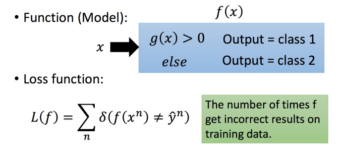

先看二分類，將 $function$ 中內嵌一個函數 $g(x)$，如果大於0，就認識是類別1，否則認為是類別2。損失函數的定義就是，如果選中某個 $funciton \ f(x)$，在訓練集上預測錯誤的次數。當然希望錯誤次數越小越好。

但是這樣的損失函數沒辦法解，這種定義沒辦法微分。這是有方法的，比如Perceptron（感知機），SVM等。這裡先引入一個概率模型。

## 概率模型實現原理
### 盒子抽球概率舉例
說明：假設兩個盒子，各裝了5個球，還得知隨機抽一個球，抽到的是盒子1的球的概率是$2/3$，是盒子2的球的概率是$1/3$ 。從盒子中藍色球和綠色球的分配可以得到：
- 在盒子1中隨機抽一個球，是藍色的概率為 $4/5$，綠的的概率為 $1/5$
- 在盒子2中隨機抽一個球，是藍色的概率為 $2/5$，綠的的概率為 $3/5$

現在求隨機從兩個盒子中抽一個球，抽到的是盒子1中藍色球的概率是多少？

$$
\begin{aligned}
P(B_1|Blue) &= \frac{P(Blue|B_1)P(B_1)}{P(Blue|B_1)P(B_1)+P(Blue|B_2)P(B_2) } \\
& = \frac{\frac{4}{5}*\frac{2}{3}}{\frac{4}{5} * \frac{2}{3}+\frac{2}{5} *\frac{1}{3}} \\
& = \frac{4}{5}
\end{aligned}
\tag{1}
$$

所以，兩個盒子中抽一個球，抽到的是盒子1中藍色球的概率是 $\frac{4}{5}$

### 概率與分類的關係
將上面兩個盒子換成兩個類別
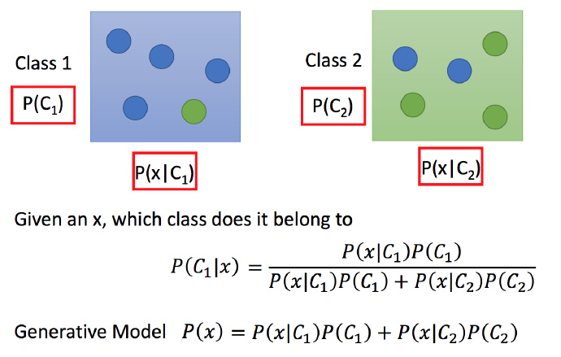

- 那麼，兩個盒子中抽一個球，抽到的是盒子1中藍色球的概率是多少？
- 相當於兩個類別中抽一個 $x$，抽到的是類別1中 $x$ 的概率是多少？
- 可以轉化成，隨機給出一個 $x$，那麼它屬於哪一個類別（屬於概率相對比較大的類別）？

同理知道紅色方框的值，就可以計算出給一個$x$，它是屬於哪個類型的，$P(C_1|x)$ 和$P(C_ 2 | x)$，哪個類別的概率大就屬於哪個類別。接下來就需要從訓練集中估測紅色方框中的值。這一套想法叫做**生成模型**（Generative Model）。因為有了這個模型，就可以生成一個 $x$，可以計算某個 $x$ 出現的概率，知道了$x$ 的分佈，就可以自己產生 $x$ 。

> $P(C_1|x)$ 是由貝葉斯（bayes）公式得到的；$P(x)$ 是由全概率公式得到的，詳情見《概率論與數理統計，浙江大學，第一章》。

#### 先驗概率

先考慮簡單的二分類，水屬性或者一般屬性，通過訓練集的數據可以計算出 $P(C_1)$ 和 $P(C_2)$，如圖所示：
- 水屬性佔比：$P(C_1) = 0.56$
- 普通屬性佔比：$P(C_2) = 0.44$

下面想計算 神奇寶貝原蓋海龜是水屬性的概率，即 $P(x|C_1)$。雖然知道這是一隻原蓋海龜，一看就是水屬性的，但是在模型中，我們輸入的是一個特徵向量（vector）。
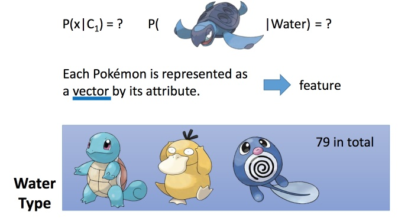

也就是在水系的神奇寶貝中隨機選一隻，是海龜的概率。下面將訓練集中79個水系的神奇寶貝，屬性`Defense`和`SP Defense`進行可視化
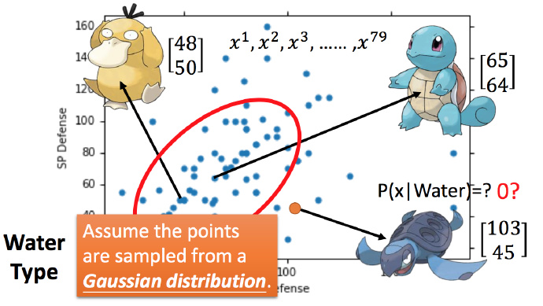

這裡假設這79點是從高斯分佈（Gaussian distribution）中採樣的，現在需要從這79個點找出符合的那個高斯分佈。

#### 高斯分佈

下面簡單說一下高斯分佈：

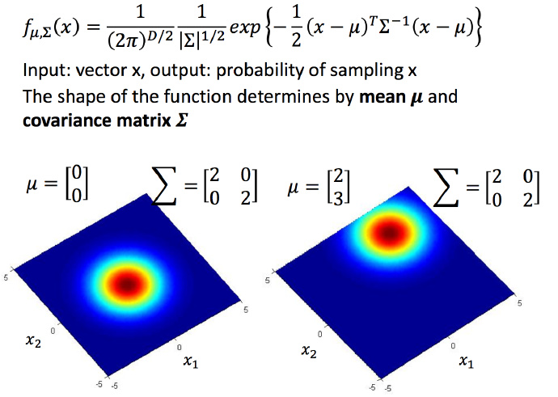

簡單點可以把高斯分佈當作一個$function$，輸入就是一個向量$x$ ，輸出就是選中$x$ 的概率（實際上高斯分佈不等於概率，只是和概率成正比，這裡簡單說成概率） 。 $function$由期望 $\mu$ 和協方差矩陣 $\sum$ 決定。上圖的例子是說同樣的 $\sum$，不同的 $\mu$ ，概率分佈的最高點的位置是不同的。下圖的例子是同樣的 $\mu$，不同的 $\sum$，概率分佈的最高點是一樣的，但是離散度是不一樣的。

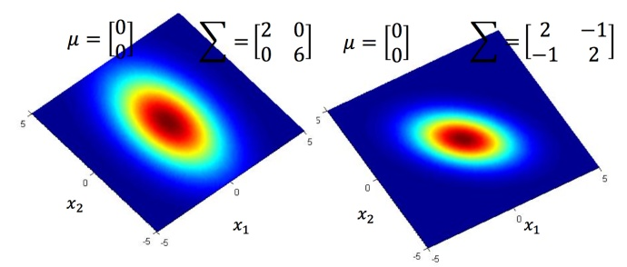

假設通過79個點估測出了期望 $\mu$ 和協方差矩陣 $\sum$。期望是圖中的黃色點，協方差矩陣是紅色的範圍。現在給一個不在79個點之內的新點，用剛才估測出的期望和協方差矩陣寫出高斯分佈的$function \ f_{μ,Σ}(x)$，然後把$x$ 帶進去，計算出被挑選出來的概率

#### 最大似然估計

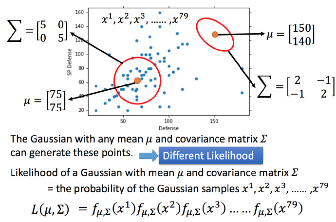

首先對於這79個點，任意期望和協方差矩陣構成的高斯分佈，都可以生成這些點。當然，像圖中左邊的高斯分佈生成這些點，比右邊高斯分佈生成這些點的機率要大。那給一個$\mu$ 和$\sum$，它生成這79個點的概率為圖中的$L(\mu,\sum)$，$L(\mu,\sum)$ 也稱為樣本的似然函數。

將使得$L(\mu,\sum)$ 最大的$L(\mu,\sum)$ 記做$(\mu^∗,\sum^∗)$ ， $(\mu^∗,\sum^ ∗)$ 就是所有$L(\mu,\sum)$ 的Maximum Likelihood（最大似然估計）

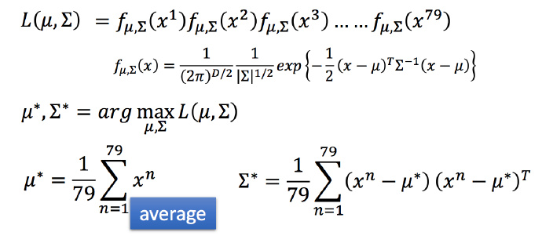

這些解法很直接，直接對 $L(\mu,\sum)$ 求兩個偏微分，求偏微分是0的點。

> 最大似然估計更多詳情參看《概率論與數理統計，浙江大學，第七章》

#### 應用最大似然估計計算期望和協方差
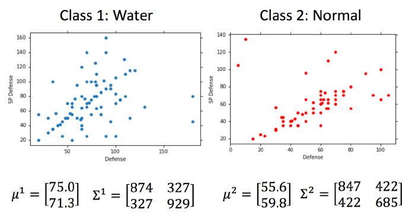

算出之前水屬性和一般屬性高斯分佈的期望和協方差矩陣的最大似然估計值。

### 分類模型
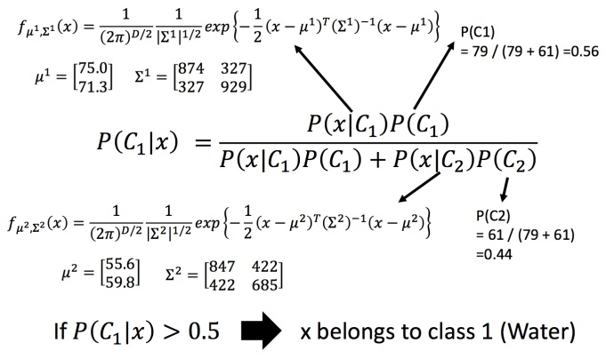

上圖看出我們已經得到了需要計算的值，可以進行分類了。

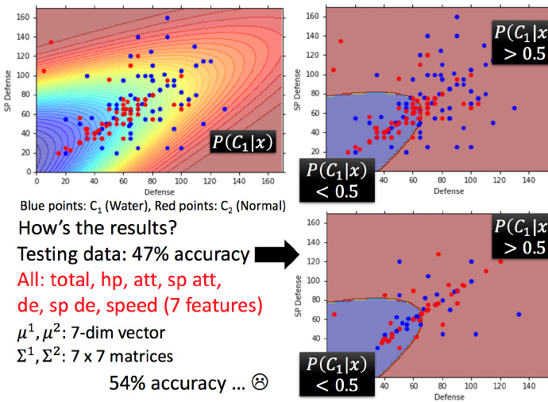

左上角的圖中藍色點是水屬性的神奇寶貝，紅色點是一般屬性的神奇寶貝，圖中的顏色：越偏向紅色代表是水屬性的可能性越高，越偏向藍色代表是水屬性的可能性越低。

右上角在訓練集上進行分類的結果，紅色就是 P(C1|x)P(C1|x) 大於0.5的部分，是屬於類別1，相對藍色屬於類別2。右下角是放在測試集上進行分類的結果。結果是測試集上正確率只有 47% 。當然這裡只處理了二維（兩個屬性）的情況，那在7維空間計算出最大釋然估計值，此時μμ是7維向量，ΣΣ是7維矩陣。得到結果也只有54% 的正確率，so so。 。 。

### 模型優化
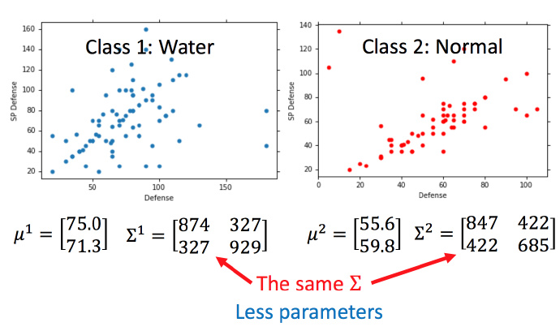

通常來說，不會給每個高斯分佈都計算出一套不同的最大似然估計，協方差矩陣是和輸入feature大小的平方成正比，所以當feature很大的時候，協方差矩陣是可以增長很快的。此時考慮到model參數過多，容易Overfitting，為了有效減少參數，給描述這兩個類別的高斯分佈相同的協方差矩陣。

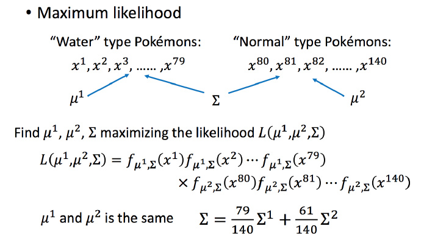

此時修改似然函數為 L(μ1,μ2,Σ)L(μ1,μ2,Σ)。 μ1,μ2μ1,μ2 計算方法和上面相同，分別加起來平均即可；而ΣΣ的計算有所不同。

這裡詳細的理論支持可以查看《Pattern Recognition and Machine Learning》Christopher M. Bishop 著，chapter4.2.2

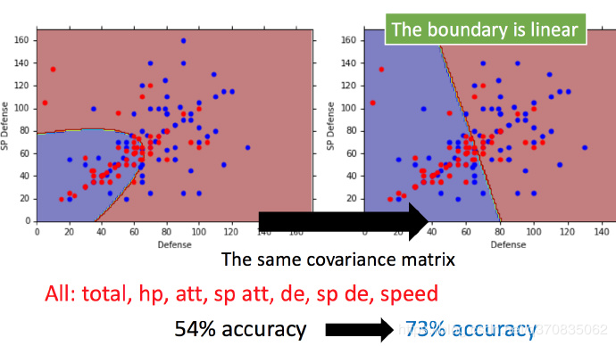

右圖新的結果，分類的boundary是線性的，所以也將這種分類叫做 linear model。如果考慮所有的屬性，發現正確率提高到了73%。

## 概率模型-建模三部曲
將上述問題簡化為前幾個系列說過的三大步：

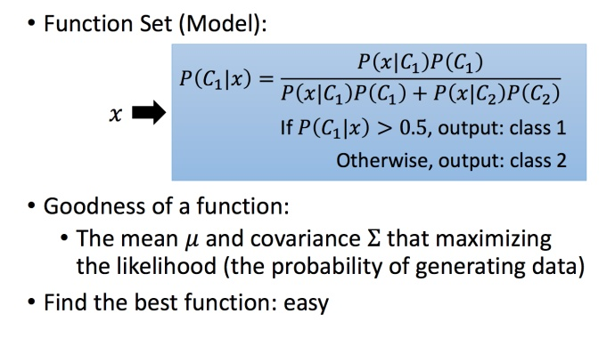

實際做的就是要找一個概率分佈模型，可以最大化產生data的likelihood。

為什麼是高斯分佈？

可能選擇其他分佈也會問同樣的問題。 。 。

有一種常見的假設

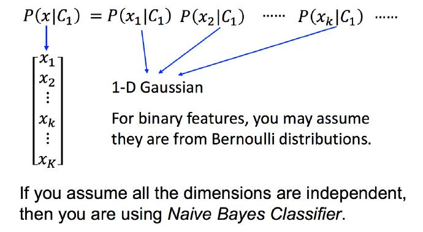

假設每一個維度用概率分佈模型產生出來的機率是相互獨立的，所以可以將 P(x|C1)P(x|C1) 拆解。

可以認為每個P(xk|C1)P(xk|C1) 產生的概率都符合一維的高斯分佈，也就是此時P(x|C1)P(x|C1) 的高斯分佈的協方差是對角型的（不是對角線的地方值都是0），這樣就可以減少參數的量。但是試一下這種做法會壞掉。

對於二元分類來說，此時用通常不會用高斯分佈，可以假設是符合 Bernoulli distribution（伯努利分佈）。

假設所有的feature都是相互獨立產生的，這種分類叫做 Naive Bayes Classifier（樸素貝葉斯分類器）

## 後驗概率

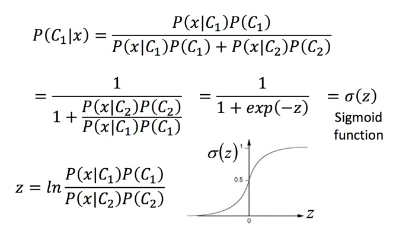

將 P(C1|x)P(C1|x)整理，得到一個 σ(z)σ(z)，這叫做Sigmoid function。

接下來算一下zz 長什麼樣子。

數學推導：

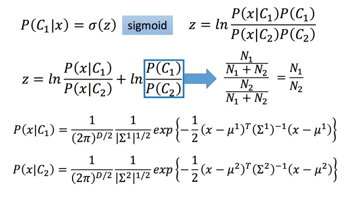

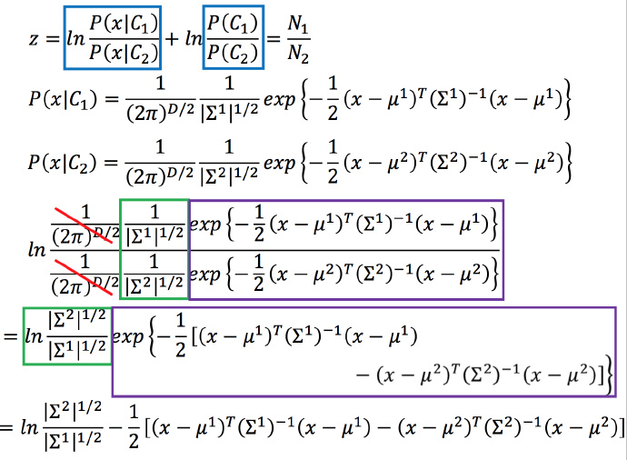
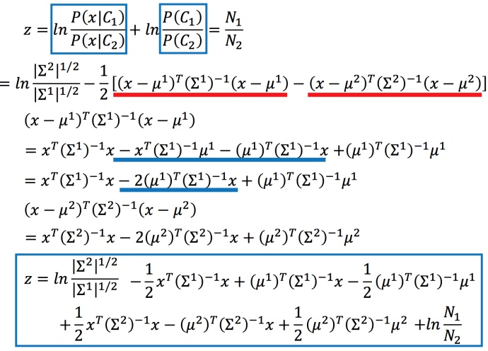

求得z，然後：

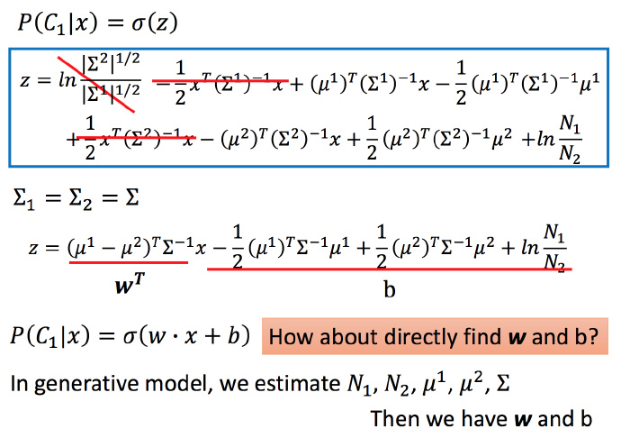

> 這裡用到簡單的矩陣知識，比如轉置，矩陣的逆，矩陣乘法。詳情可參考《高等代數》or《線性代數》；喜歡代數的，推薦丘維聲著的《高等代數》，分上下冊，這本書是國內代數方面的翹楚，數學系的鄙人強烈推薦。別被抄來抄去的書害了—||

化簡z，x的係數記做向量wTwT，後面3項結果都是標量，所以三個數字加起來記做bb。最後P(C1|x)=σ(w⋅x+b)P(C1|x)=σ(w⋅x+b)。從這個式子也可以看出上述當共用協方差矩陣的時候，為什麼分界線是線性的。

既然這裡已經化簡為上述的式子，直觀感受就是可以估測N1,N2,μ1,μ2,ΣN1,N2,μ1,μ2,Σ，就可以直接得到結果了。下一篇講述另外一種方法

> 參考：《Pattern Recognition and Machine Learning》Christopher M. Bishop 著 Chapter4.1 -4.2
Data: https://www.kaggle.com/abcsds/pokemon
