## 深度學習的發展趨勢
回顧一下deep learning的歷史：
- 1958: Perceptron (linear model)
- 1969: Perceptron has limitation
- 1980s: Multi-layer perceptron
- Do not have significant difference from DNN today
- 1986: Backpropagation
- Usually more than 3 hidden layers is not helpful
- 1989: 1 hidden layer is “good enough”, why deep?
- 2006: RBM initialization (breakthrough)
- 2009: GPU
- 2011: Start to be popular in speech recognition
- 2012: win ILSVRC image competition
感知機（Perceptron）非常像我們的邏輯回歸（Logistics Regression）只不過是沒有`sigmoid`激活函數。 09年的GPU的發展是很關鍵的，使用GPU矩陣運算節省了很多的時間。

## 深度學習的三個步驟
我們都知道機器學習有三個step，對於deep learning其實也是3個步驟：

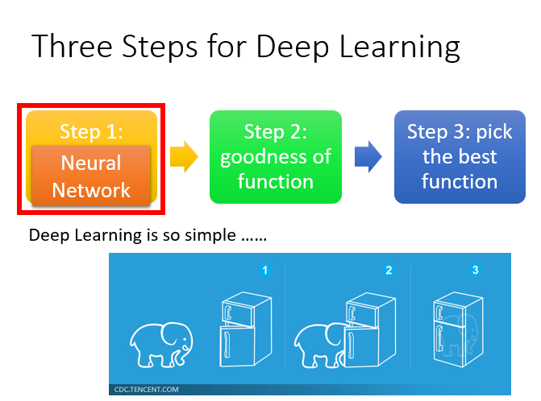
- Step1：神經網絡（Neural network）
- Step2：模型評估（Goodness of function）
- Step3：選擇最優函數（Pick best function）

那對於深度學習的Step1就是神經網絡（Neural Network）

### Step1：神經網絡
神經網絡（Neural network）裡面的節點，類似我們的神經元。

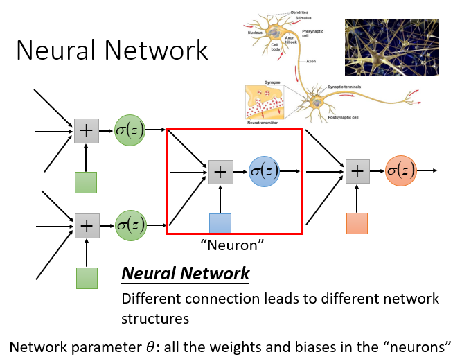

神經網絡也可以有很多不同的連接方式，這樣就會產生不同的結構（structure）在這個神經網絡裡面，我們有很多邏輯回歸函數，其中每個邏輯回歸都有自己的權重和自己的偏差，這些權重和偏差就是參數。
那這些神經元都是通過什麼方式連接的呢？其實連接方式都是你手動去設計的。

#### 完全連接前饋神經網絡
概念：前饋（feedforward）也可以稱為前向，從信號流向來理解就是輸入信號進入網絡後，信號流動是單向的，即信號從前一層流向後一層，一直到輸出層，其中任意兩層之間的連接並沒有反饋（feedback），亦即信號沒有從後一層又返回到前一層。
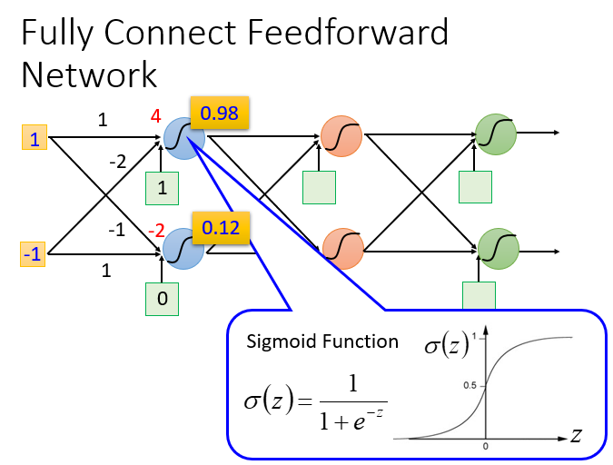
- 當已知權重和偏差時輸入$(1,-1)​$的結果
- 當已知權重和偏差時輸入$(-1,0)$的結果
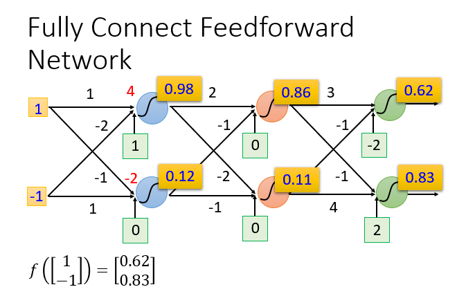

上圖是輸入為1和-1的時候經過一系列複雜的運算得到的結果
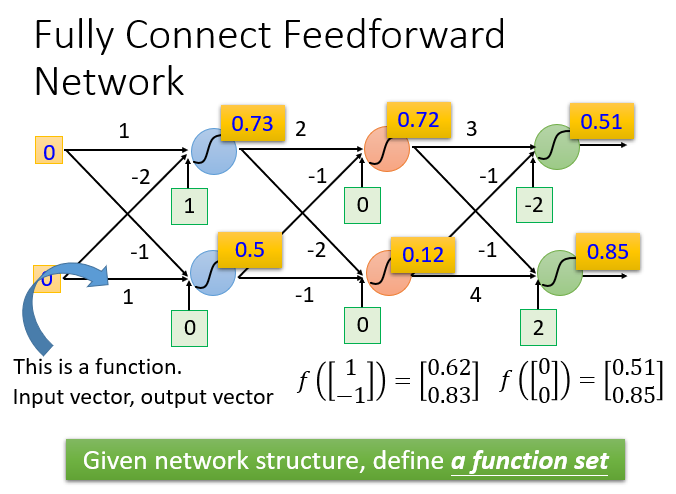

當輸入0和0時，則得到0.51和0.85，所以一個神經網絡如果權重和偏差都知道的話就可以看成一個函數，他的輸入是一個向量，對應的輸出也是一個向量。不論是做回歸模型（linear model）還是邏輯回歸（logistics regression）都是定義了一個函數集（function set）。我們可以給上面的結構的參數設置為不同的數，就是不同的函數（function）。這些可能的函數（function）結合起來就是一個函數集（function set）。這個時候你的函數集（function set）是比較大的，是以前的回歸模型（linear model）等沒有辦法包含的函數（function），所以說深度學習（Deep Learning）能表達出以前所不能表達的情況。

我們通過另一種方式顯示這個函數集：
##### 全鏈接和前饋的理解
- 輸入層（Input Layer）：1層
- 隱藏層（Hidden Layer）：N層
- 輸出層（Output Layer）：1層
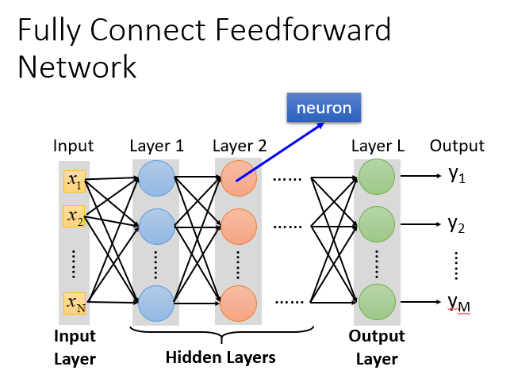
- 為什麼叫全鏈接呢？
- 因為layer1與layer2之間兩兩都有連接，所以叫做Fully Connect；
- 為什麼叫前饋呢？
- 因為現在傳遞的方向是由後往前傳，所以叫做Feedforward。
##### 深度的理解
那什麼叫做Deep呢？ Deep = Many hidden layer。那到底可以有幾層呢？這個就很難說了，以下是老師舉出的一些比較深的神經網絡的例子
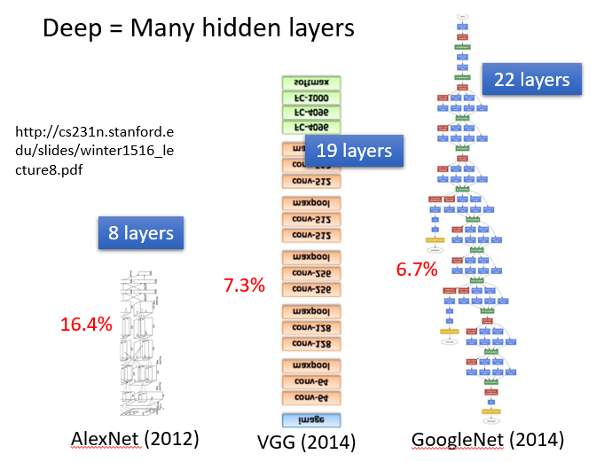
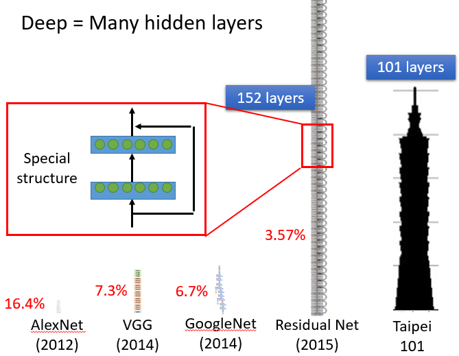
- 2012 AlexNet：8層
- 2014 VGG：19層
- 2014 GoogleNet：22層
- 2015 Residual Net：152層
- 101 Taipei：101層

隨著層數變多，錯誤率降低，隨之運算量增大，通常都是超過億萬級的計算。對於這樣複雜的結構，我們一定不會一個一個的計算，對於億萬級的計算，使用loop循環效率很低。

這裡我們就引入矩陣計算（Matrix Operation）能使得我們的運算的速度以及效率高很多：

#### 矩陣計算
如下圖所示，輸入是$$\begin{bmatrix}&1&-2\\ &-1&1\end{bmatrix}$$，輸出是$$\begin{bmatrix}&0.98\\ &0.12\end{ bmatrix}$$。
計算方法就是：sigmoid（權重w【黃色】 * 輸入【藍色】+ 偏移量b【綠色】）= 輸出
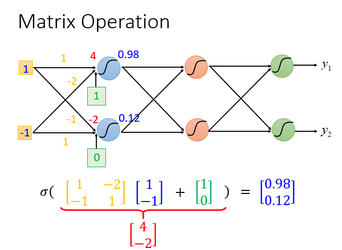

其中sigmoid更一般的來說是激活函數(activation function)，現在已經很少用sigmoid來當做激活函數。

如果有很多層呢？
$$a^1 = \sigma (w^1x+b^1) \\
a^2 = \sigma (w^1a^1+b^2) \\
··· \\
y = \sigma (w^La^{L-1}+b^L) ​$$

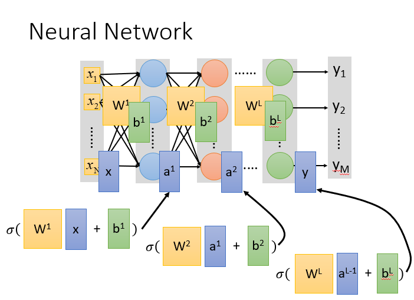

計算方法就像是嵌套，這裡就不列公式了，結合上一個圖更好理解。所以整個神經網絡運算就相當於一連串的矩陣運算。

從結構上看每一層的計算都是一樣的，也就是用計算機進行並行矩陣運算。
這樣寫成矩陣運算的好處是，你可以使用GPU加速。
整個神經網絡可以這樣看：
#### 本質：通過隱藏層進行特徵轉換
把隱藏層通過特徵提取來替代原來的特徵工程，這樣在最後一個隱藏層輸出的就是一組新的特徵（相當於黑箱操作）而對於輸出層，其實是把前面的隱藏層的輸出當做輸入（經過特徵提取得到的一組最好的特徵）然後通過一個多分類器（可以是softmax函數）得到最後的輸出y。

#### 示例：手寫數字識別
舉一個手寫數字體識別的例子：
輸入：一個16*16=256維的向量，每個pixel對應一個dimension，有顏色用（ink）用1表示，沒有顏色（no ink）用0表示
輸出：10個維度，每個維度代表一個數字的置信度。
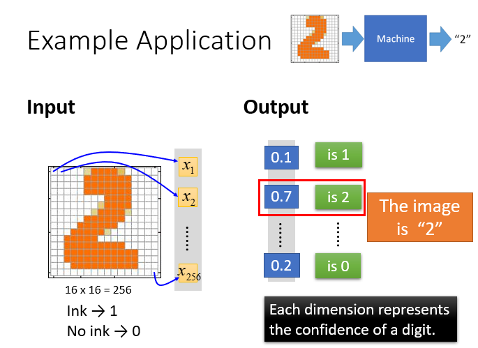

從輸出結果來看，每一個維度對應輸出一個數字，是數字2的概率為0.7的概率最大。說明這張圖片是2的可能性就是最大的
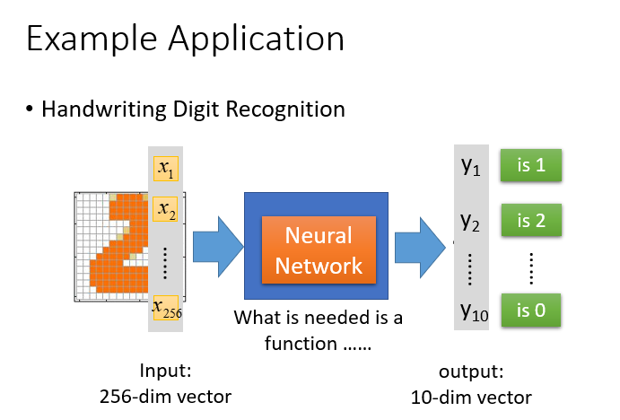

在這個問題中，唯一需要的就是一個函數，輸入是256維的向量，輸出是10維的向量，我們所需要求的函數就是神經網絡這個函數

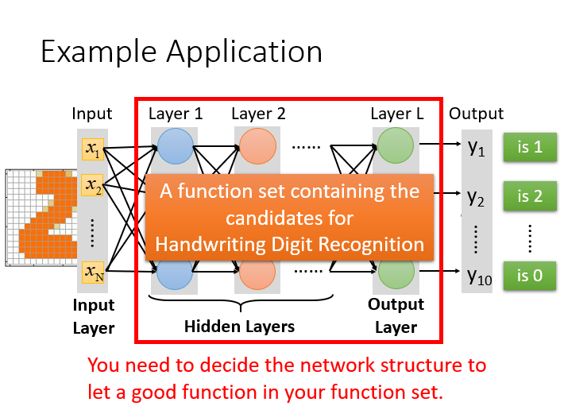
從上圖看神經網絡的結構決定了函數集（function set），所以說網絡結構（network structured）很關鍵。

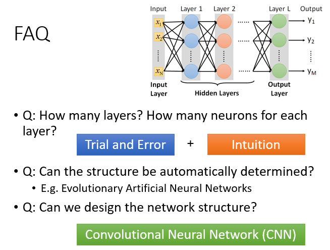

接下來有幾個問題：
- 多少層？每層有多少神經元？
這個問我們需要用嘗試加上直覺的方法來進行調試。對於有些機器學習相關的問題，我們一般用特徵工程來提取特徵，但是對於深度學習，我們只需要設計神經網絡模型來進行就可以了。對於語音識別和影像識別，深度學習是個好的方法，因為特徵工程提取特徵並不容易。
- 結構可以自動確定嗎？
有很多設計方法可以讓機器自動找到神經網絡的結構的，比如進化人工神經網絡（Evolutionary Artificial Neural Networks）但是這些方法並不是很普及 。
- 我們可以設計網絡結構嗎？
可以的，比如 CNN卷積神經網絡（Convolutional Neural Network ）

### Step2: 模型評估

#### 損失示例

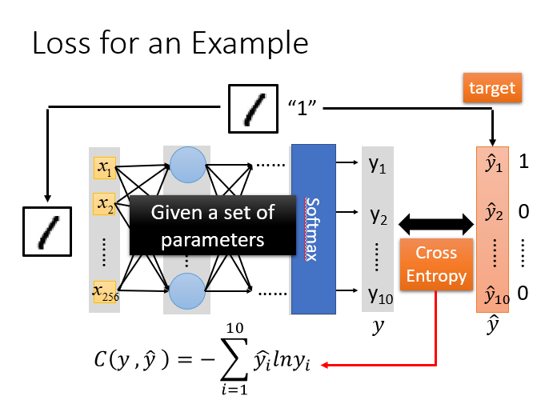

對於模型的評估，我們一般採用損失函數來反應模型的好差，所以對於神經網絡來說，我們採用交叉熵（cross entropy）函數來對$y$和$\hat{y}​$的損失進行計算，接下來我們就是調整參數，讓交叉熵越小越好。
#### 總體損失
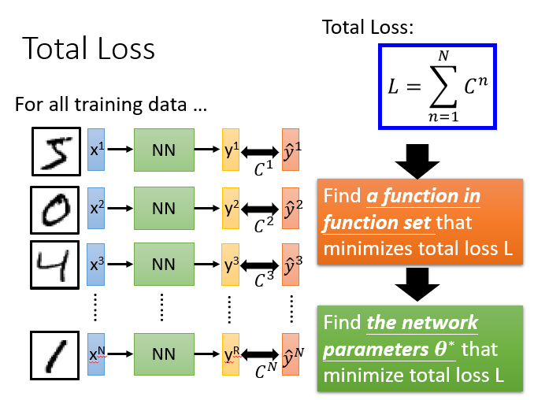

對於損失，我們不單單要計算一筆數據的，而是要計算整體所有訓練數據的損失，然後把所有的訓練數據的損失都加起來，得到一個總體損失L。接下來就是在function set裡面找到一組函數能最小化這個總體損失L，或者是找一組神經網絡的參數$\theta$，來最小化總體損失L

### Step3：選擇最優函數
如何找到最優的函數和最好的一組參數呢，我們用的就是梯度下降，這個在之前的視頻中已經仔細講過了，需要復習的小伙伴可以看前面的筆記。
 
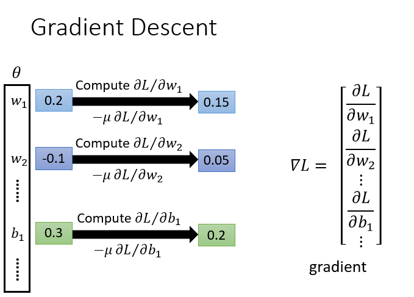
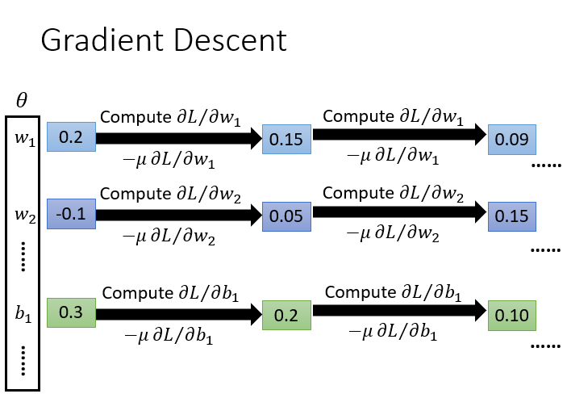

具體流程：$\theta$是一組包含權重和偏差的參數集合，隨機找一個初試值，接下來計算一下每個參數對應偏微分，得到的一個偏微分的集合$\nabla{L}$就是梯度,有了這些偏微分，我們就可以不斷更新梯度得到新的參數，這樣不斷反復進行，就能得到一組最好的參數使得損失函數的值最小

#### 反向傳播
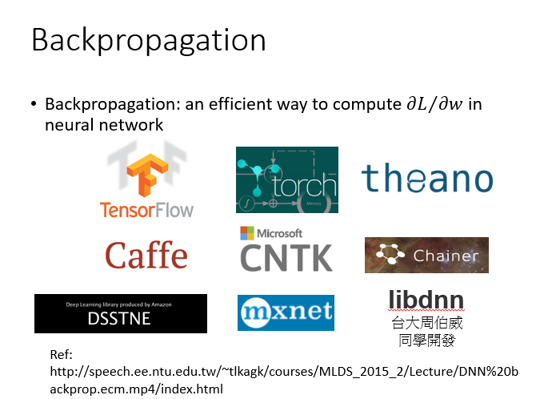

在神經網絡中計算損失最好的方法就是反向傳播，我們可以用很多框架來進行計算損失，比如說TensorFlow，theano，Pytorch等等

## 思考
為什麼要用深度學習，深層架構帶來哪些好處？那是不是隱藏層越多越好？

### 隱藏層越多越好？
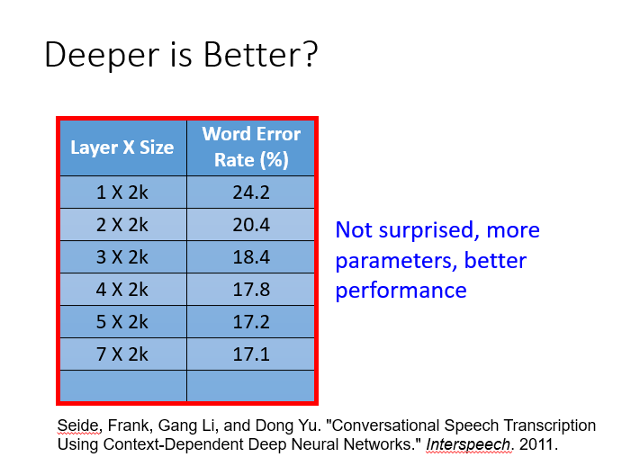

從圖中展示的結果看，毫無疑問，層次越深效果越好~~

### 普遍性定理

參數多的model擬合數據很好是很正常的。下面有一個通用的理論：
對於任何一個連續的函數，都可以用足夠多的隱藏層來表示。那為什麼我們還需要‘深度’學習呢，直接用一層網絡表示不就可以了？在接下來的課程我們會仔細講到
