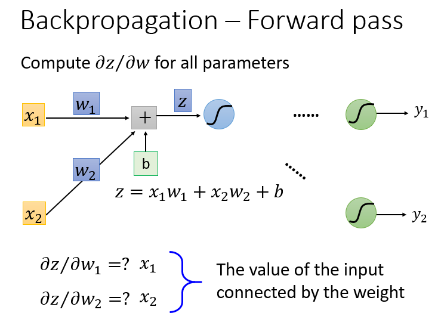
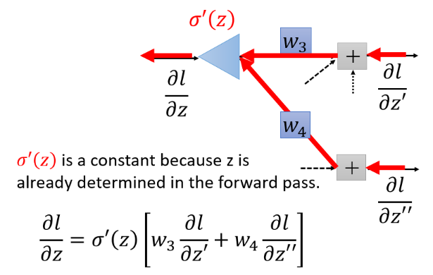
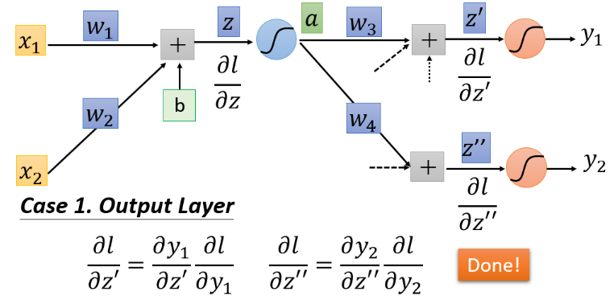
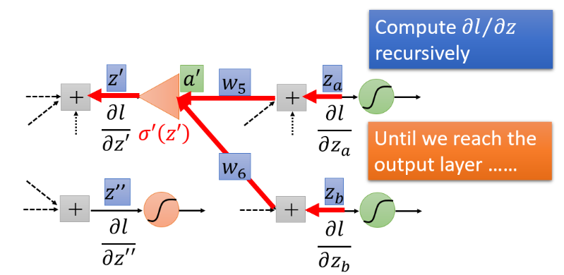
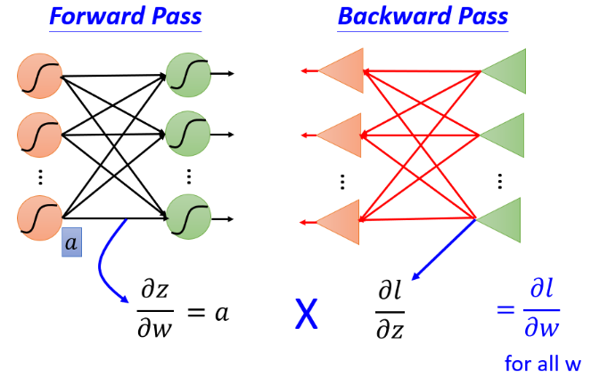

## 背景
### 梯度下降

- 給到 $\theta$ (weight and bias)
- 先選擇一個初始的 $\theta^0$，計算 $\theta^0$ 的損失函數（Loss Function）設一個參數的偏微分
- 計算完這個向量（vector）偏微分，然後就可以去更新的你 $\theta$
- 百萬級別的參數（millions of parameters）
- 反向傳播（Backpropagation）是一個比較有效率的算法，讓你計算梯度（Gradient） 的向量（Vector）時，可以有效率的計算出來

### 鍊式法則

- 連鎖影響(可以看出x會影響y，y會影響z)
- BP主要用到了chain rule

## 反向傳播

1. 損失函數(Loss function)是定義在單個訓練樣本上的，也就是就算一個樣本的誤差，比如我們想要分類，就是預測的類別和實際類別的區別，是一個樣本的，用L表示。
2. 代價函數(Cost function)是定義在整個訓練集上面的，也就是所有樣本的誤差的總和的平均，也就是損失函數的總和的平均，有沒有這個平均其實不會影響最後的參數的求解結果。
3. 總體損失函數(Total loss function)是定義在整個訓練集上面的，也就是所有樣本的誤差的總和。也就是平時我們反向傳播需要最小化的值。

對於$L(\theta)$就是所有$l^n$的損失之和，所以如果要算每個$L(\theta)$的偏微分，我們只要算每個$l^n$的偏微分，再把所有$l^n$偏微分的結果加起來就是$L(\theta)$的偏微分，所以等下我們只計算每個$l^n​$的偏微分。
我們先在整個神經網絡（Neural network）中抽取出一小部分的神經（Neuron）去看（也就是紅色標註的地方）：

#### 取出一個Neuron進行分析

從這一小部分中去看，把計算梯度分成兩個部分

- 計算$\frac{\partial z}{\partial w}$（Forward pass的部分）
- 計算$\frac{\partial l}{\partial z}​$ ( Backward pass的部分 )
### Forward Pass

那麼，首先計算$\frac{\partial z}{\partial w}​$（Forward pass的部分）：

根據求微分原理，forward pass的運算規律就是：

$\frac{\partial z}{\partial w_1} = x_1 \\ \frac{\partial z}{\partial w_2} = x_2$
這裡計算得到的$x_1$和$x_2$恰好就是輸入的$x_1$和$x_2$
直接使用數字，更直觀地看到運算規律：

### Backward Pass
 (Backward pass的部分)這就很困難復雜因為我們的l是最後一層：
那怎麼計算 $\frac{\partial l}{\partial z}$ （Backward pass的部分）這就很困難復雜因為我們的$l$是最後一層：

計算所有激活函數的偏微分，激活函數有很多，這裡使用Sigmoid函數為例

這裡使用鍊式法則（Chain Rule）的case1，計算過程如下：

$\frac{\partial l}{\partial z} = \frac{\partial a}{\partial z}\frac{\partial l}{\partial a} \Rightarrow {\sigma}'(z)​$
$\frac{\partial l}{\partial a} = \frac{\partial z'}{\partial a}\frac{\partial l}{\partial z'} +\frac{\partial z''} {\partial a}\frac{\partial l}{\partial z''}​$

最終的式子結果：

但是你可以想像從另外一個角度看這個事情，現在有另外一個神經元，把forward的過程逆向過來,其中${\sigma}'(z)$是常數，因為它在向前傳播的時候就已經確定了

#### case 1 : Output layer
假設$\frac{\partial l}{\partial z'}$和$\frac{\partial l}{\partial z''}​$是最後一層的隱藏層
也就是就是y1與y2是輸出值，那麼直接計算就能得出結果

但是如果不是最後一層，計算$\frac{\partial l}{\partial z'}$和$\frac{\partial l}{\partial z''}​$的話就需要繼續往後一直通過鏈式法則算下去
#### case 2 : Not Output Layer

對於這個問題，我們要繼續計算後面綠色的$\frac{\partial l}{\partial z_a}$和$\frac{\partial l}{\partial z_b}$,然後通過繼續乘$w_5$和$ w_6$得到$\frac{\partial l}{\partial z'}$，但是要是$\frac{\partial l}{\partial z_a}$和$\frac{\partial l}{\partial z_b}$都不知道，那麼我們就繼續往後面層計算，一直到碰到輸出值，得到輸出值之後再反嚮往輸入那個方向走。

對上圖，我們可以從最後一個$\frac{\partial l}{\partial z_5}$和$\frac{\partial l}{\partial z_6}$看，因為$\frac{\partial l}{ \partial z_a}$和$\frac{\partial l}{\partial z_b}$比較容易通過output求出來，然後繼續往前求$\frac{\partial l}{\partial z_3}$和$\frac {\partial l}{\partial z_4}$，再繼續求$\frac{\partial l}{\partial z_1}$和$\frac{\partial l}{\partial z_2}$
最後我們就得到下圖的結果

實際上進行backward pass時候和向前傳播的計算量差不多。

## 總結
我們的目標是要求計算$\frac{\partial z}{\partial w}$（Forward pass的部分）和計算$\frac{\partial l}{\partial z}$ ( Backward pass的部分)，然後把$\frac{\partial z}{\partial w}$和$\frac{\partial l}{\partial z}$相乘，我們就可以得到$\frac{\partial l}{\partial w} $,所有我們就可以得到神經網絡中所有的參數，然後用梯度下降就可以不斷更新，得到損失最小的函數

