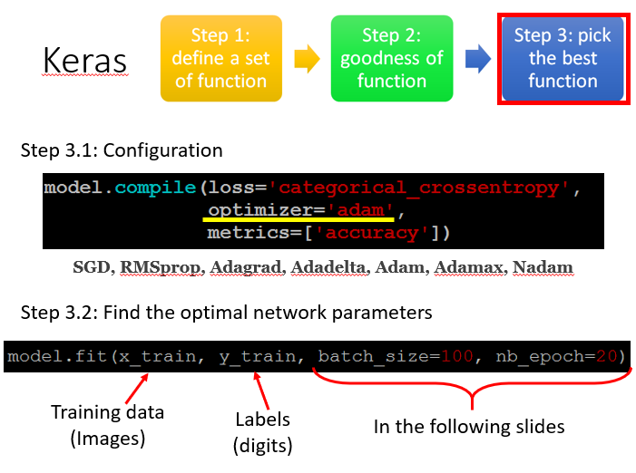
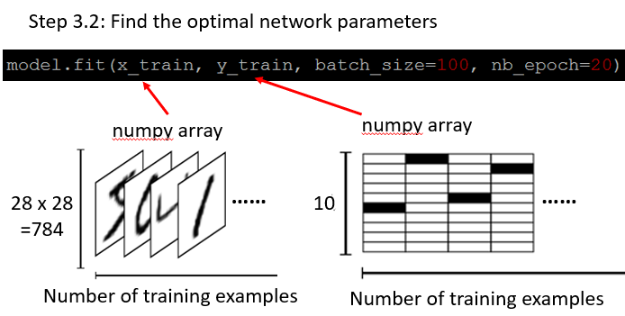
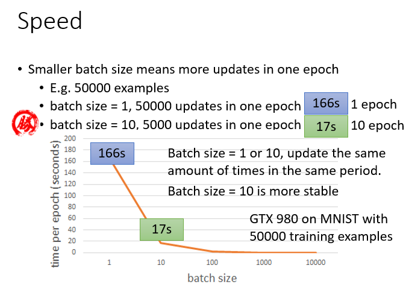
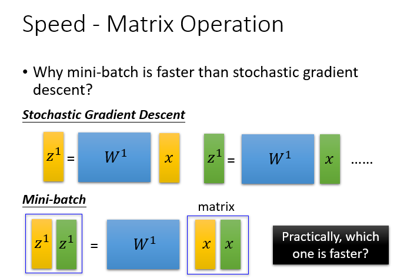

## keras 是什麼
Keras 是一個用 Python 編寫的高級神經網絡 API，它能夠以 TensorFlow, CNTK, 或者 Theano 作為後端運行。


## 示例

以手寫數字識別為例
### 步驟1：定義模型


neural network是長什麼樣的，在keras首先定義model是sequential
```python
model = sequential()
```

- 第1個隱藏層
- 你看要你的neural長什麼樣子，自己就決定長什麼樣子，舉例，這裡hidden layer 有兩個layer，每個layer都有500 Neural。已經定義了一個model，然後model.add，加一個Fully connect laye(這裡用Dense表示)，然後input，output
- 然後增加一個activation(激活函數)，將sigmoid當做activation(也可以使用其他的當做activation)
```
model.add(activation('sigmoid'))
```
- 第2個隱藏層
- 這個layer的input就是上一個layer的output，不用說input是500Neural，keras自己知道

- 輸出層：
- output為10dimension
- activation為softmax


### 步驟2：模型評估


- 評估模型的好壞


compile 編譯
```python
model.compile()
```
定義一個loss是什麼(不同的場合，需要不同的loss function)
```python
loss = ('cateqorical crossentropy') #損失函數
```
```python
optimizer #優化器
```
```python
metrics #指標
```

### 步驟3：最佳模型

#### 3.1 Configuration



```python
model.compile = (loss = 'categorical crossentropy', optimizer = 'adam')
```
- optimizer後面可以跟不同的方式，這些方式都是GD，只是用的learning rate不同，有一些machine會自己決定learning rate
#### 3.2 尋找最優網絡參數


- 給定四個輸入, x_train, y_train, batch_size, nb_epoch
- 訓練數據就是一張一張的圖片, 每張圖片對應的標籤就是數字
- Two dimension matrix(X_train)，第一個dimension代表你有多少個example，第二個dimension代表你有多少個pixel
- Two dimension matrix(y_train)，第一個dimension代表你有多少個training example，第二個dimension代表label(黑色的為數字，從0開始計數)

##### mini-batch 的原理詳解
keras model參數`batch_size`和`nb_epoch`


我們在做梯度下降和深度學習時，我們並不是真的最小化總損失,我們會把訓練數據隨機分成幾個mini-batch。
具體步驟：
- 隨機初始化神經網絡的參數 (跟梯度下降一樣)
- 先隨機選擇第一個batch出來,對選擇出來的batch裡面total loss, 計算偏微分，根據 L 去更新參數
- 然後隨機選擇第二個batch ，對第二個選擇出來的batch裡面total loss 計算偏微分，根據 L 更新參數
- 反复上述過程，直到把所有的batch都統統過一次，一個epoch才算結束。
注意：假設今天有100個batch的話，就把這個參數更新100次，把所有的batch都遍歷過叫做一個epoch。
```
 model.fit(x_train, y_train, batch_size =100, nb_epoch = 20)
```
1. 這裡的batch_size代表一個batch有多大(就是把100個example，放到一個batch裡)
2. nb_epoch等於20表示對每個batch重複20次

##### 使用mini-batch的原因：Speed



- batch-szie不同時，一個epoch所需的時間是不一樣的（上圖用batch size=1是166s，當batch size=10是17s）
- batch =10相比於batch=1，較穩定
- Speed-- why minni batch is faster than stochastic GD(為什麼批量梯度下降比隨機梯度下降要快)
  因為利用計算機的平行運算，之前也提到過矩陣運算會使計算速度快很多。
- 很大的batch size會導致很差的表現（不能設置太大也不能設置太小）


用隨機梯度下降的時候兩個矩陣x是分開計算的，當用mini batch的時候，直接是用兩個x合併在一起，一起計算得到 Z^1 和 Z^2 ，對GPU來說上面運算時間是下面運算時間的兩倍，這就是為什麼我們用上mini batch和GPU的時候速度會加快的原理。但是如果你用了GPU沒用mini batch的話，那也達不到加速的效果。

### 模型保存和使用

```python
#case1：測試集正確率
score = model.evaluate(x_test,y_test)
print("Total loss on Testing Set:", score[0])
print("Accuracy of Testing Set:", score[1])

#case2：模型預測
result = model。 predict(x_test)
```

