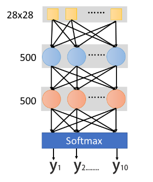
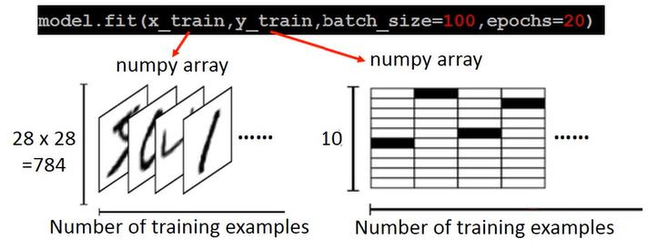

## 創建網絡

假設我們要做的事情是手寫數字辨識，那我們要建一個Network scratch，input是28X28 的dimension，其實就是說這是一張image，image的解析度是28X28，我們把它拉成長度是28X28 維的向量。 output呢？現在做的是手寫數字辨識，所以要決定它是0-9的哪個數字，output就是每一維對應的數字，所以output就是10維。中間假設你要兩個layer，每個layer有500個hidden neuro，那麼你會怎麼做呢。

)

如果用keras的話，你要先宣告一個Network，也就是首先你先宣告
```
model=Sequential()
```
再來，你要把第一個hidden layer 加進去，你要怎麼做呢？很簡單，只要add就好
```
model.add(Dense(input_dim=28*28,units=500,activation='relu'))
```
Dense意思就是說你加一個全連接網絡，可以加其他的，比如加Con2d，就是加一個convolution layer，這些都很簡單。 input_dim是說輸入的維度是多少，units表示hidden layer的neuro 數，activation就是激活函數，每個activation是一個簡單的英文縮寫，比如relu，softplus，softsign，sigmoid，tanh，hard_sigmoid，linear
再加第二個layer，就不需再宣告input_dim，因為它的輸入就是上一層的units，所以不需要再定義一次，在這，只需要聲明units和activation
```
model.add(Dense(units=500,activation='relu'))
```
最後一個layer，因為output是10維，所以units=10，activation一般選softmax，意味著輸出每個dimension只會介於0-1之間，總和是1，就可以把它當做為一種機率的東西。
```
model.add(Dense(units=10,activation='softmax'))
```
## 配置
第二過程你要做一下configuration，你要定義loss function，選一個optimizer，以及評估指標metrics，其實所有的optimizer都是Gradent descent based，只是有不同的方法來決定learning rate，比如Adam，SGD，RMSprop ，Adagrad，Adalta，Adamax ，Nadam等，設完configuration之後你就可以開始train你的Network
```
model.compile(loss='categorical crossentropy',optimizer='adam',metrics=['accuracy'])
```

## 選擇最好的方程
```
model.fit(x_train,y_train,batch_size=100,epochs=20)
```
call model.fit 方法，它就開始用Gradent Descent幫你去train你的Network，那麼你要給它你的train_data input 和label，這裡x_train代表image，y_train代表image的label，關於x_train和y_train的格式，你都要存成numpy array。那麼x_train怎樣表示呢，第一個軸表示example，第二個軸代表每個example用多長vecter來表示它。 x_train就是一個matrix。 y_train也存成一個二維matrix，第一個維度一樣代表training examples，第二維度代表著現在有多少不同的case，只有一維是1，其他的都是0，每一維都對應一個數字，比如第0維對應數字0，如果第N維是1，對應的數字就是N。




## 使用模型

- 存儲和載入模型-Save and load models
參考keras的說明，http://keras.io/getting-started/faq/#how-can-i-save-a-keras-model
- 模型使用
接下來你就要拿這個Network進行使用，使用有兩個不同的情景，這兩個不同的情景一個是evaluation，意思就是說你的model在test data 上到底表現得怎樣，call evaluate這個函數，然後把x_test，y_test餵給它，就會自動給你計算出Accuracy。它會output一個二維的向量，第一個維度代表了在test set上loss，第二個維度代表了在test set上的accuracy，這兩個值是不一樣的。 loss可能用cross_entropy，Accuraccy是對與不對，即正確率。
- case1
```
score = model.evaluate(x_test,y_test)
print('Total loss on Testiong Set : ',score[0])
print('Accuracy of Testiong Set : ',score[1])
```
第二種是做predict，就是系統上線後，沒有正確答案的，call predict進行預測
- case 2
```
result = model.predict(x_test)
```
