當你的模型表現不好，應該怎麼處理？

如上圖建立deep learning的三個步驟

• define a set function

• goodness of function

• pick the best function

做完這些事情后，你會得到一個neural network。在得到neural network後。
## 神經網絡的表現
（1）首先你要檢查的是，這個neural network在你的training set有沒有得到好的結果（是否陷入局部最優），沒有的話，回頭看，是哪個步驟出了什麼問題，你可以做什麼樣的修改，在training set得到好的結果。

（2）假如說你在training set得到了一個好的結果了，然後再把neural network放在你的testing data，testing set的performance才是我們關心的結果。

如果在testing data performance不好，才是overfitting（注：training set上結果就不好，不能說是overfitting的問題）。

**小結：如果training set上的結果變現不好，那麼就要去neural network在一些調整，如果在testing set表現的很好，就意味成功了。**

（tips：很多人容易忽視查看在training set上結果，是因為在機器學習中例如是用SVM等模型，很容易使得training set得到一個很好的結果，但是在深度學習中並不是這樣的。所以一定要記得查看training set 上的結果。不要看到所有不好的performance都是overfitting。）

 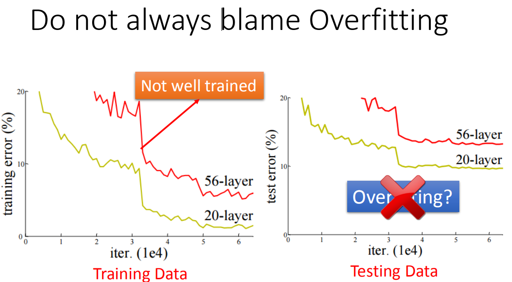

例如：在testing data上看到一個56-layer和20-layer，顯然20-layer的error較小，那麼你就說是overfitting，那麼這是錯誤的。首先你要檢查你在training data上的結果。

在training data上56-layer的performance本來就比20-layer變現的要差很多，在做neural network時，有很多的問題使你的train不好，比如local mininmize等等，56-layer可能卡在一個local minimize上，得到一個不好的結果，這樣看來，56-layer並不是overfitting，只是沒有train的好。
 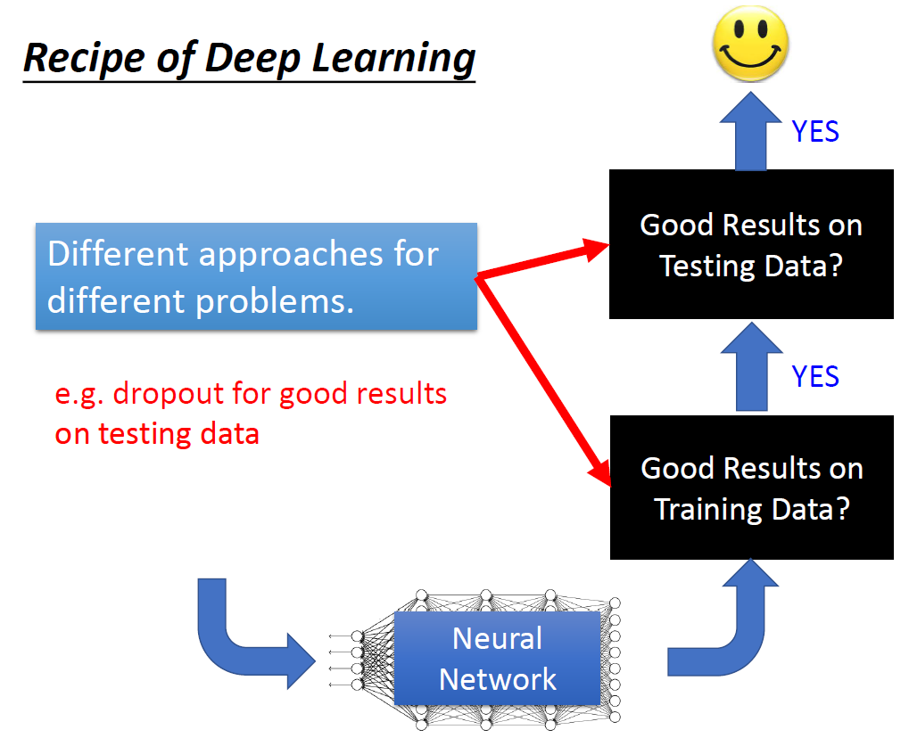
 在deep learning文件上，當你看到一個方式的時候，你首先要想一下說，它是要解什麼樣的問題，是解決在deep learning 中一個training data的performance不好，還是解決testing data performance不好。

當一個方法要被approaches時，往往都是針對這兩個其中一個做處理，比如，你可能會聽到這個方法(dropout),dropout是在training data表現好，testing data上表現不好的時候才會去使用，當training data 結果就不好的時候用dropout 往往會越訓練越差。
## 如何改進神經網絡？
### 新的激活函數
 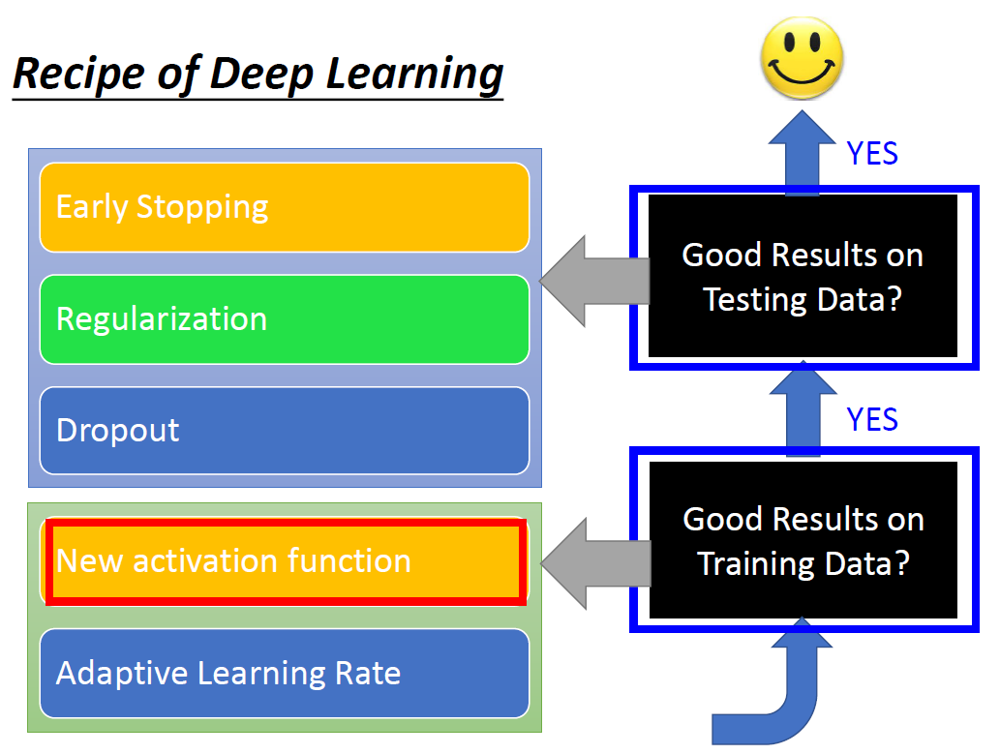
 現在你的training data performance不好的時候，是不是你在做neural的架構時設計的不好，舉例來說，你可能用的activation function不夠好。

在2006年以前，如果將網絡疊很多層，往往會得到上圖的結果。上圖，是手寫數字識別的訓練準確度的實驗，使用的是sigmoid function。可以發現當層數越多，訓練結果越差，特別是當網絡層數到達9、10層時，訓練集上準確度就下降很多。但是這個不是當層數多了以後就overfitting，因為這個是在training set上的結果。

（在之前可能常用的activation function是sigmoid function,今天我們如果用sigmoid function，那麼deeper usually does not imply better,這個不是overfitting）
### 梯度消失
 
當網絡比較深的時候會出現vanishing Gradient problem

比較靠近input 的幾層Gradient值十分小，靠近output的幾層Gradient會很大，當你設定相同的learning rate時，靠近input layer 的參數updata會很慢，靠近output layer的參數updata會很快。當前幾層都還沒有更動參數的時候（還是隨機的時候），隨後幾層的參數就已經收斂了。

 

為什麼靠近前幾層的參數會特別小呢？

怎麼樣來算一個參數w對 total loss做偏微分，實際上就是對參數做一個小小的變化，對loss的影響，就可以說，這個參數gradient 的值有多大。

給第一個layer的某個參數加上△w時，對output與target之間的loss有什麼樣的變化。現在我們的△w很大，通過sigmoid function時這個output會很小(一個large input，通過sigmoid function，得到small output)，每通過一次sogmoid function就會衰減一次（因為sogmoid function會將值壓縮到0到1之間，將參數變化衰減），hidden layer很多的情況下，最後對loss 的影響非常小(對input 修改一個參數其實對output 是影響是非常小)。

理論上我們可以設計dynamic的learning rate來解決這個問題，確實這樣可以有機會解決這個問題，但是直接改activation function會更好，直接從根本上解決這個問題。

### 怎麼樣去解決梯度消失？
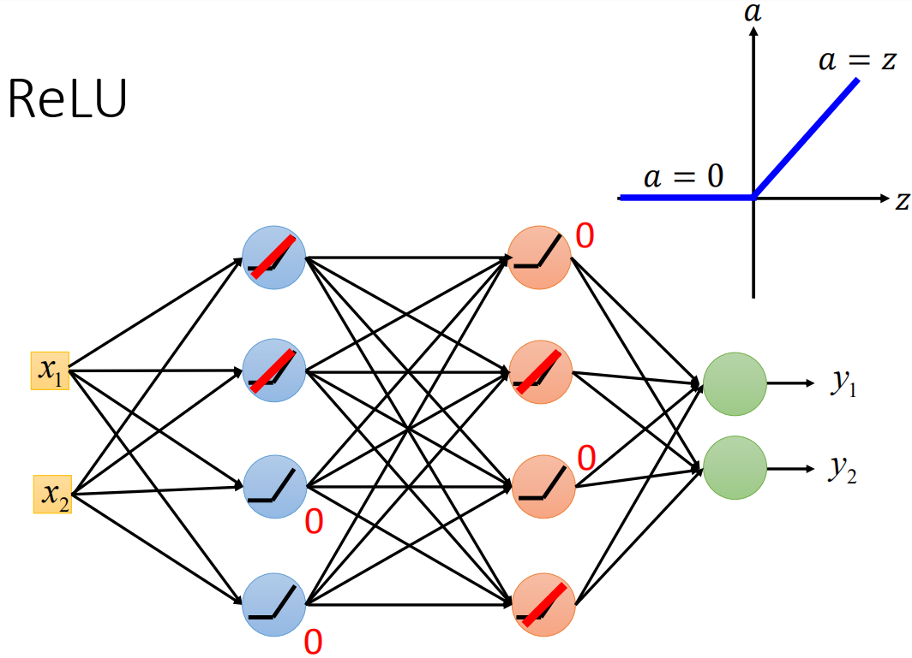

 修改activation function，ReLU input 大於0時，input 等於 output，input小於0時，output等於0

選擇這樣的activation function有以下的好處：

• 比sigmoid function比較起來是比較快的

• 生物上的原因

• 無窮多的sigmoid function疊加在一起的結果(不同的bias)

• 可以處理 vanishing gradient problem
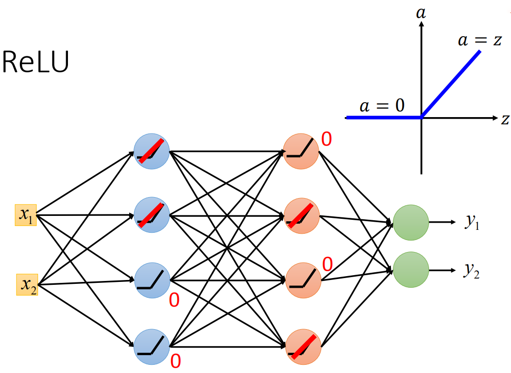

ReLU activation function 作用於兩個不同的range，一個range是當activation input大於0時，input等於output，另外一個是當activation function小於0是,output等於0。

那麼對那些output等於0的neural來說，對我們的network一點的影響都沒。加入有個output等於0的話，你就可以把它從整個network拿掉。 (下圖所示) 剩下的input等於output是linear時，你整個network就是a thinner linear network。

我們之前說，GD遞減，是通過sigmoid function，sigmoid function會把較大的input變為小的output，如果是linear的話，input等於output,你就不會出現遞減的問題。

我們需要的不是linear network（就像我們之所以不使用邏輯回歸，就是因為邏輯回歸是線性的），所以我們才用deep learning ，就是不希望我們的function不是linear，我們需要它不是linear function，而是一個很複雜的function。對於ReLU activation function的神經網絡，只是在小範圍內是線性的，在總體上還是非線性的。

如果你只對input做小小的改變，不改變neural的activation range,它是一個linear function，但是你要對input做比較大的改變，改變neural的activation range，它就不是linear function。

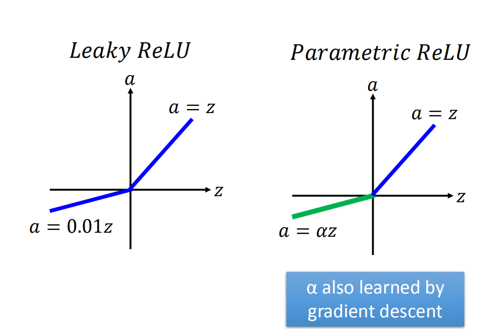

1、改進1 leaky ReLU
ReLU在input小於0時，output為0，這時微分為0，你就沒有辦法updata你的參數，所有我們就希望在input小於0時，output有一點的值(input小於0時，output等於0.01乘以input)，這被叫做leaky ReLU。

2、改進2 Parametric ReLU

Parametric ReLU在input小於0時，output等於\alpha zαz\alphaα為neural的一個參數，可以通過training data學習出來，甚至每個neural都可以有不同的\alphaα值。

那麼除了ReLU就沒有別的activation function了嗎，所以我們用Maxout來根據training data自動生成activation function。

3、改進3Exponential linear Unit (ELU)

讓network自動去學它的activation function，因為activation function是自動學出來的，所有ReLU就是一種特殊的Maxout case。

input是x1,x2，x1,x2乘以weight得到5,7,-1,1。這些值本來是通過ReLU或者sigmoid function等得到其他的一些value。現在在Maxout裡面，在這些value group起來(哪些value被group起來是事先決定的，如上圖所示)，在組裡選出一個最大的值當做output(選出7和1，這是一個vector 而不是一個value)，7和1再乘以不同的weight得到不同的value，然後group，再選出max value。

Maxout network 是怎麼樣產生不同的activation function，Maxout有辦法做到跟ReLU一樣的事情。

對比ReLu和Maxout

ReLu：input乘以w,b，再經過ReLU得a。

Maxout：input中x和1乘以w和b得到z1，z2，x和1乘以w和b得到z2，z2(現在假設第二組的w和b等於0，那麼z2,z2等於0)，在兩個中選出max得到a(如上圖所示)
現在只要第一組的w和b等於第二組的w和b，那麼Maxout做的事就是和ReLU是一樣的。

當然在Maxout選擇不同的w和b做的事也是不一樣的(如上圖所示)，每一個Neural根據它不同的wight和bias，就可以有不同的activation function。這些參數都是Maxout network自己學習出來的，根據數據的不同Maxout network可以自己學習出不同的activation function。

上圖是由於Maxout network中有兩個pieces，如果Maxout network中有三個pieces，Maxout network會學習到不同的activation function如下圖。
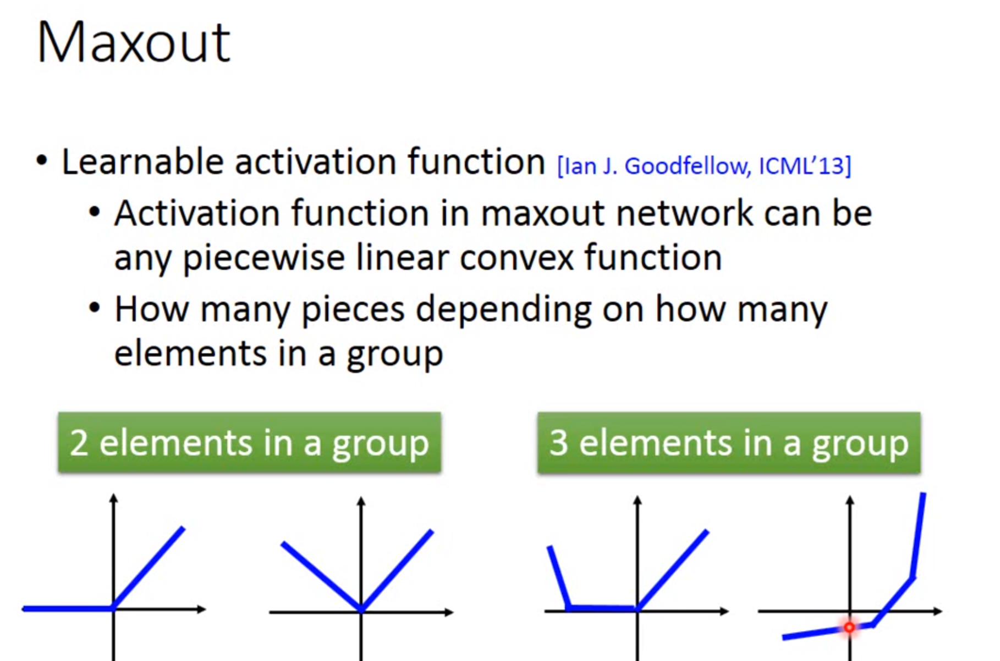

面對另外一個問題，怎麼樣去training，因為max函數無法微分。但是其實只要可以算出參數的變化，對loss的影響就可以用梯度下降來train網絡。

 max operation用方框圈起來，當你知道在一組值裡面哪一個比較大的時候，max operation其實在這邊就是一個linear operation，只不過是在選取前一個group的element。把group中不是max value拿掉。
 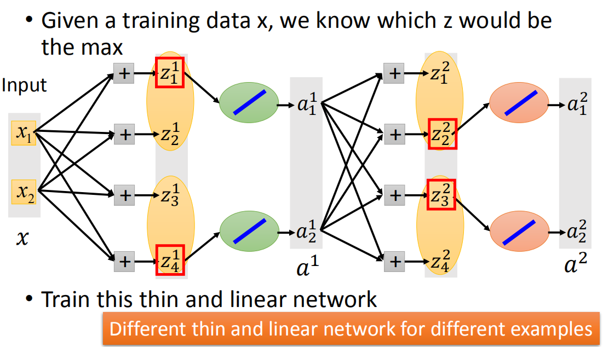
 沒有被training到的element，那麼它連接的w就不會被training到了，在做BP時，只會training在圖上顏色深的實線，不會training不是max value的weight。這表面上看是一個問題，但實際上不是一個問題。

當你給到不同的input時，得到的z的值是不同的，max value是不一樣的，因為我們有很多training data，而neural structure不斷的變化，實際上每一個weight都會被training。
### Adaptive Learning Rate

 每一個parameter 都要有不同的learning rate，這個 Adagrd learning rate 就是用固定的learnin rate除以這個參數過去所有GD值的平方和開根號，得到新的parameter。

我們在做deep learnning時，這個loss function可以是任何形狀。
 
考慮同一個參數假設為w1，參數在綠色箭頭處，可能會需要learning rate小一些，參數在紅色箭頭處，可能會需要learning rate大一些。

你的error surface是這個形狀的時候，learning rate是要能夠快速的變動.

在deep learning 的問題上，Adagrad可能是不夠的，這時就需要RMSProp（該方法是Hinton在上課的時候提出來的，找不到對應文獻出處）。

 一個固定的learning rate除以一個\sigmaσ(在第一個時間點，\sigmaσ就是第一個算出來GD的值)，在第二個時間點，你算出來一個g^1g1，\sigma^1σ1 (你可以去手動調一個\alphaα值，把\alphaα值調整的小一點，說明你傾向於相信新的gradient 告訴你的這個error surface的平滑或者陡峭的程度。
 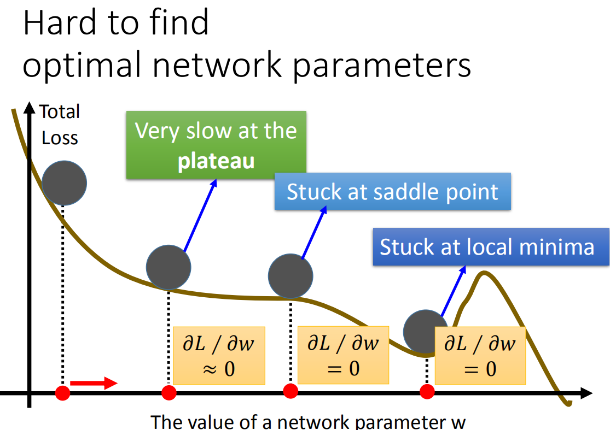
除了learning rate的問題以外，我們在做deep learning的時候，有可能會卡在local minimize，也有可能會卡在 saddle point，甚至會卡在plateau的地方。

其實在error surface上沒有太多的local minimize，所以不用太擔心。因為，你要是一個local minimize，你在一個dimension必須要是一個山谷的谷底，假設山谷的谷底出現的機率是P，因為我們的neural有非常多的參數(假設有1000個參數，每一個參數的dimension出現山谷的谷底就是各個P相乘)，你的Neural越大，參數越大，出現的機率越低。所以local minimize在一個很大的neural其實沒有你想像的那麼多。
  
有一個方法可以處理下上述所說的問題

在真實的世界中，在如圖所示的山坡中，把一個小球從左上角丟下，滾到plateau的地方，不會去停下來(因為有慣性)，就到了山坡處，只要不是很陡，會因為慣性的作用去翻過這個山坡，就會走到比local minimize還要好的地方，所以我們要做的事情就是要把這個慣性加到GD裡面(Mometum)。
現在復習下一般的GD
 
 選擇一個初始的值，計算它的gradient，G負梯度方向乘以learning rate，得到θ1，然後繼續前面的操作，一直到gradinet等於0時或者趨近於0時。

當我們加上Momentu時
 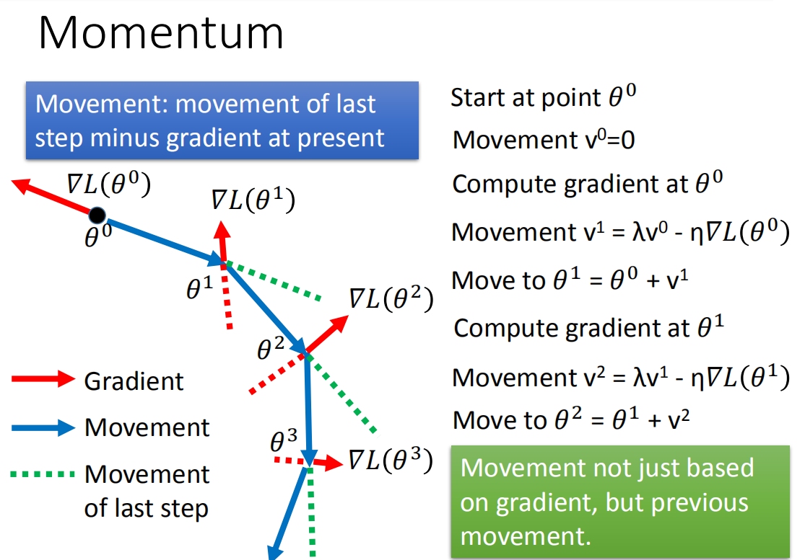

 我們每次移動的方向，不再只有考慮gradient，而是現在的gradient加上前一個時間點移動的方向

（1）步驟

選擇一個初始值\theta……0θ……0然後用v^0v0去記錄在前一個時間點移動的方向(因為是初始值，所以第一次的前一個時間點是0)接下來去計算在\theta^0θ0上的gradient，移動的方向為v^1v1。在第二個時間點，計算gradient\theta^1θ1，gradient告訴我們要走紅色虛線的方向(梯度的反方向)，由於慣性是綠色的方向(這個\lambdaλ和learning rare一樣是要調節的參數， ``$\lambda$`會告訴你慣性的影響是多大)，現在走了一個合成的方向。以此類推...

（2）運作
 

 加上Momentum之後，每一次移動的方向是 negative gardient加上Momentum的方向(現在這個Momentum就是上一個時間點的Moveing)。

現在假設我們的參數是在這個位置(左上角)，gradient建議我們往右走，現在移動到第二個黑色小球的位置，gradient建議往紅色箭頭的方向走，而Monentum也是會建議我們往右走(綠的箭頭)，所以真正的Movement是藍色的箭頭(兩個方向合起來)。現在走到local minimize的地方，gradient等於0(gradient告訴你就停在這個地方)，而Momentum告訴你是往右邊的方向走，所以你的updata的參數會繼續向右。如果local minimize不深的話，可以藉Momentum跳出這個local minimize

Adam：RMSProp+Momentum
 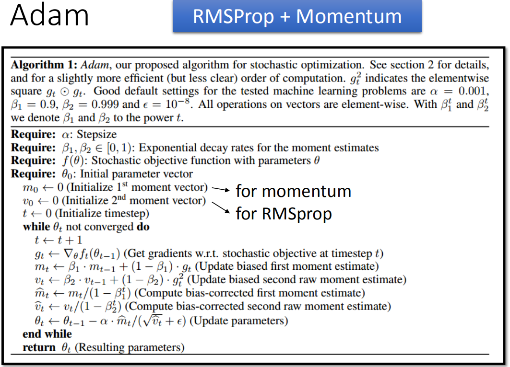

**如果你在training data已經得到了很好的結果了，但是你在testing data上得不到很好的結果，那麼接下來會有三個方法幫助解決。 **

### Early Stopping
  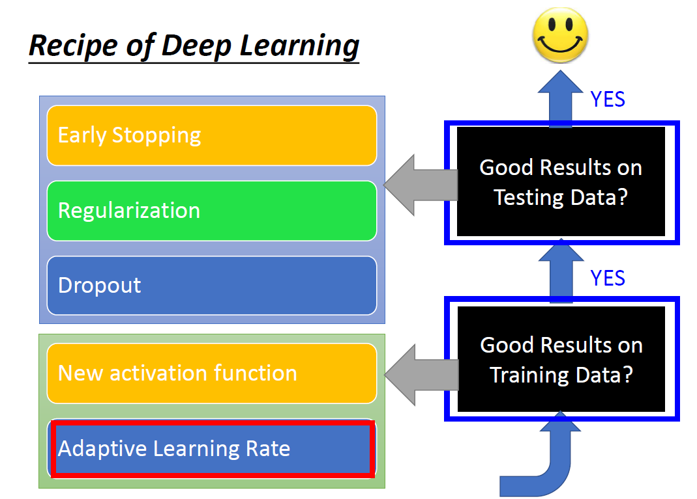
   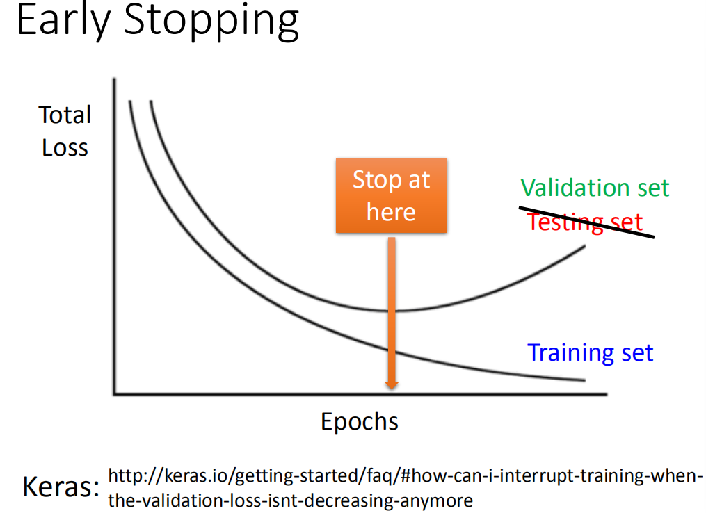

隨著你的training，你的total loss會越來越小(learning rate沒有設置好，total loss 變大也是有可能的)，training data和testing data的distribute是不一樣的，在training data上loss逐漸減小，而在testing data上loss逐漸增大。理想上，假如你知道testing set 上的loss變化，你應該停在不是training set最小的地方，而是testing set最小的地方(如圖所示)，可能training到這個地方就停下來。但是你不知道你的testing set(有label的testing set)上的error是什麼。所以我們會用validation會 解決

會validation set模擬 testing set，什麼時候validation set最小，你的training 會停下來。

### Regularization
類似與大腦的神經，剛剛從嬰兒到6歲時，神經連接變多，但是到14歲一些沒有用的連接消失，神經連接變少。
  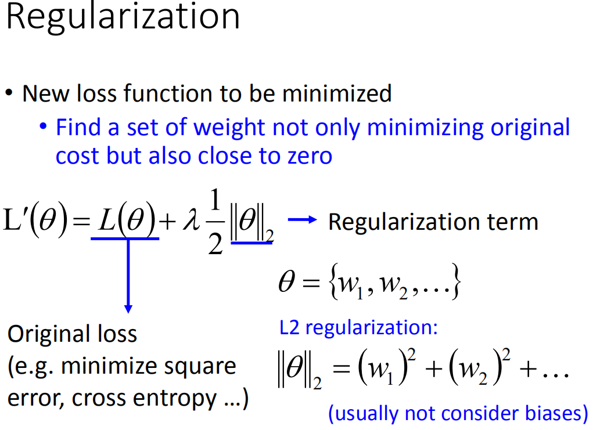
重新去定義要去minimize的那個loss function。

在原來的loss function(minimize square error, cross entropy)的基礎上加一個regularization term(L2-Norm)，在做regularization時是不會加bias這一項的，加regularization的目的是為了讓線更加的平滑(bias跟平滑這件事情是沒有任何關係的)。

  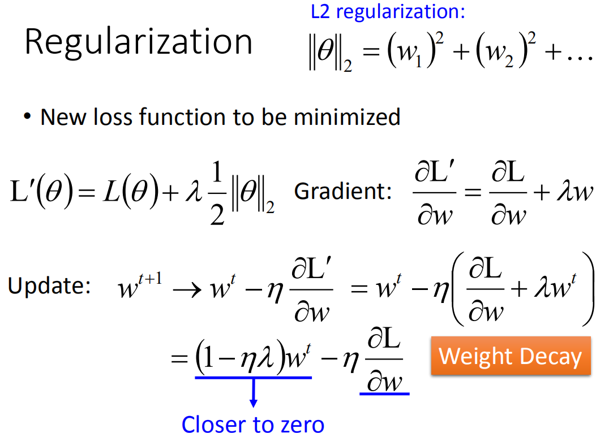

在update參數的時候，其實是在update之前就已近把參數乘以一個小於1的值(\eta \lambdaηλ都是很小的值)，這樣每次都會讓weight小一點。最後會慢慢變小趨近於0，但是會與後一項梯度的值達到平衡，使得最後的值不等於0。 L2的Regularization 又叫做Weight Decay，就像人腦將沒有用的神經元去除。

regularization term當然不只是平方，也可以用L1-Norm

  

w是正的微分出來就是+1，w是負的微分出來就是-1，可以寫為sgn(w)。

每一次更新時參數時，我們一定要去減一個\eta \lambda sgn(w^t)ηλsgn(wt)值(w是正的，就是減去一個值；若w是負的，就是加上一個值，讓參數變大)。

L2、L1都可以讓參數變小，但是有所不同的，若w是一個很大的值，L2下降的很快，很快就會變得很小，在接近0時，下降的很慢，會保留一些接近01的值；L1的話，減去一個固定的值(比較小的值)，所以下降的很慢。所以，通過L1-Norm training 出來的model，參數會有很大的值。

## Dropout

### How to train?

在train的時候，每一次update參數之前，對network裡面的每個neural(包括input)，做sampling（抽樣）。每個neural會有p%會被丟掉，跟著的weight也會被丟掉。

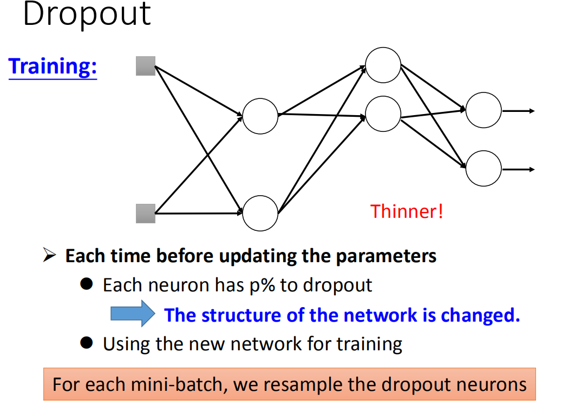

你在training 時，performance會變的有一點差(某些neural不見了)，加上dropout，你會看到在testing set會變得有點差，但是dropout真正做的事就是讓你testing 越做越好

  
 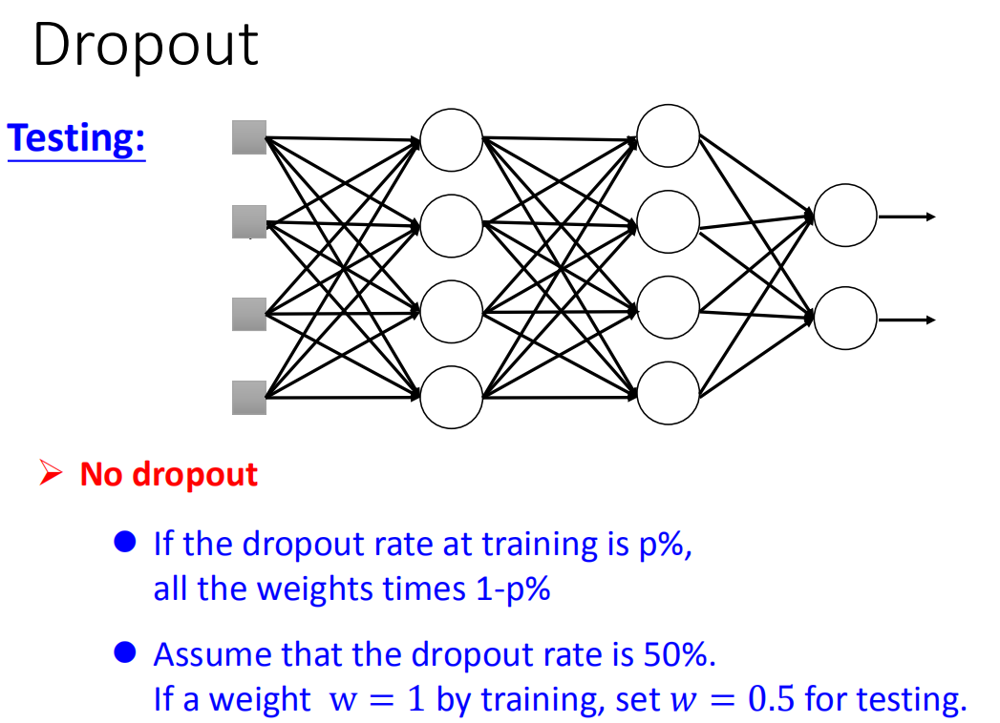
  
在testing上註意兩件事情：
- 第一件事情就是在testing上不做dropout。
- 在dropout的時候，假設dropout rate在training是p%，all weights都要乘以（1-p%）

假設training時dropout rate是p%，在testing rate時weights都要乘以（1-p）%。 （假定dropout rate是50%，在training的時候計算出來的weights等於1，那麼testing時的rate設為0.5

### 為什麼Dropout會有用

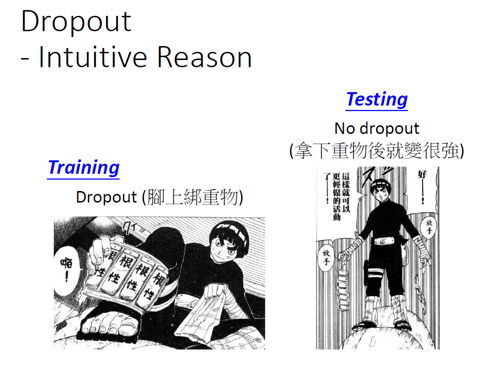

為什麼在訓練的時候要dropout，但是測試的時候不dropout。

training的時候會丟掉一些neural，就好像使在練習輕功一樣在腳上綁上一些重物，然後實際上戰鬥的時候把重物拿下來就是testing時（沒有進行dropout），那時候你就會變得很強

  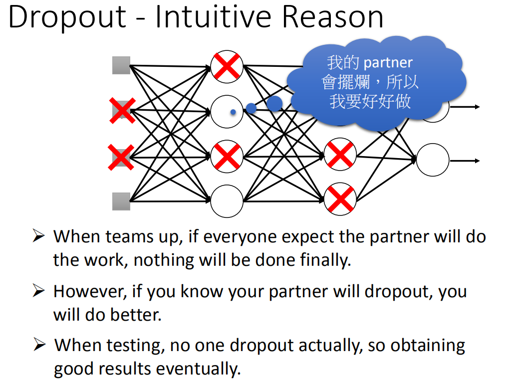

另外一個很直覺的理由是：在一個團隊裡面，總是會有人擺爛（擺爛，指事情已經無法向好的方向發展,於是就乾脆不再採取措施加以控製而是任由其往壞的方向繼續發展下去），這是會dropout的。

假設你覺得你的隊友會擺爛，所以這個時候你就想要好好做，你想要去carry他。但實際上在testing的時候，大家都是有在好好做，沒有需要被carry，因為每個人做的很努力，所以結果會更好。

### testing時為什麼要乘以（1-p）%

   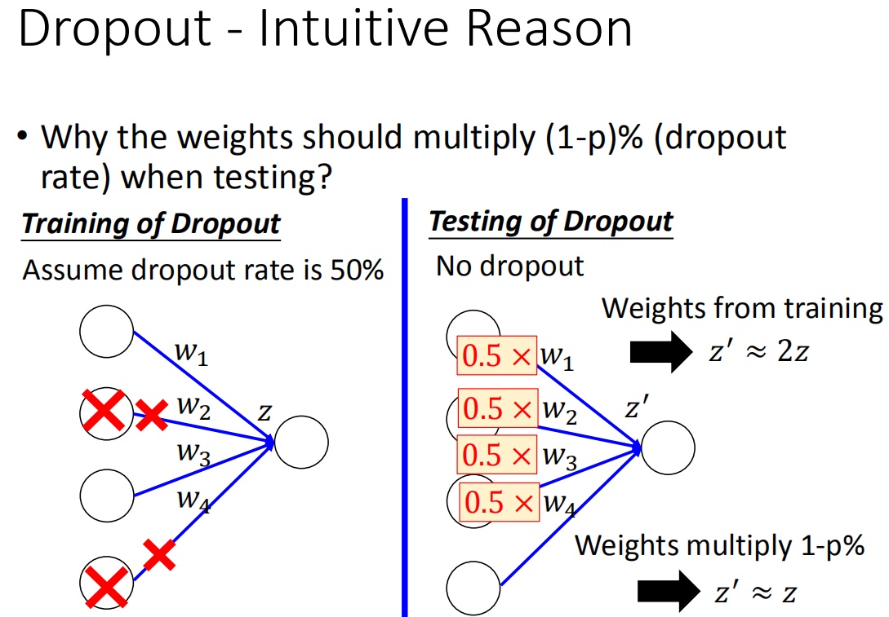

還有一個要解釋的是：在做dropout任務時候要乘以（1-p）%，為什麼和training時使用的training不相同呢？很直覺的理由是這樣的：

假設dropout rate是50 percent，那在training的時候總是會丟掉一般的neural。假設在training時learning好一組weight($w1,w2,w3,w4$)，但是在testing時沒有dropout，對同一組weights來說：在training時得到z，在testing是得到$z'$。但是training和testing得到的值是會差兩倍的，所以在做testing時都乘以0.5，這樣得到的結果是比較match：$z=z'$。

上述的描述是很直覺的解釋

其實dropout還是有很多的理由，這個問題還是可以探討的問題，你可以在文獻上找到很多不同的觀點來解釋dropout。我覺得我比較能接受的是：dropout是一個終極的ensemble方法

ensemble的意思是：我們有一個很大的training set，每次從training set裡面只sample一部分的data。我們之前在講bias和variance時，打靶有兩種狀況：一種是bias很大，所以你打準了；一種是variance很大，所以你打準了。如果今天有一個很複雜的model，往往是bias準，但variance很大。若很複雜的model有很多，雖然variance很大，但最後平均下來結果就很準。所以ensemble做的事情就是利用這個特性。

我們可以training很多的model（將原來的training data可以sample很多的set，每個model的structures不一樣）。雖然每個model可能variance很大，但是如果它們都是很複雜的model時，平均起來時bias就很小。

在training時train了很多的model，在testing時輸入data x進去通過所有的model（$Network1, Network2, Network3, Network4$），得到結果（$y_1, y_2, y_3, y_4$），再將這些結果做平均當做最後的結果。

如果model很複雜時，這一招是往往有用的

### 為什麼說dropout是終極的ensemble方法

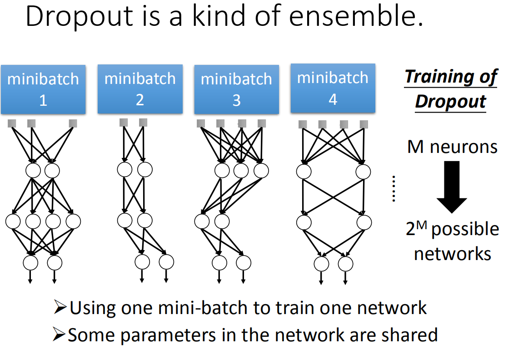

為什麼說dropout是終極的ensemble方法？在進行dropout時，每次sample一個minibatch update參數時，都會進行dropout。

第一個、第二個、第三個、第四個minibatch如圖所示，所以在進行dropout時，是一個終極ensemble的方式。假設有M個neurons，每個neuron可以dropout或者不dropout，所以可能neurons的數目為$2^M$，但是在做dropout時，你在train$2^M$neurons。

每次只用one mini-batch去train一個neuron，總共有$2^M$可能的neuron。最後可能update的次數是有限的，你可能沒有辦法把$2^M$的neuron都train一遍，但是你可能已經train好多的neurons。

每個neuron都用one mini-batch來train，每個neuron用一個batch來train可能會讓人覺得很不安（一個batch只有100筆data，怎麼可能train整個neuron呢）。這是沒有關係的，因為這些不同neuron的參數是共享的。

 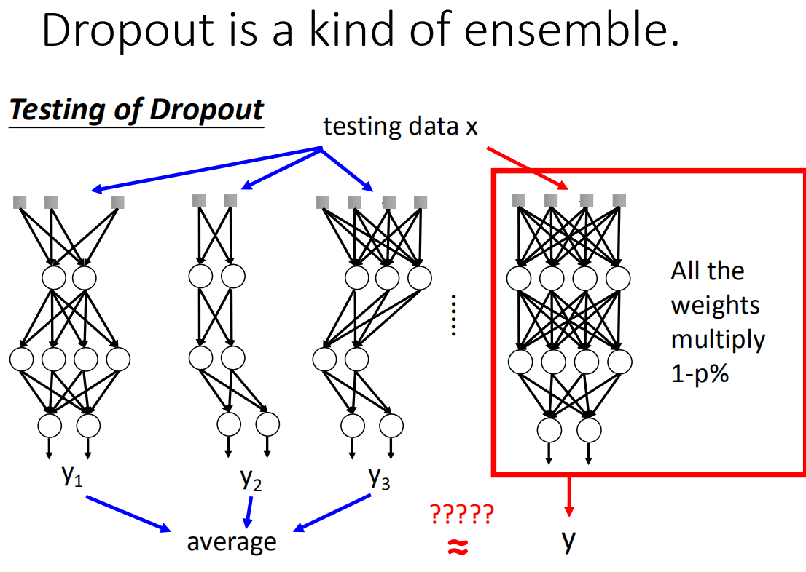

在testing的時候，按照ensemble方法，把之前的network拿出來，然後把train data丟到network裡面去，每一個network都會給你一個結果，這些結果的平均值就是最終的結果。但是實際上沒有辦法這樣做，因為network太多了。所以dropout最神奇的是：當你把一個完整的network不進行dropout，但是將它的weights乘以（1-p）percent，然後將train data輸入，得到的output y。神奇的是：之前做average的結果跟output y是approximated

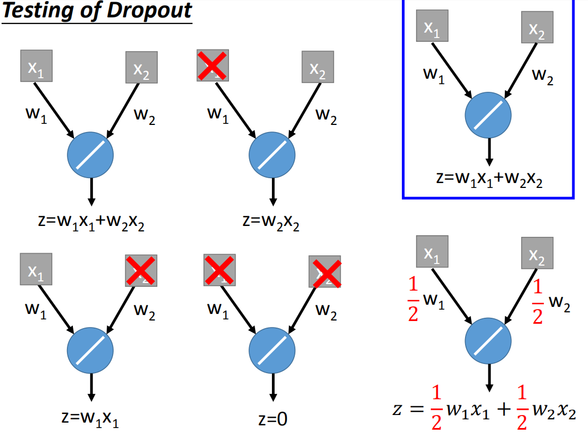

你可能想說何以見得？接下來我們將來舉一個示例：若我們train一個很簡單的network（只有一個neuron並且不考慮bis），這個network的activation是linear的。

這個neuron的輸入是$x_1, x_2$，經過dropout以後得到的weights是$w_1, w_2$，所以它的output是$z=w_1x_2+w_2x_2$。如果我們要做ensemble時，每個input可能被dropout或者不被dropout，所以總共有四種structure，它們所對應的結果分別為$z=w_1x_1, z=w_2x_2, z=w_1x_1, z=0$。因為我們要進行ensemble，所以要把這四個neuron的output要average，得到的結果是$z=\frac{1}{2}w_1x_1+\frac{1}{2}w_2x_2$。

如果我們現在將這兩個weights都乘以$\frac{1}{2}$（$\frac{1}{2}w_1x_1+\frac{1}{2}w_2x_2$）,得到的output為$z =\frac{1}{2}w_1x_1+\frac{1}{2}w_2x_2$。在這個最簡單的case裡面，不同的neuron structure做ensemble這件事情跟我們將weights multiply一個值，而不做ensemble所得到的output其實是一樣的。

只有是linear network，ensemble才會等於weights multiply一個值。
