## 為什麼用CNN
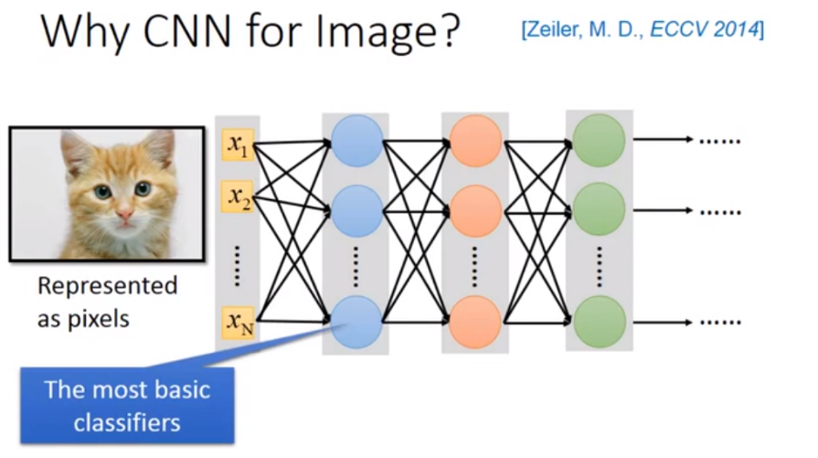

我們都知道CNN常常被用在影像處理上，如果你今天用CNN來做影像處理，當然也可以用一般的neural network來做影像處理，不一定要用CNN。比如說你想要做影像的分類，那麼你就是training一個neural network,input一張圖片，那麼你就把這張圖片表示成裡面的pixel，也就是很長很長的vector。 output就是(假如你有1000個類別，output就是1000個dimension)dimension。那我相信根據剛才那堂課內容，若給你一組training data你都可以描作出來。

但是呢，我們現在會遇到的問題是這樣的，實際上我們在training neural network時，我們會期待說：在network的structure裡面，每一個neural就是代表了一個最基本的classifier，事實在文件上根據訓練的結果，你有可能會得到很多這樣的結論。舉例來說：第一層的neural是最簡單的classifier，它做的事情就是detain有沒有綠色出現，有沒有黃色出現，有沒有斜的條紋。

第二個layer是做比這個更複雜的東西，根據第一個layer的output，它看到直線橫線就是窗框的一部分，看到棕色紋就是木紋，看到斜條紋+灰色可能是很多的東西(輪胎的一部分等等)

再根據第二個hidden layer的outpost，第三個hidden layer會做更加複雜的事情。

但現在的問題是這樣的，當我們一般直接用fully connect feedforward network來做影像處理的時候，往往我們會需要太多的參數，舉例來說，假設這是一張100 *100的彩色圖(一張很小的imgage)，你把這個拉成一個vector，(它有多少個pixel)，它有100 *100 3的pixel。
如果是彩色圖的話，每個pixel需要三個value來描述它，就是30000維(30000 dimension)，那input vector假如是30000dimension，那這個hidden layer假設是1000個neural，那麼這個hidden layer的參數就是有30000 *1000，那這樣就太多了。那麼CNN做的事就是簡化neural network的架構。我們把這裡面一些根據人的知識，我們根據我們對影像就知道，某些weight用不上的，我們一開始就把它濾掉。不是用fully connect feedforward network，而是用比較少的參數來做影像處理這件事。所以CNN比一般的DNN還要簡單的。

等一下我們講完會覺得發現說：你可能覺得CNN運作很複雜，但事實上它的模型是要比DNN還要更簡單的。我們就是用power-knowledge 去把原來fully connect layer中一些參數拿掉就成了CNN。

### Small region

我們先來講一下，為什麼我們有可能把一些參數拿掉(為什麼可以用比較少的參數可以來做影像處理這件事情)

這裡有幾個觀察，第一個是在影像處理裡面，我們說第一層的 hidden layer那些neural要做的事就是偵測某一種pattern，有沒有某一種patter出現。大部分的pattern其實要比整張的image還要小，對一個neural來說，假設它要知道一個image裡面有沒有某一個pattern出現，它其實是不需要看整張image，它只要看image的一小部分。

舉例來說，假設我們現在有一張圖片，第一個hidden layer的某一種neural的工作就是要偵測有沒有鳥嘴的存在(有一些neural偵測有沒有爪子的存在，有沒有一些neural偵測有沒有翅膀的存在，有沒有尾巴的存在，合起來就可以偵測圖片中某一隻鳥)。假設有一個neural的工作是要偵測有沒有鳥嘴的存在，那並不需要看整張圖，其實我們只需要給neural看著一小紅色方框的區域(鳥嘴)，它其實就可以知道說，它是不是一個鳥嘴。對人來說也是一樣，看這一小塊區域這是鳥嘴，不需要去看整張圖才知道這件事情。所以，每一個neural連接到每一個小塊的區域就好了，不需要連接到整張完整的圖。

### Same Patterns

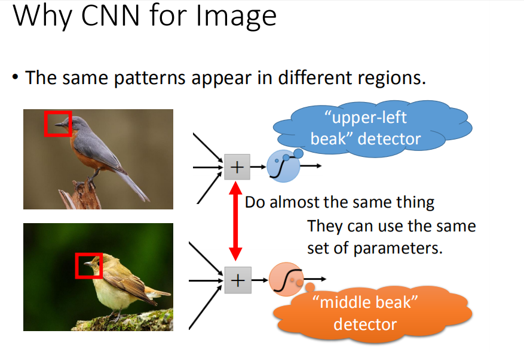

第二個觀察是這樣子，同樣的pattern在image裡面，可能會出現在image不同的部分，但是代表的是同樣的含義，它們有同樣的形狀，可以用同樣的neural，同樣的參數就可以把patter偵測出來。

比如說，這張圖裡面有一張在左上角的鳥嘴，在這張圖裡面有一個在中央的鳥嘴，但是你並不需要說：我們不需要去訓練兩個不同的detector，一個專門去偵測左上角的鳥嘴，一個去偵測中央有沒有鳥嘴。如果這樣做的話，這樣就太冗了。我們不需要太多的冗源，這個nerual偵測左上角的鳥嘴跟偵測中央有沒有鳥嘴做的事情是一樣的。我們並不需要兩個neural去做兩組參數，我們就要求這兩個neural用同一組參數，就樣就可以減少你需要參數的量

### Subsampling

第三個是：我們知道一個image你可以做subsampling，你把一個image的奇數行，偶數列的pixel拿掉，變成原來十分之一的大小，它其實不會影響人對這張image的理解。對你來說：這張image跟這張image看起來可能沒有太大的差別。是沒有太大的影響的，所以我們就可以用這樣的概念把image變小，這樣就可以減少你需要的參數。

## CNN架構

所以整個CNN的架構是這樣的，首先input一張image以後，這張image會通過convolution layer，接下里做max pooling這件事，然後在做convolution，再做max pooling這件事。這個process可以反复無數次，反复的次數你覺得夠多之後，(但是反復多少次你是要事先決定的，它就是network的架構(就像你的neural有幾層一樣)，你要做幾層的convolution，做幾層的Max Pooling，你再定neural架構的時候，你要事先決定好)。你做完決定要做的convolution和Max Pooling以後，你要做另外一件事，這件事情叫做flatten，再把flatten的output丟到一般fully connected feedforward network，然後得到影像辨識的結果。

我們剛才講基於三個對影像處理的觀察，所以設計了CNN這樣的架構。

第一個觀察是，要生成一個pattern，不要看整張的image，你只需要看image的一小部分。第二是，通用的pattern會出現在一張圖片的不同的區域。第三個是，我們可以做subsampling

前面的兩個property可以用convolution來處理掉，最後的property可以用Max Pooling這件事來處理。等一下我們要介紹每一個layer再做的事情，我們就先從convolution開始看起。

## Convolution

### Propetry1

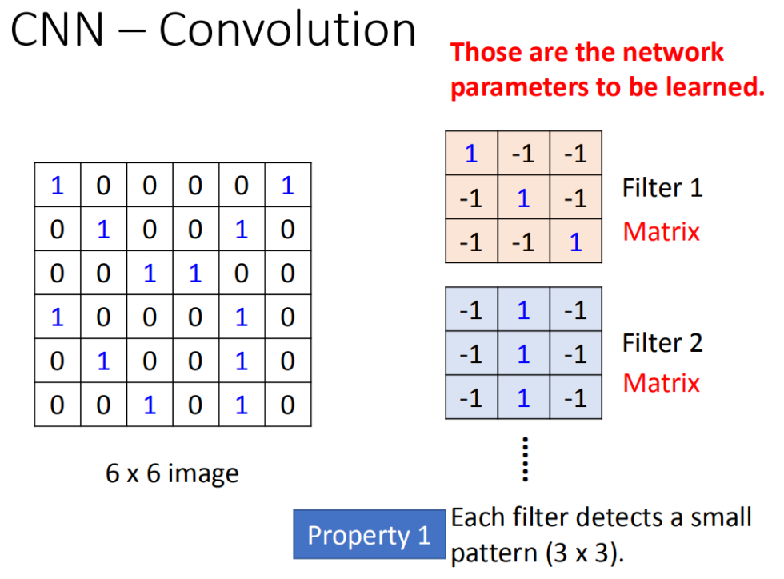

假設現在我們的network的input是一張6*6的Image，如果是黑白的，一個pixel就只需要用一個value去描述它，1就代表有塗墨水，0就代表沒有塗到墨水。那在convolution layer裡面，它由一組的filter，(其中每一個filter其實就等同於是fully connect layer裡面的一個neuron)，每一個filter其實就是一個matrix(3 *3)，這每個filter裡面的參數(matrix裡面每一個element值)就是network的parameter(這些parameter是要學習出來的，並不是需要人去設計的)

每個filter如果是3* 3的detects意味著它就是再偵測一個3 *3的pattern(看3 *3的一個範圍)。在偵測pattern的時候不看整張image，只看一個3 *3的範圍內就可以決定有沒有某一個pattern的出現。這個就是我們考慮的第一個Property

### Propetry2

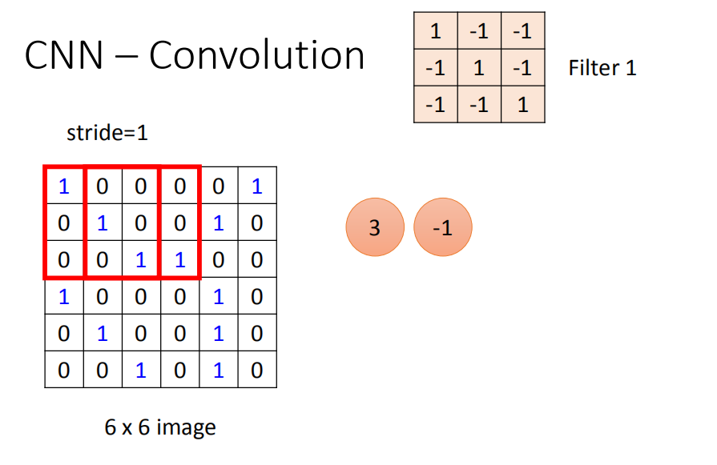

這個filter咋樣跟這個image運作呢？首先第一個filter是一個3* 3的matrix，把這個filter放在image的左上角，把filter的9個值和image的9個值做內積，兩邊都是1,1,1(斜對角)，內積的結果就得到3。 (移動多少是事先決定的)，移動的距離叫做stride(stride等於多少，自己來設計)，內積等於-1。 stride等於2，內積等於-3。我們先設stride等於1。

你把filter往右移動一格得到-1，再往右移一格得到-3，再往右移動一格得到-1。接下里往下移動一格，得到-3。以此類推(每次都移動一格)，直到你把filter移到右下角的時候，得到-1(得到的值如圖所示)

經過這件事情以後，本來是6 *6的matrix，經過convolution process就得到4 *4的matrix。如果你看filter的值，斜對角的值是1,1,1。所以它的工作就是detain1有沒有1,1,1(連續左上到右下的出現在這個image裡面)。比如說：出現在這裡(如圖所示藍色的直線)，所以這個filter就會告訴你：左上跟左下出現最大的值

就代表說這個filter要偵測的pattern，出現在這張image的左上角和左下角，這件事情就考慮了propetry2。同一個pattern出現在了左上角的位置跟左下角的位置，我們就可以用filter 1偵測出來，並不需要不同的filter來做這件事。

在一個convolution layer 裡面會有很多的filter(剛才只是一個filter的結果)，那另外的filter會有不同的參數(圖中顯示的filter2)，它也做跟filter1一模一樣的事情，在filter放到左上角再內積得到結果-1，依次類推。你把filter2跟input image做完convolution之後，你就得到了另一個4*4的matrix，紅色4 *4的matrix跟藍色的matrix合起來就叫做feature map，看你有幾個filter，你就得到多少個image(你有100個filter，你就得到100個4 *4的image)

 剛才舉的例子是一張黑白的image，所以input是一個matrix。若今天換成彩色的image,彩色的image是由RGB組成的，所以，一個彩色的image就是好幾個matrix疊在一起，就是一個立方體。如果要處理彩色image，這時候filter不是一個matrix，filter而是一個立方體。如果今天是RGB表示一個pixel的話，那input就是3*6 *6，那filter就是3 *3 *3。
 
 在做convolution的話，就是將filter的9個值和image的9個值做內積(不是把每一個channel分開來算，而是合在一起來算，一個filter就考慮了不同顏色所代表的channel )

## convolution和fully connected之間的關係

convolution就是fully connected layer把一些weight拿掉了。經過convolution的output其實就是一個hidden layer的neural的output。如果把這兩個link在一起的話，convolution就是fully connected拿掉一些weight的結果。

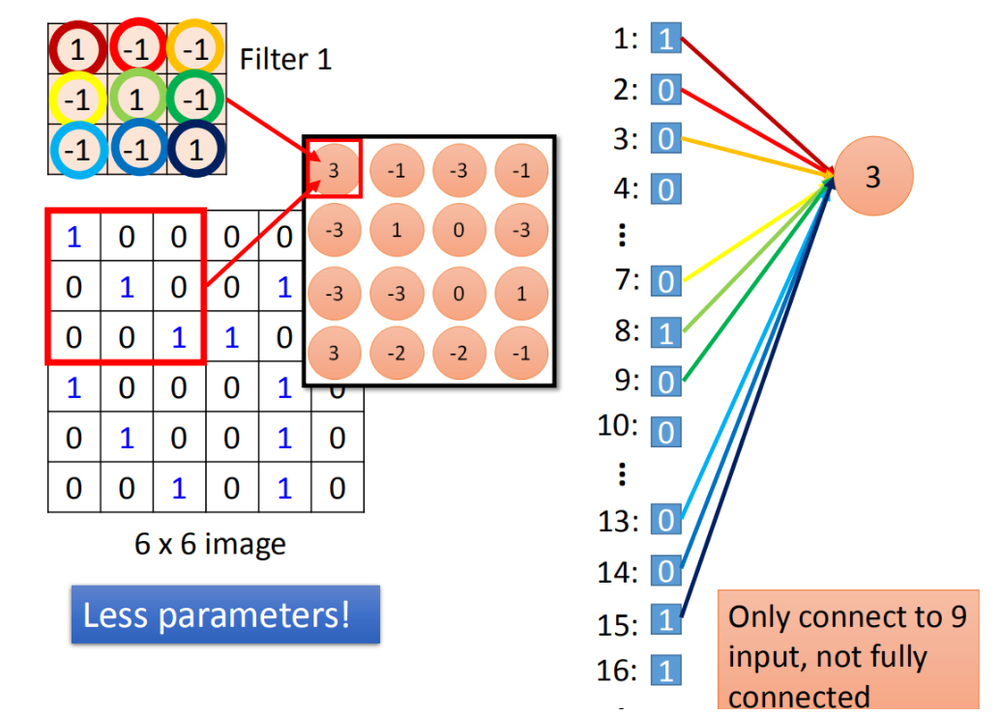

我們在做convolution的時候，我們filter1放到左上角(先考慮filter1)，然後做inner product，得到內積為3，這件事情就等同於把6* 6的image拉直(變成如圖所示)。然後你有一個neural的output是3，這個neural的output考慮了9個pixel，這9個pixel分別就是編號(1,2,3,7,8,9,13,14,15)的pixel。這個filter做inner product以後的output 3就是某個neuron output 3時，就代表這個neuron的weight只連接到(1,2,3,7,8,9,13,14,15)。這9個weight就是filter matrix裡面的9個weight(同樣的顏色)

在fully connected中，一個neural應該是連接在所有的input(有36個pixel當做input，這個neuron應連接在36個input上)，但是現在只連接了9個input(detain一個pattern，不需要看整張image，看9個input就好)，這樣做就是用了比較少的參數了。

將stride=1(移動一格)做內積得到另外一個值-1，假設這個-1是另外一個neural的output，這個neural連接到input的(2,3,4，8,9,10,14 ，15,16)，同樣的weight代表同樣的顏色。在9個matrix

當我們做這件事情就意味說：這兩個neuron本來就在fully connect裡面這兩個neural本來是有自己的weight，當我們在做convolution時，首先把每一個neural連接的wight減少，強迫這兩個neural共用一個weight。這件事就叫做shared weight，當我們做這件事情的時候，我們用的這個參數就比原來的更少。

## Max pooling

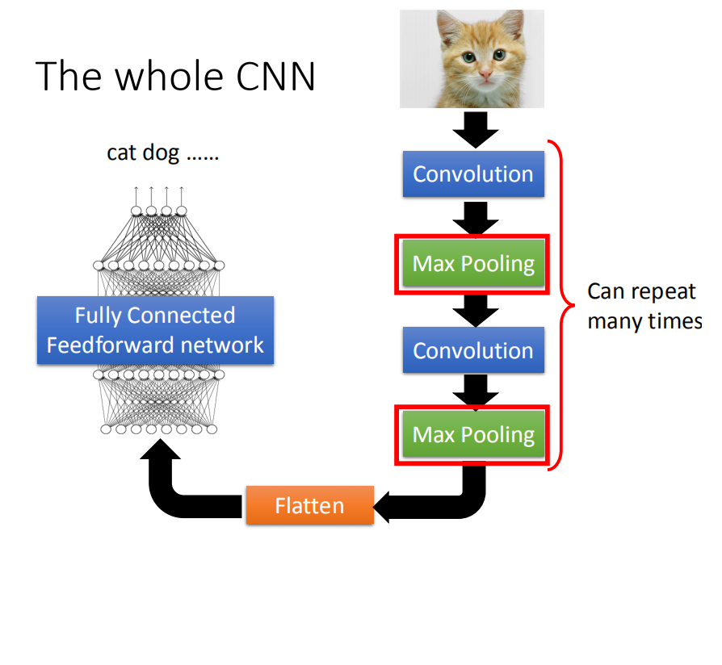

相對於convolution來說，Max Pooling是比較簡單的。我們根據filter 1得到4*4的maxtrix，根據filter2得到另一個4 *4的matrix，接下來把output ，4個一組。每一組裡面可以選擇它們的平均或者選最大的都可以，就是把四個value合成一個value。這個可以讓你的image縮小。

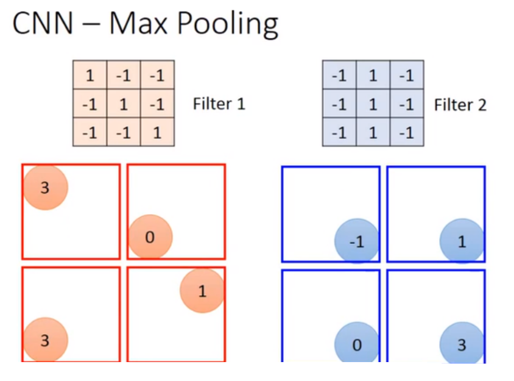

假設我們選擇四個里面的max vlaue保留下來，這樣可能會有個問題，把這個放到neuron裡面，這樣就不能夠微分了，但是可以用微分的辦法來處理的

做完一個convolution和一次max pooling，就將原來6 * 6的image變成了一個2 *2的image。這個2 *2的pixel的深度depend你有幾個filter(你有50個filter你就有50維)，得到結果就是一個new image but smaller，一個filter就代表了一個channel。

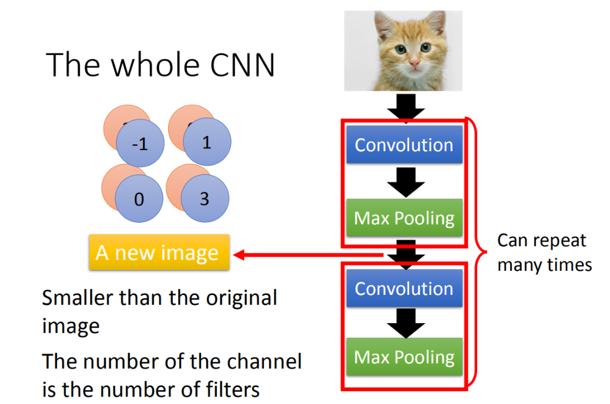

這件事可以repeat很多次，通過一個convolution + max pooling就得到新的 image。它是一個比較小的image，可以把這個小的image，做同樣的事情，再次通過convolution + max pooling，將得到一個更小的image。

這邊有一個問題：第一次有25個filter，得到25個feature map，第二個也是由25個filter，那將其做完是不是要得到`$25^2$`的feature map。其實不是這樣的！

假設第一層filter有2個，第二層的filter在考慮這個imput時是會考慮深度的，並不是每個channel分開考慮，而是一次考慮所有的channel。所以convolution有多少個filter，output就有多少個filter(convolution有25個filter，output就有25個filter。只不過，這25個filter都是一個立方體)

## Flatten

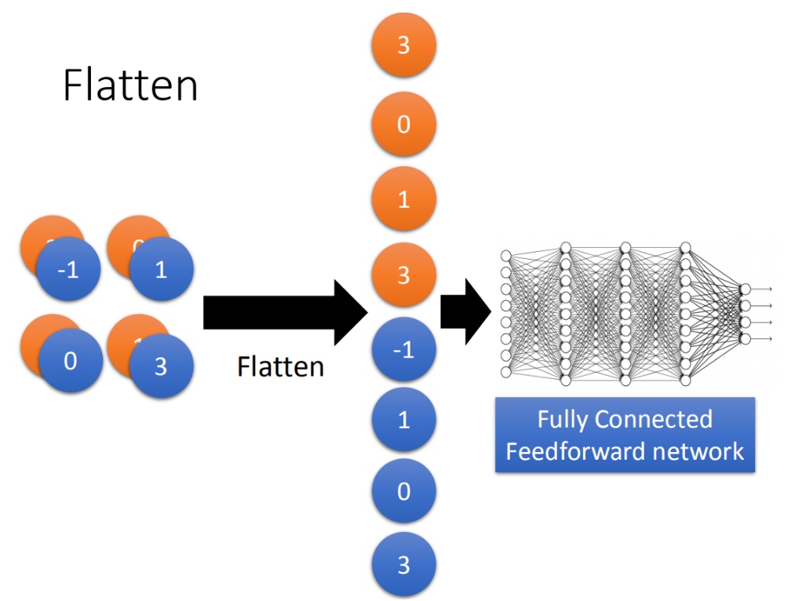

flatten就是feature map拉直，拉直之後就可以丟到fully connected feedforward netwwork，然後就結束了。

## CNN in Keras

唯一要改的是：network structure和input format，本來在DNN中input是一個vector，現在是CNN的話，會考慮 input image的幾何空間的，所以不能給它一個vector。應該input一個tensor(高維的vector)。為什麼要給三維的vector？因為image的長寬高各是一維，若是彩色的話就是第三維。所以要給三維的tensor

**model.add(Convolution2D**( **25, 3, 3**)

25代表有25個filter，3 *3代表filter是一個3 *3的matrix

**Input_shape=(28,28,1)**

假設我要做手寫數字辨識，input是28 *28的image，每個pixel都是單一顏色。所以input_shape是(1,28,28)。如果是黑白圖為1(blacj/white)，如果是彩色的圖時為3(每個pixel用三個值來表述)。

**MaxPooling2D**(( 2, 2 ))

2,2表示把2*2的feature map裡面的pixel拿出來，選擇max value

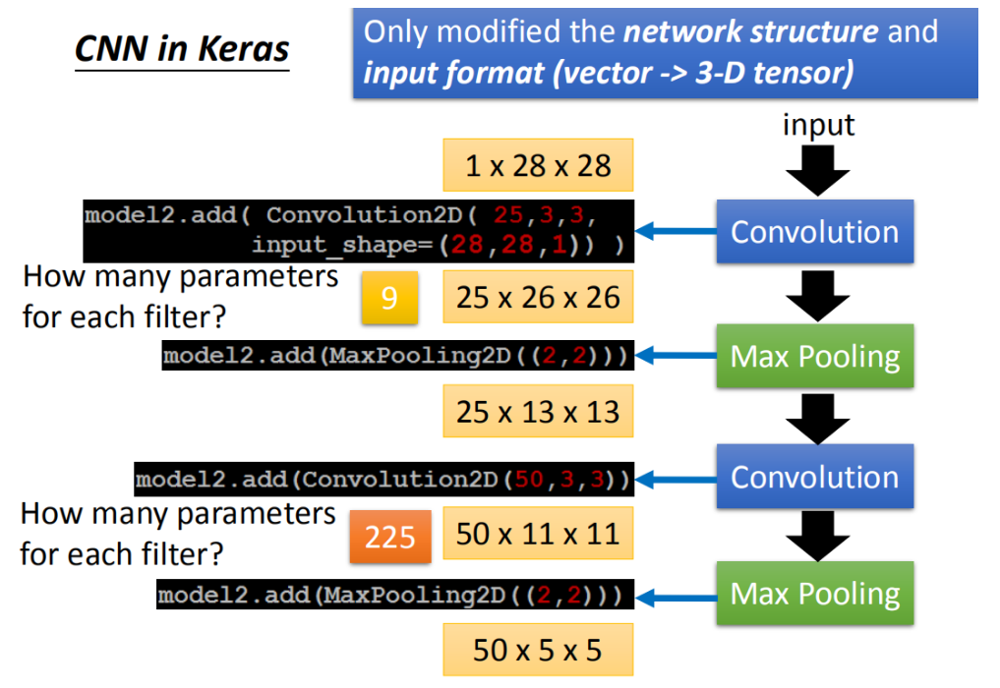

假設我們input一個1 *28 * 28的image，你就可以寫model.add(Convolution2D( 25, 3, 3, Input_shape=(28,28,1)))。通過convplution以後得到output是25 *26 26(25個filter，通過3 *3得到26 * 26)。然後做max pooling，2 *2一組選擇 max value得到 25 *13 * 13

然後在做一次convolution，假設我在這選50個filter，每一個filter是3 *3時，那麼現在的channel就是50。13 *13的image通過3 *3的filter，就成11 *11，然後通過2 *2的Max Pooling，變成了50 *5 *5

在第一個convolution layer裡面，每一個filter有9個參數，在第二個convolution layer裡面，雖然每一個filter都是3 *3，但不是3 *3個參數，因為它input channel 是25個，所以它的參數是3 *3 *25(225)。

通過兩次convolution，兩次Max Pooling，原來是1 *28 *28變為50 *5 *5。 flatten的目的就是把50 *5 *5拉直，拉直之後就成了1250維的vector，然後把1250維的vector丟到fully connected。

## CNN學到了什麼?
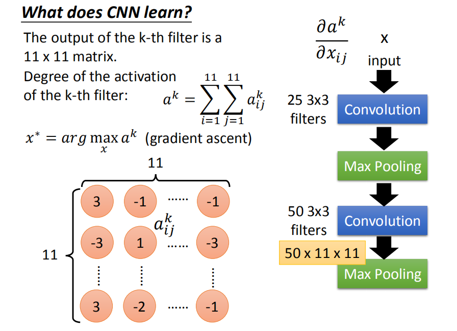

很多人常會說：deep learning就是一個黑盒子，然後你learn以後你不知道它得到了什麼，所以有很多人不喜歡用這種方法。但還有很多的方法分析的，比如說我們今天來示範一下咋樣分析CNN，它到底學到了什麼。

分析input第一個filter是比較容易的，因為一個layer每一個filter就是一個3*3的mmatrix，對應到3 *3的範圍內的9個pixel。所以你只要看到這個filter的值就可以知道說：它在detain什麼東西，所以第一層的filter是很容易理解的，但是你沒有辦法想要它在做什麼事情的是第二層的filter 。在第二層我們也是3 *3的filter有50個，但是這些filter的input並不是pixel(3 *3的9個input不是pixel)。而是做完convolution再做Max Pooling的結果。所以這個3 *3的filter就算你把它的weight拿出來，你也不知道它在做什麼。另外這個3 *3的filter它考慮的範圍並不是3 *3的pixel(9個pixel)，而是比9個pxiel更大的範圍。不要這3 *3的element的 input是做完convolution再加Max Pooling的結果。所以它實際上在image上看到的範圍，是比3 *3還要更大的。那我們咋樣來分析一個filter做的事情是什麼呢，以下是一個方法。

我們知道現在做第二個convolution layer裡面的50個filter，每一個filter的output就是一個matrix(11*11的matrix)。假設我們現在把第k個filter拿出來，它可能是這樣子的(如圖)，每一個element我們就叫做`$a_{ij}^k$`(上標是說這是第k個filter， i,j代表在這個matrix裡面的第i row和第j column)。

接下來我們定義一個東西叫做："Degree of the activation of the k-th filter"，我們定義一個值代表說：現在第k個filter有多被active(現在的input跟第k個filter有多match) ，第k個filter被啟動的Degree定義成：這個11*11的matrix裡面全部的element的summation。 (input一張image，然後看這個filter output的這個11 *11的值全部加起來，當做是這個filter被active的程度)

截下來我們要做的事情是這樣子的：我們想知道第k個filter的作用是什麼，所以我們想要找一張image，這張image它可以讓第k個filter被active的程度最大。

假設input一張image，我們稱之為X，那我們現在要解的問題就是：找一個x，它可以讓我們現在定義的activation Degree `$a^k$`最大，這件事情要咋樣做到呢？其實是用gradient ascent你就可以做到這件事(minimize使用gradient descent，maximize使用gradient ascent)

這是事還是蠻神妙的，我們現在是把X當做我們要找的參數用gradient ascent做update，原來在train CNN network neural的時候，input是固定的，model的參數是你需要用gradient descent找出來的，用gradient descent找參數可以讓loss被minimize。但是現在立場是反過來的，現在在這個task裡面，model的參數是固定的，我們要讓gradient descent 去update這個X，可以讓這個activation function的Degree of the activation是最大的。

這個是得到的結果，如果我們隨便取12個filter出來，每一個filter都去找一張image，這個image可以讓那個filter的activation最大。現在有50個filter，你就要去找50張image，它可以讓這些filter的activation最大。我就隨便取了前12個filter，可以讓它最active的image出來(如圖)。

這些image有一個共同的特徵就是：某種紋路在圖上不斷的反复。比如說第三張image，上面是有小小的斜條紋，意味著第三個filter的工作就是detain圖上有沒有斜的條紋。那不要忘了每一個filter考慮的範圍都只是圖上一個小小的範圍。所以今天一個圖上如果出現小小的斜的條紋的話，這個filter就會被active，這個output的值就會比較大。那今天如果讓圖上所有的範圍通通都出現這個小小的斜條紋的話，那這個時候它的Degree activation會是最大的。 (因為它的工作就是偵測有沒有斜的條紋，所以你給它一個完整的數字的時候，它不會最興奮。你給它都是斜的條紋的時候，它是最興奮的)

所以你就會發現：每一個filter的工作就是detain某一張pattern。比如說：第三圖detain斜的線條，第四圖是detain短的直線條，等等。每一個filter所做的事情就是detain不同角度的線條，如果今天input有不同角度的線條，你就會讓某一個activation function，某一個filter的output值最大

### 分析全連接層

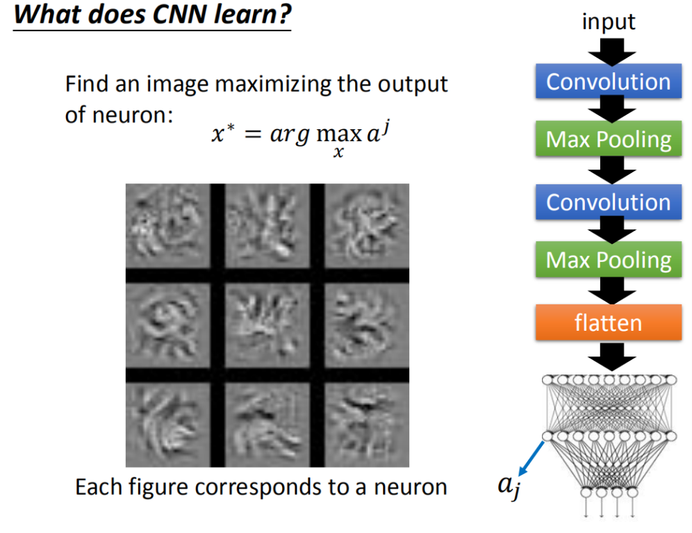

在做完convolution和Max Pooling以後，要做一件事情叫做flatten，把flatten的結果丟到neural network裡面去。那我們想要知道：在這個neural network裡面，每一個neural的工作是什麼。

我們要做的事情是這樣的：定義第j個neural，它的output叫做`$a_j$`。接下來我們要做事情就是：找一張image(用gradient ascent的方法找一張X)，這個image X你把它丟到neural network裡面去，它可以讓`$a_j$`的值被maximize。找到的結果就是這樣的(如圖)

如圖是隨便取前9個neural出來，什麼樣的圖丟到CNN裡面可以讓這9個neural最被active output的值最大，就是這9張圖(如圖)

這些圖跟剛才所觀察到圖不太一樣，在剛在的filter觀察到的是類似紋路的圖案，在整張圖上反复這樣的紋路，那是因為每個filter考慮是圖上一個小小的range(圖上一部分range)。現在每一個neural，在你做flatten以後，每個neural的工作就是去看整張圖，而不是是去看圖的一小部分。

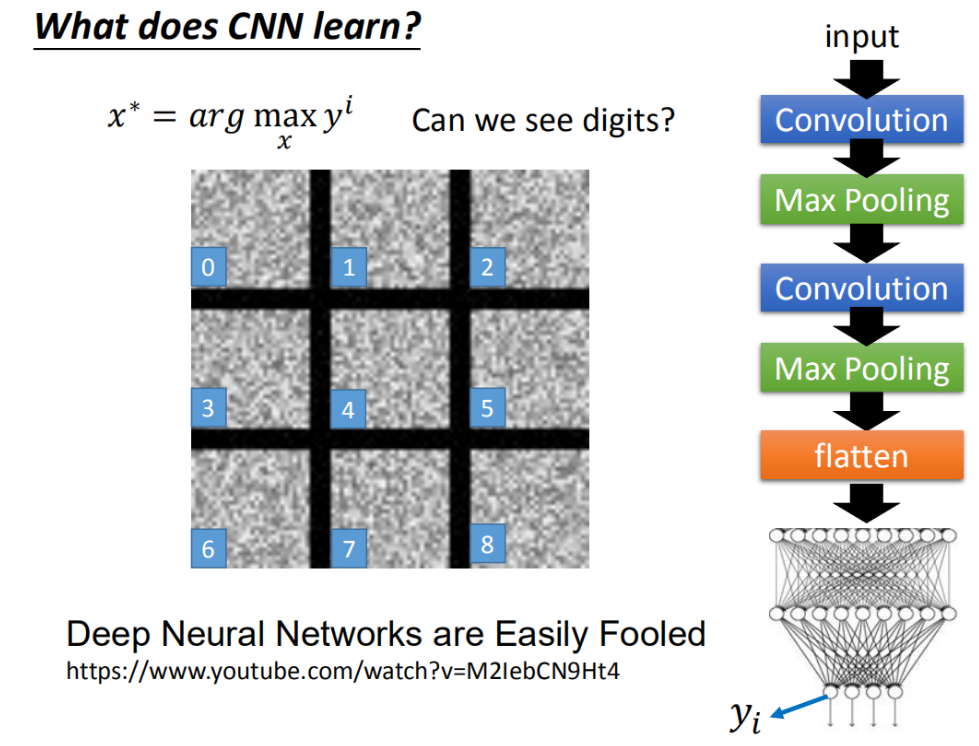

那今天我們考慮是output呢？ (output就是10維，每一維對應一個digit)我們把某一維拿出來，找一張image讓那個維度output最大。那我們會得到咋樣的image呢？你可以想像說：每一個output，每一個dimension對應到某一個數字。

現在我們找一張image，它可以讓對應在數字1的output 最大，那麼那張image顯然就像看起來是數字1。你可以期待說：我們可以用這個方法讓machine自動畫出數字。

但是實際上我們得到的結果是這樣子的，每一張圖分別代表數字0-9。也就是說：我們到output layer對應到0那個neuron，其實是這樣的(如圖)，以此類推。你可能會有疑惑，為什麼是這樣子的，是不是程序有bug。為了確定程序沒有bug，再做了一個實驗是：我把每張image(如圖)都丟到CNN裡面，然後看它classifier的結果是什麼。 CNN確定就說：這個是1，這個是，...，這個是8。 CNN就覺得說：你若拿這張image train出來正確率有98的話，就說：這個就是8。所以就很神奇

這個結果在很多的地方有已經被觀察到了，今天的這個neuron network它所學到東西跟我們人類是不太一樣的(它所學到的東西跟我們人類想像和認知不一樣的)。你可以查看這個鏈接的paper(如圖)

[相關的paper](https://www.youtube.com/watch?v=M2IebCN9H)

### 讓圖更像數字

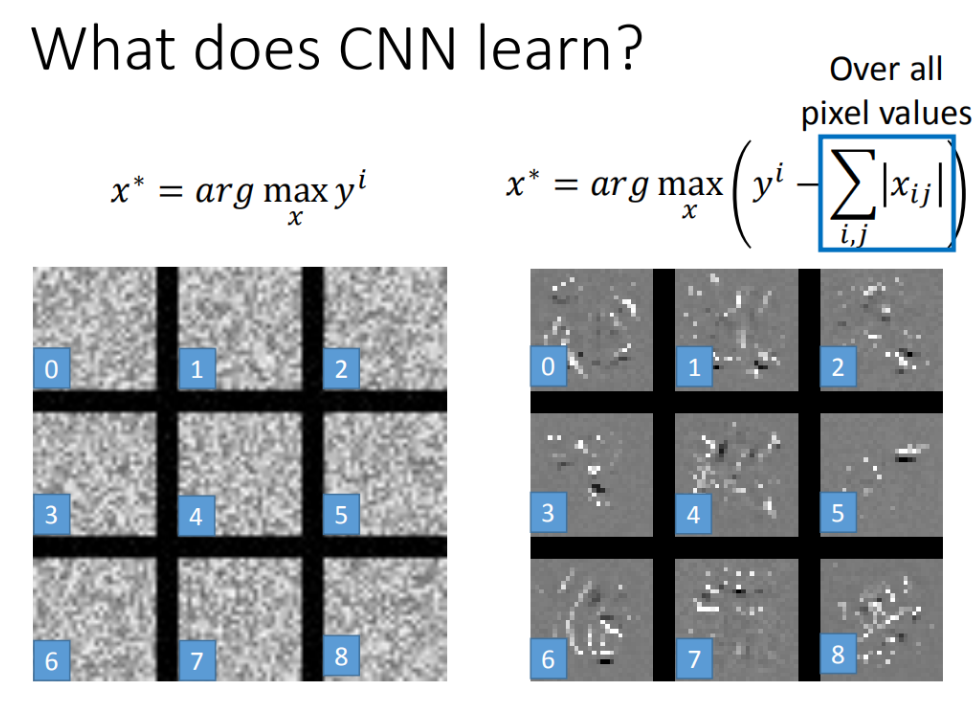

我們有沒有辦法讓這個圖看起來更像數字呢？想法是這樣的：一張圖是不是數字我們有一些基本的假設，比如說：這些就算你不知道它是什麼數字(顯然它不是digit)，人類手寫出來的就不是這個樣子。所以我們應該對x做constraint，我們告訴machine，有些x可能會使y很大但不是數字。我們根據人的power-knowledge就知道，這些x不可能是一些數字。那麼我們可以加上咋樣的constraint呢？ (圖中白色的亮點代表的是有墨水的，對一個digit來說，圖白的部分其實是有限的，對於一個數字來說，一整張圖的某一個小部分會有筆劃，所以我們應該對這個x做一些限制)

假設image裡面的每一個pixel用`$x_{ij}$`來表示，(每一個image有28 *28的pixel)我們把所有image上`$i,j$`的值取絕對值後加起來。如果你熟悉machine learning的話，這一項就是L1-regularization。然後我們希望說：在找一個x可以讓`$y^i$`最大的同時讓`$|x_{ij}|$`的summation越小越好。也就是我們希望找出的image，大部分的地方是沒有塗顏色的，只有非常少的部分是有塗顏色的。如果我們加上constraint以後我們得到的結果是這樣的(如右圖所示)，跟左邊的圖比起來，隱約可以看出來它是一個數字(得到的結果看起來像數字)

你可能會有一個問題，絕對值咋樣去微分，下堂課會講到

你如果加上一些額外的constraint，比如說：你希望相鄰的pixel
是同樣的顏色等等，你應該可以得到更好的結果。不過其實有更多很好的方法可以讓machine generate數字

## Deep Dream

其實上述的想法就是Deep Dream的精神，Deep Dream是說：如果你給machine一張image，它會在這張image裡加上它看到的東西。咋樣做這件事情呢？你先找一張image，然後將這張image丟到CNN中，把它的某一個hidden layer拿出來(vector)，它是一個vector(假設這裡是：[3.9, -1.5, 2.3...] )。接下來把postitive dimension值調大，把negative dimension值調小(正的變的更正，負的變得更負)。你把這個(調節之後的vector)當做是新的image的目標(把3.9的值變大，把-1.5的值變得更負，2.3的值變得更大。然後找一張image(modify image )用GD方法，讓它在hidden layer output是你設下的target)。這樣做的話就是讓CNN誇大化它所看到的東西，本來它已經看到某一個東西了，你讓它看起來更像它原來看到的東西。本來看起來是有一點像東西，它讓某一個filter有被active，但是你讓它被active的更劇烈(誇大化看到的東西)。

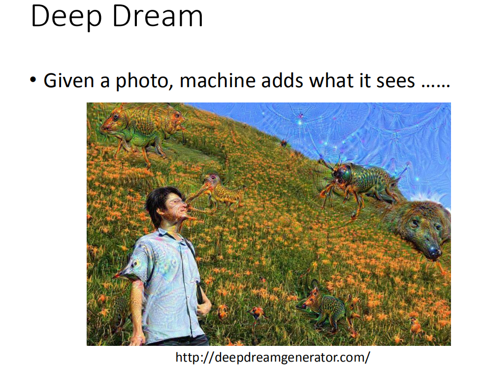

如果你把這張image拿去做Deep Dream的話，你看到的結果是這樣子的。右邊有一隻熊，這個熊原來是一個石頭(對機器來說，這個石頭有點像熊，它就會強化這件事情，所以它就真的變成了一隻熊)。 Deep Dream還有一個進階的版本，叫做Deep Style

## Deep style

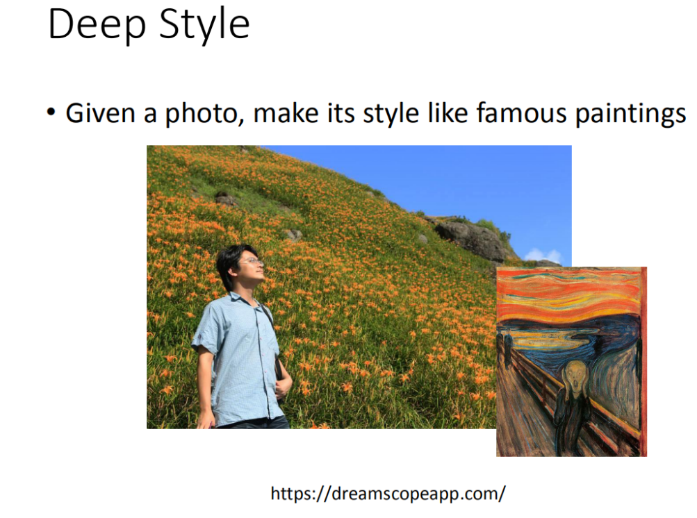

今天input一張image，input一張image，讓machine去修改這張圖，讓它有另外一張圖的風格 (類似於風格遷移)

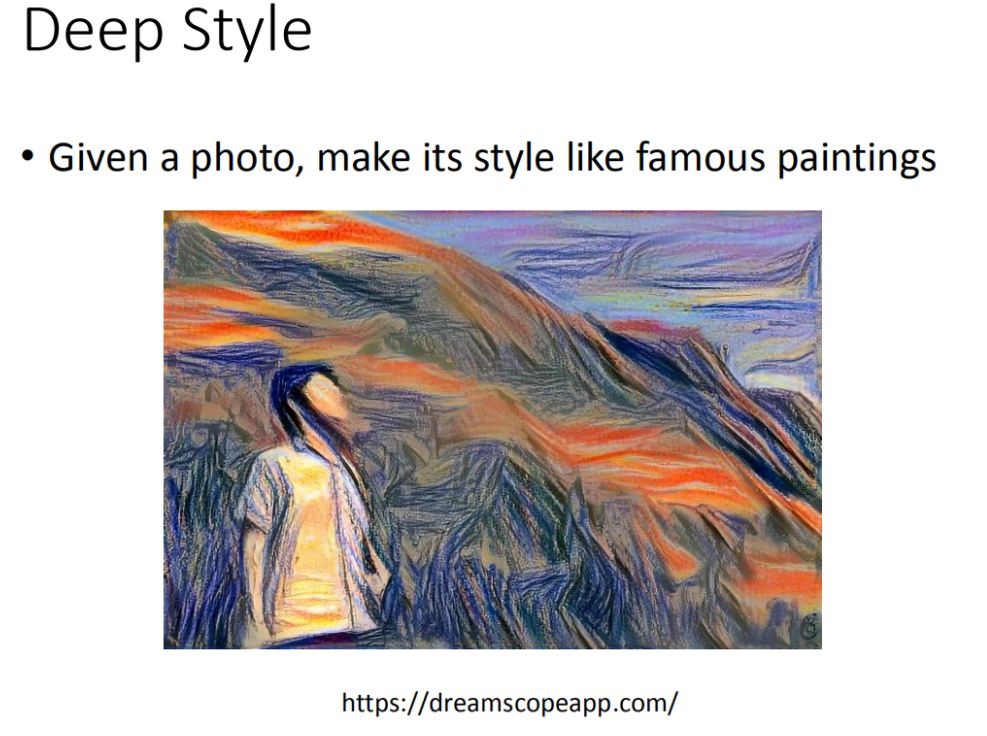

得到的結果就是這樣子的

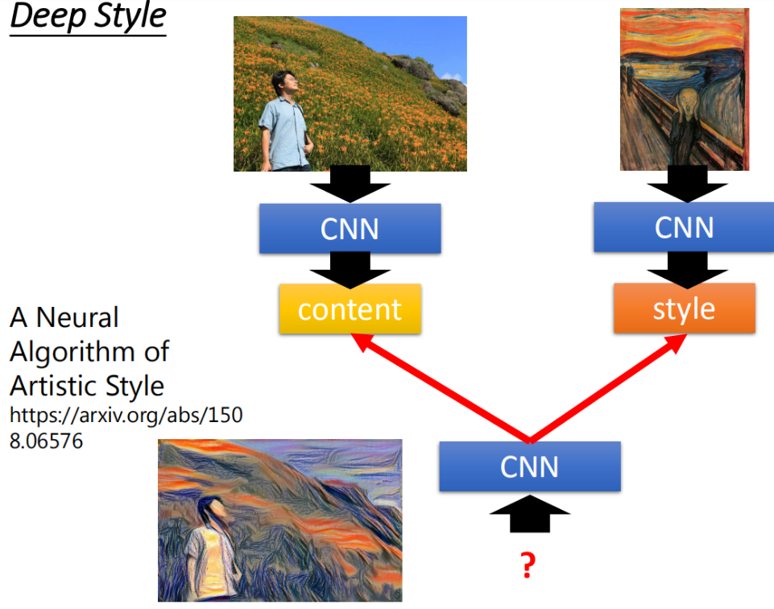

[這裡給一個reference給參考](https://arxiv.org/abs/158.06576)

其中做法的精神是這樣的：原來的image丟給CNN，然後得到CNN的filter的output，CNN的filter的output代表這張image有什麼content。接下來你把吶喊這張圖也丟到CNN裡面，也得到filter的output。我們並不在意一個filter ，而是在意filter和filter之間
的convolution，這個convolution代表了這張image的style。

接下來你用同一個CNN找一張image，這張image它的content像左邊這張相片，但同時這張image的style像右邊這張相片。你找一張image同時可以maximize左邊的圖，也可以maximize右邊的圖。那你得到的結果就是像最底下的這張圖。用的就是剛才講的gradient ascent的方法找一張image，然後maximize這兩張圖，得到就是底下的這張圖。

## CNN的應用

### 圍棋
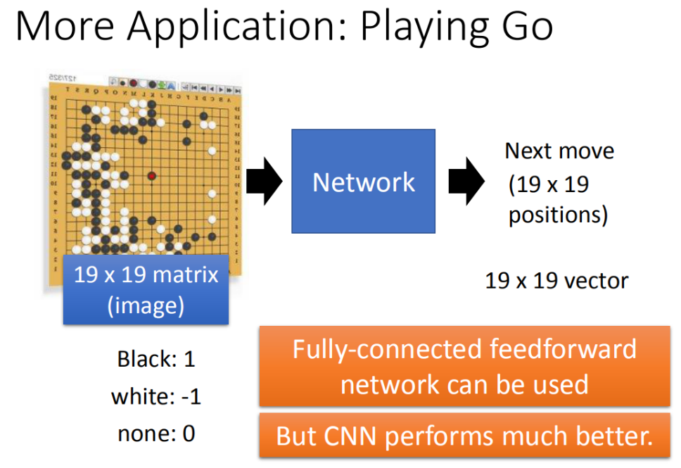

我們現在CNN已經在很多不同的應用上，而不是只有影像處理上。比如：CNN現在有一個很知名的應用，就用用在下圍棋上面。為什麼CNN可以用來下圍棋上面呢？

我們知道如果讓machine來下圍棋，你不見得需要用CNN。其實一般的topic neuron network也可以幫我們做到這件事情。你只要learn一個network(也就是找一個function)，它的input是棋盤，output是棋盤上的位置。也就是說：你根據這個棋盤的盤式，如果你下一步要落子的話，你落子的位置其實就可以讓machine學會。

所以你用Fully-connected feedforward network也可以幫我們做到讓machine下圍棋這件事情。也就是你只要告訴input是一個19 *19的vector，每一個vector的dimension對應到棋盤上面的每一個位置。 machine就可以學會下圍棋了。
如果那個位置有一個黑子的話就是1，如果有一個白子的話就是-1，反之就是0。

但是我們這邊採用CNN的話，我們會得到更好的performance。我們之前舉的例子是把CNN用在影像上面，也就是input是matrix(也就是把19*19的vector表示成19 *19的matrix)，然後當做一個image來看，然後讓它output 下一步落子的位置就結束了。

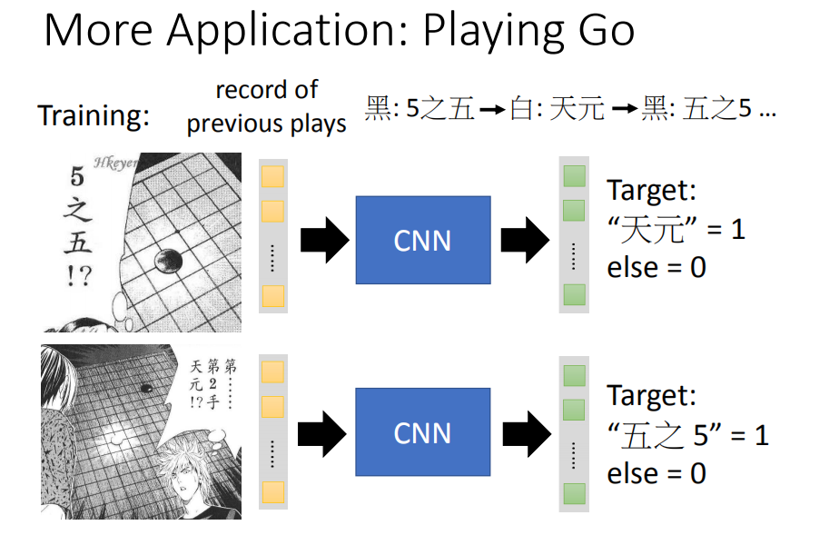

告訴machine說：看到落子在“5之五”，CNN的output就是在“天元”的地方是1，其他地方是0。看到“5之五”和“天元”都有子，CNN的output就是在“五之5”的地方是1，其他地方是0。這個是supervised部分

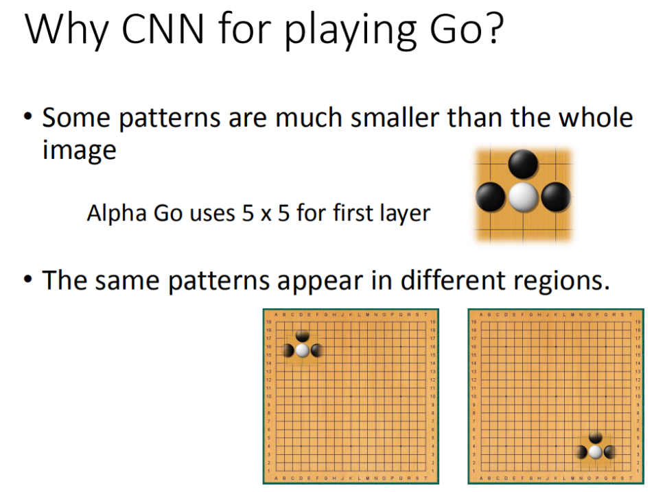

現在大家都說“AlphaGo”，都是懂懂的樣子。但是自從“AlphaGo”用了CNN以後，大家都覺得說：CNN應該很厲害。所以如果你沒有用CNN來處理你的問題，別人就會問你為什麼不用CNN來處理問題(比如說：面試的時候)，CNN不是比較強嗎

什麼時候應該用CNN呢？ image必須有該有的那些特性，在CNN開頭就有說：根據那三個觀察，所以設計出了CNN這樣的架構。在處理image時是特別有效的。為什麼這樣的架構也同樣可以用在圍棋上面(因為圍棋有一些特性跟影像處理是非常相似的)

第一個是：在image上面，有一些pattern是要比整張image還要小的多的(比如：鳥喙是要比整張的image要小的多)，只需要看那一小的部分就知道那是不是鳥喙。在圍棋上也有同樣的現象，如圖所示，一個白子被三個黑子圍住(這就是一個pattern)，你現在只需要看這一小小的範圍，就可以知道白子是不是沒“氣”了，不需要看整個棋盤才能夠知道這件事情，這跟image是有同樣的性質。

在“AlphaGo”裡面它的第一個layer filter其實就是用5*5的filter，顯然做這個設計的人覺得說：圍棋最基本的pattern可能都是在5 *5的範圍內就可以被偵測出來，不需要看整個棋牌才能知道這件事情。

接下來我們說image還有一個特性：同樣的pattern會出現在不同的regions，而他們代表的是同樣的意義，在圍棋上可能也會有同樣的現象。像如圖這個pattern可以出現在左上角，也可以出現在右下角，它們都代表了同樣的意義。所以你可以用同一個pattern來處理在不同位置的同樣的pattern。所以對圍棋來說，是有這兩個特性的。

### AlphaGo

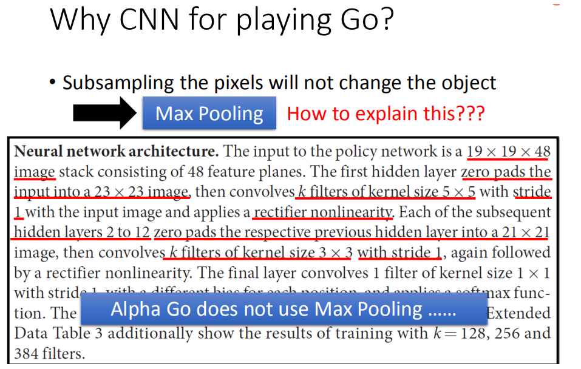

但是沒有辦法讓我想通的地方就是第三點，我們可以對一個image做subsampling，把image變為原來的1/4的大小，但是也不會影響你看這張圖的樣子。因為基於這個觀察，所以有Max Pooling這個layer。但是對圍棋來說，你可以做這件事情嗎？你可以丟到奇數行偶數類，這樣它還是同一個盤式嗎，顯然不是的，這個讓我相當的困擾。

“AlphaGo”裡面有用了Max Pooling這個架構，或許這是一個弱點。可以針對這個弱點去攻擊它，擊敗它。但是“AlphaGo”(比李世石還強)，沒有這個顯而易見的弱點

有一天我突然領悟到“AlphaGo”的CNN架構裡面有什麼特別的地方(“AlphaGo”Paper的附錄)，在“AlphaGo”Paper裡面只說了一句：用CNN架構，但它沒有在正文裡仔細描述CNN的架構，會不會實際上CNN架構裡有什麼特別的玄機呢？

在“AlphaGo”Paper的附錄裡面，描述了neuron network structure，它的input是一個19 *19 *48的image。 19 *1是可以理解，因為棋盤就是19 *19。48是咋樣來的呢？對於“AlphaGo”來說，它把每一個位置都用48個value來描述。這裡面的value包括：我們只要在一個位置來描述有沒有白子，有沒有黑子；還加上了domain-knowledge(不只是說：有沒有黑子或者白子，還會看這個位置是不是出於沒“氣”的狀態，等等)

如果讀完這段你會發現：第一個layer有做 zero pads。也就是說：把原來19*19的image外圍補上更多的0，讓它變成23 *23的image。

第一個hidden layer用的是5*5 filter(總共有k個filter)，k的值在Paper中用的是192(k=192)；stride設為1；使用RLU activation function等等。

然後你就會發現“AlphaGo”是沒有用Max Pooling，所以這個neuron network的架構設計就是“運用之妙，存乎一心”。雖然在image裡面我們都會用Max Pooling這個架構，但是針對圍棋的特性來設計neuron network的時候，我們是不需要Max Pooling這個架構的，所以在“AlphaGo”裡面沒有這個架構.

### 語音

CNN也可以用在其它的task裡面，比如說：CNN也用在影像處理上。如圖是一段聲音，你可以把一段聲音表示成Spectrogram(橫軸是時間，縱軸是那段時間裡面聲音的頻率)，紅色代表：在那段時間裡那一頻率的energy比較大。

這張image其實是我說“你好”，然後看到的Spectrogram。有通過訓練的人，看這張image，就知道這句話的內容是什麼。

人既然可以看這個image就可以知道是什麼樣的聲音訊號，那我們也可以讓機器把這個Spectrogram當做一張image。然後用CNN來判斷：input一張image，它是對應什麼樣的聲音訊號(單位可能是phone)。但是神奇的地方是：CNN裡面的時候，在語音上，我們通常只考慮在frequency方向上移動的filter。也就是說：我們的filter是長方形的，其中寬是跟image的寬是一樣的，我們在移動filter的時候，我們移這個方向(如圖所示)

如果把filter向時間的方向移動的話，結果是沒有太大的幫助。這樣的原因是：在語音裡面，CNN的output還會接其他的東西(比如:LSTM)，所以在向時間方向移動是沒有太多的幫助。

為什麼在頻率上的filter會有幫助呢？我們用filter的目的是：為了detain同樣的pattern出現在不同的range，我們都可以用同一個的filter detain出來。那在聲音訊號上面，男生跟女生髮同樣的聲音(同樣說“你好”)，Spectrogram看起來是非常不一樣的，它們的不同可能只是頻率的區別而已(男生的“你好”跟女生的“你好”，它們的pattern其實是一樣的)

所以今天我們把filter在frequency direction移動是有效的。當我們把CNN用在application時，你永遠要想一想，這個application的特性是什麼，根據那個application的特性來design network的structure

### 文本

[相關的paper](http://citeseerx.ist.psu.edu/viewdoc/download?doi=10.1.1.703.6858&rep=rep1&type=pdf)

我們知道CNN耶可以用在文字處理上面，這個是從paper截下來的圖。在文字處理上面，假設你要做的是：讓machine偵測這個word sequence代表的是positive還是negative。首先input一個word sequence，你把word sequence裡面的每一個word都用一個vector來表示。這邊的每一個vector代表word本身的sementic，如果兩個word含義越接近的話，那它們的vector在高維的空間上就越接近，這個就叫做“wordembedding”(每一個word用vector來表示) 。

當你把每一個word用vector來表示的時候，你把sentence所有的word排在一起，它就變成一張image。你可以把CNN套用在這個image上面。

當我們把CNN用在文字處理上的時候，你的filter其實是這個樣子的(如圖所示)。它的高跟image是一樣的，你把filter沿著句子裡面詞彙的順序來移動，然後你就會得到一個vector。不同的filter就會得到不同的vector，然後Max Pooling，然後把Max Pooling的結果丟到fully connect裡面，就會得到最後的結果。在文字處理上，filter只在時間的序列上移動，不會在“embedding dimension”這個方向上移動。如果你有做過類似的task(文字處理)，知道“embedding dimension”指的是什麼，你就會知道在“embedding dimension”反向上移動是沒有幫助的，因為在word embedding裡面每一個dimension的含義其實是獨立的。所以當我們如果使用CNN的時候，你會假設說：第二個dimension跟第一個dimension有某種特別的關係；第四個dimension跟第五個dimension有某種特別的關係。這個關係是重複的(這個pattern出現在不同的位置是同樣的意思)。但是在word embedding裡面，不同dimension是獨立的(independent)。所以在embedding dimension移動是沒有意義的，所以你在做文字處理的時候，你只會在sentence順序上移動filter，這個是另外的例子。

## Reference

如果你想知道更多visualization事情的話，以上是一些reference。

如果你想要用Degree的方法來讓machine自動產生一個digit，這件事是不太成功的，但是有很多其它的方法，可以讓machine畫出非常清晰的圖。這裡列了幾個方法，比如說​​：PixelRNN，VAE，GAN來給參考.

