## 問題1：越深越好？

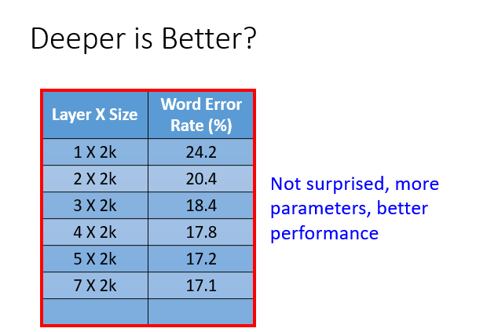

learning從一層到七層，error rate在不斷的下降。能看出network越深，參數越多，performance較也越好。

## 問題2：矮胖結構 v.s. 高瘦結構
**真正比較deep和shallow**

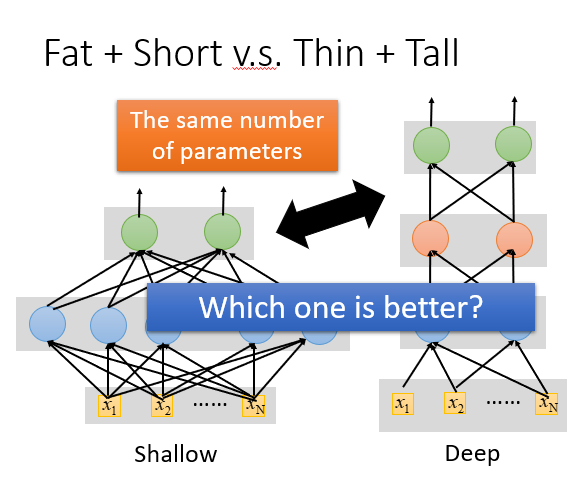

比較shallow model較好還是deep model較好，在比較的時候一個前提就是調整shallow和Deep讓他們的參數是一樣多，這樣就會得到一個矮胖的模型和高瘦的模型。

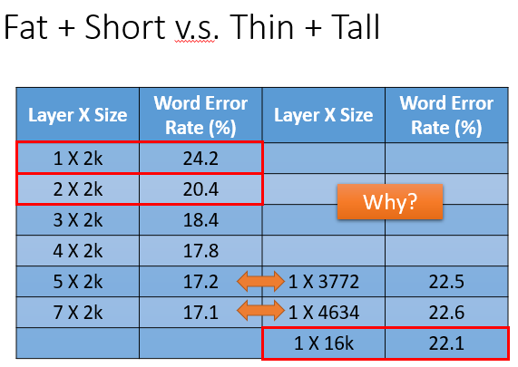

這個實驗的後半段的實驗結果是：我們用5層hidden layer，每層2000個neural，得到的error rate是17.2%（error rate是越小越好的）而用相對應的一層的模型，得到的錯誤率是22.5%，這兩個都是對應的擁有相似參數個數的模型。繼續看下面的4634個參數和16k個參數，如果你只是單純的增加parameters，是讓network變寬不是變高的話，其實對performance的幫助是比較小的。

所以如果把network變高對performance是很有幫助的，network變寬對performance幫助沒有那麼好的

## 引入模塊化

問題1：為什麼變高比變寬好呢？

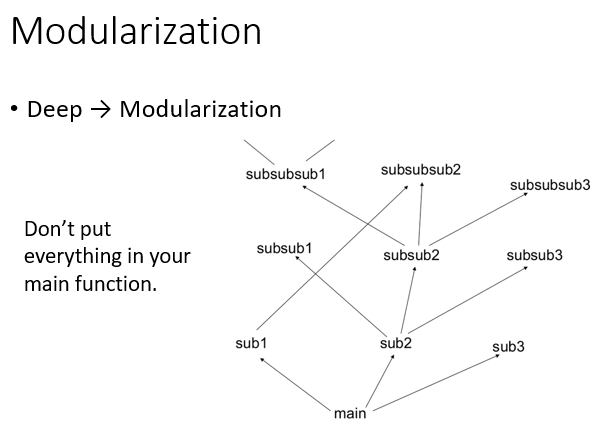

我們在做deep learning的時候，其實我們是在模塊化這件事。我們在main function時，我們會寫一些sub function,一層一層結構化的架構。有一些function是可以共用的，就像一個模型，需要時候去用它減小複雜度(如圖所示)

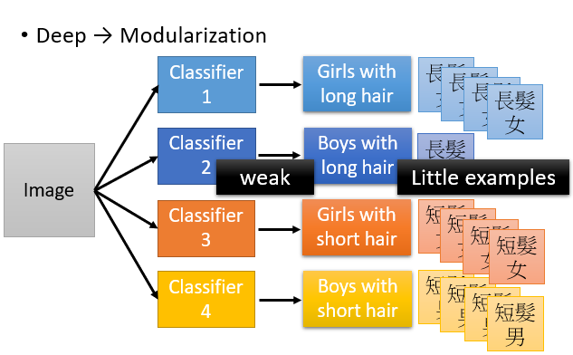

在 machine learning上，可以想像有這樣的test。我們現在要做影像分類，我們把image分為四類(每個類別都有一些data)，然後去train 四個classifier。但問題是boys with long hair的data較少(沒有太多的training data)，所以這個boys with long hair的classifier就比較weak(performance比較差)

解決方法：利用模組化的概念(modularization)的思想

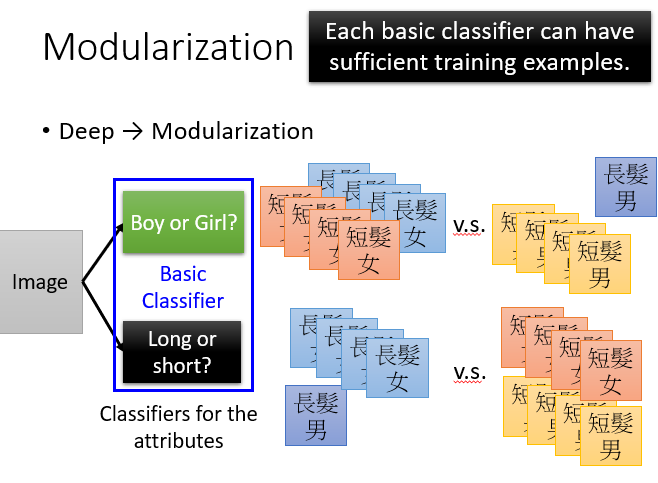

假設我們先不去解那個問題，而是把原來的問題切成比較小的問題。比如說，我們先classifier，這些classifier的工作就是決定有沒有一種特徵出現。
現在就是不直接去分類長頭髮男生還是短頭髮男生，而是我們先輸入一張圖片，判斷是男生還是女生和是長頭髮還是短頭髮，雖然說長頭髮的男生很少，但通過女生的數據和男生的數據都很多，雖然長頭髮的數據很少，但是短髮的人和長發的人的數據都很多。所以，這樣訓練這些基分類器就不會訓練的太差(有足夠的數據去訓練)

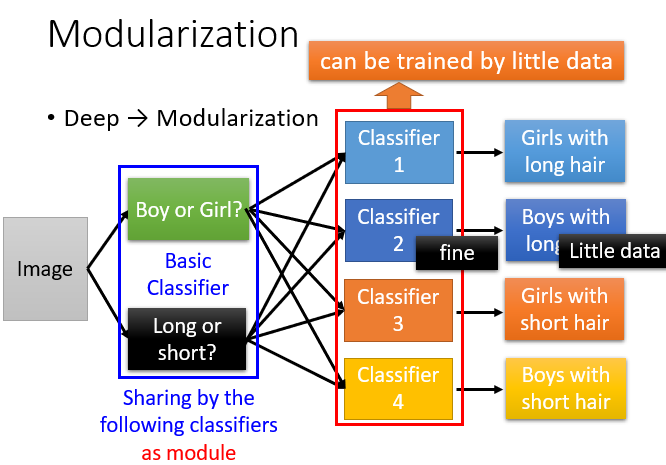

現在我們要解決真正問題的時候，你的每個分類器就可以去參考輸出的基本特徵，最後要下決定的分類器，它是把前面的基分類器當做模組，每一個分類器都共用同一組模型(只是用不同的方式來使用它而已)。對分類器來說，它看到前面的基分類器告訴它說是長頭髮是女生，這個分類器的輸出就是yes，反之就是no。

所以他們可以對後面的classifier來說就可以利用前面的classifier(中間)，所以它就可以用比較少的訓練數據就可以把結果訓練好。

## 深度學習

問題2：深度學習和模組化有什麼關係？

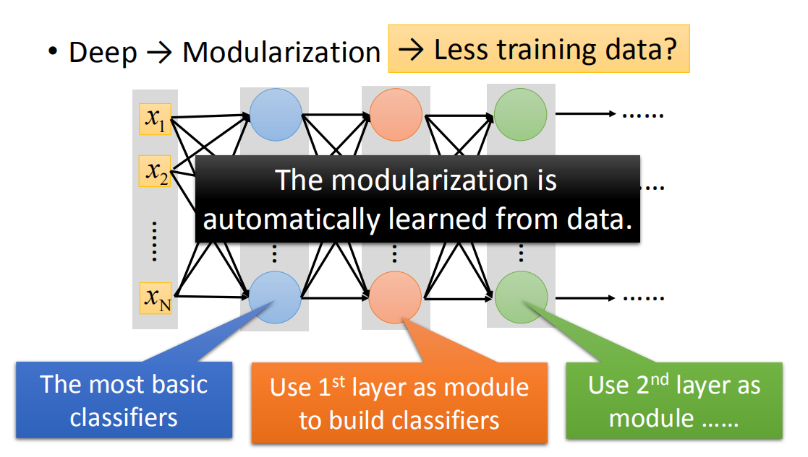
每一層neural可以被看做是一個basic classifier，第一層的neural就是最基分類器，第二層的neural是比較複雜的classifier，把第一層basic classifier 的output當做第二層的input(把第一層的classifier當做module)，第三層把第二層當做module，以此類推。

在做deep learning的時候，如何做模組化這件事，是機器自動學到的。

做modularization這件事，把我們的模型變簡單了(把本來複雜的問題變得簡單了)，把問題變得簡單了，就算訓練數據沒有那麼多，我們也就可以把這個做好

## 使用語音識別舉例

在語音上我們為什麼會用到模組化的概念

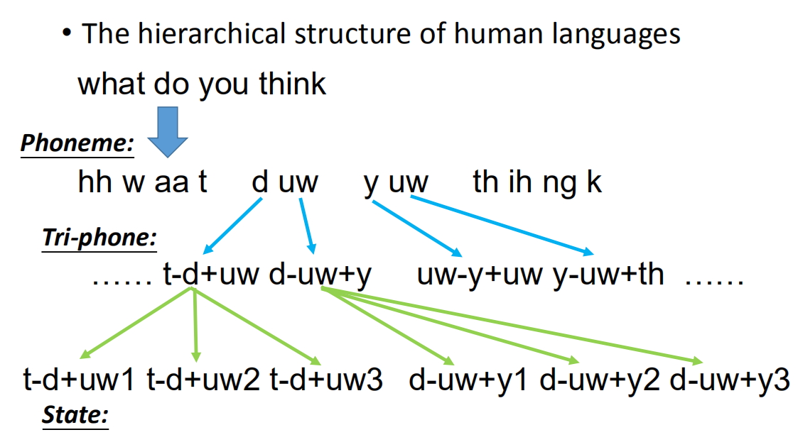
當你說一句：what do you think，這句話其實就是由一組phoneme(音素)所組成的。同樣的phoneme可能會有不太一樣的發音。當你發d-uw的u時和發y-uw的u時，你心裡想的是同一個phoneme，心裡想要發的都是-uw。但是因為人類口腔器官的限制，所以你沒辦法每次發的-uw都是一樣的。因為前面和後面都接了其他的phoneme，因為人類發音口腔器官的限制，你的phoneme發音會受到前後的影響。為了表達這件事情，我們會給同樣的phoneme不同的model，這就是Tri-phone。

Tri-phone表達是這樣的，你把這個-uw加上前面的phoneme和後面的phoneme，跟這個-uw加上前面phoneme和後面的phonemeth，就是Tri-phone(這不是考慮三個phone的意思)

這個意思是說，現在一個phone用不同的model來表示，一個phoneme它的constant phone不一樣,我們就要不同model來模擬描述這個phoneme。

一個phoneme可以拆成幾個state，state有幾個通常自己定義，通常就定義為三個state

### 語音辨識：

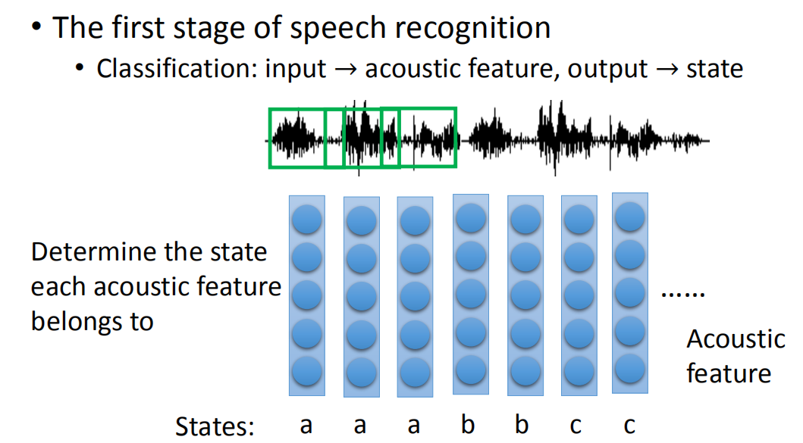
語音辨識特別的複雜，現在來講第一步，第一步要做的事情就是把acoustic feature轉成state。所謂的acoustic feature簡單說起來就是聲音訊號發生一段wave phone，這這個wave phone通常取一段window(這個window通常不是太大)。一個window裡面就用一個feature來描述裡面的特性，那這個就是一個acoustic feature。你會在這個聲音訊號上每隔一段時間來取一個window，聲音訊號就變成一串的vector sequence。在語音辨識的第一階段，你需要做的就是決定了每一個acoustic feature屬於哪一個state。把state轉成phone，phoneme，在把phoneme轉成文字，接下來考慮同音異字的問題，這不是我們今天討論的問題。

## 傳統的實現方法：HMM-GMM

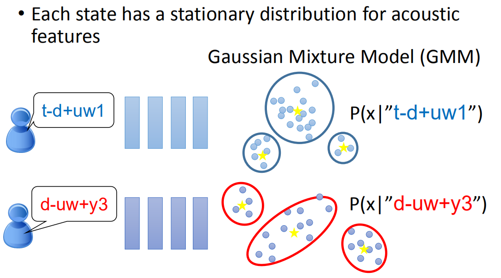
在deep learning之前和之後，語音辨識有什麼不同，這時候你就更能體會deep learning會在語音辨識有顯著的成果。

我們要機器做的是，在第一階段做的是分類這件事，就是決定一個acoustic feature屬於哪一個state，傳統方式是做GNN

我們假設每一個state就是一個stationary，屬於每一個state的acoustic feature的分佈是stationary，所以你可以用model來描述。

比如第一個state，可以用GNN來描述；另外一個state，可以用另外一個GNN來描述。這時候給你一個feature，你就可以說每一個acoustic feature從每一個state產生出來的機率，這個就叫做Gaussian Mixture Model

仔細一想，這一招根本不太work，因為這個Tri-phone的數目太多了。一般的語言(中文、英文)都有將近30、40phone。在Tri-phone裡面，每一個phoneme隨著它constant不同，你要用不同的model。到底有多少個Tri-phone，你有30的三次方的Tri-phone(27000)，每個Tri-phone有三個state，所以，你有數万的state，而你每一個state都要用Gaussian Mixture Model來描述，參數太多了。

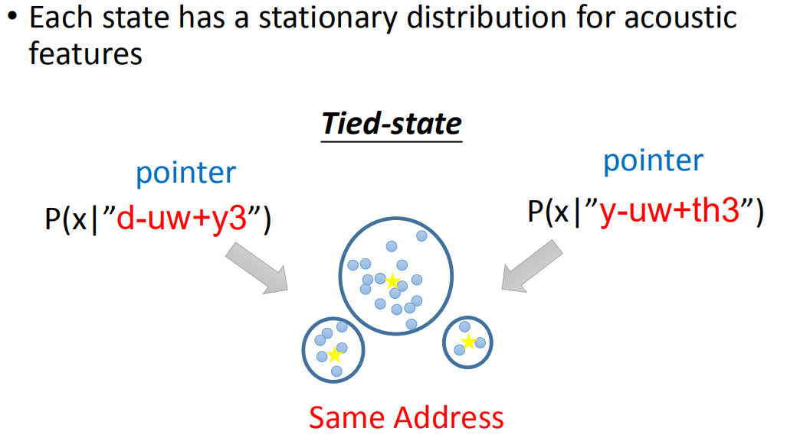

有一些state，他們會共用同一個model distribution，這件事叫做Tied-state。加入說，我們在寫一些程式的時候，不同的state名稱就好像是pointer，那不同的pointer他們可能會指向同樣的distribution。所以有一些state，它的distribution是共用的，有些是不共用的。那到底哪些事共用的，哪些不是共用的，那麼就變成你要憑著經驗和一些語言學的知識來決定哪些state是要共用的

這些是不夠用的，如果只分state distribution是共用的或不共用的，這樣就太粗了。所以就有人開始提一些想法：如何讓它部分共用等等。

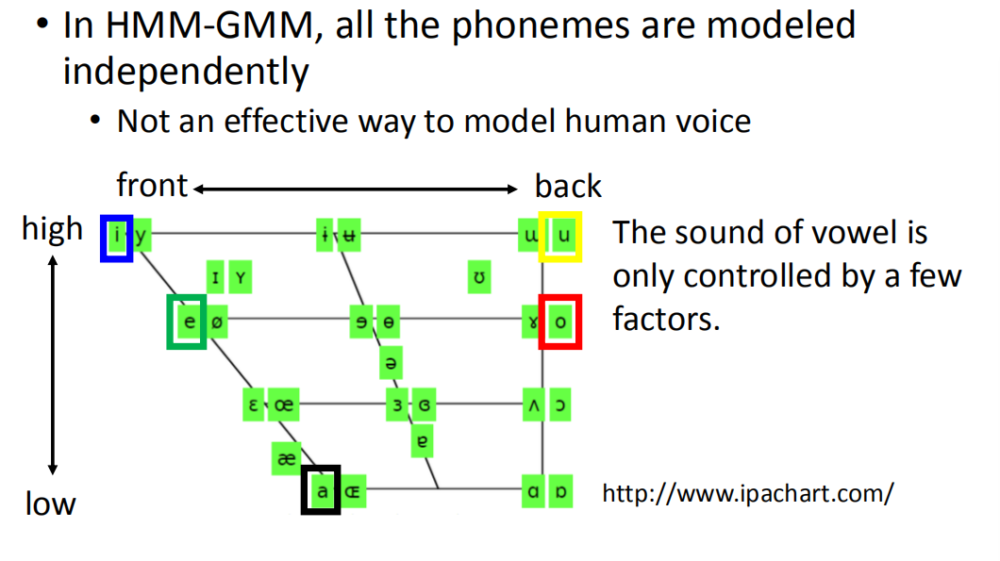

仔細想想剛才講的HMM-GMM的方式，所有困惑的是state是independently,這件事是不effection對model人類的聲音來說。

想看人類的聲音來說，不同的phoneme雖然歸為不同的因素，分類歸類為不同的class，但這些phoneme不是完全無關的。這些都是人類發音器官generate出來的，它們中間是有根據人類發音器官發音的方式，之間是有關係的

舉例來說，在這張圖上畫出了人類語言所有的母音，那麼這個母音的發音其實就只是受到三件事的影響。一個是你舌頭前後的位置，一個是你舌頭上下的位置，還有一個是你的嘴型。 (母音就只受到這三件事的影響)在這張圖你可以找到最常見的母音(i,e,a,u,o)i,e,a,u,0它們之間的差別就是當你從a發到e發到i的時候，你的舌頭是由往上的。 i跟u的差別是你的舌頭在前後的區別。你可能感覺不要舌頭的位置在哪裡，你要知道的是舌頭的位置是不是真的跟這個圖上一樣，你可以在對著鏡子喊a,e,i,u,o，你就會發現你舌頭的位置就跟這個圖上的形狀一模一樣的。

這這個圖上，同一個位置的母音代表說舌頭的位置是一樣的但是嘴型是不一樣的。比如說，我們看最左上角的母音，一個是i一個是y，i跟y的差別就是嘴型不一樣的。如果是i的話嘴型是扁的，如果是y的話嘴型是圓的，所以改變嘴型就可以從i到y。

所以這個不同的phoneme之間是有關係的，如果說每個phoneme都搞一個model，這件事是沒有效率的。

## 深度學習的實現方法 DNN

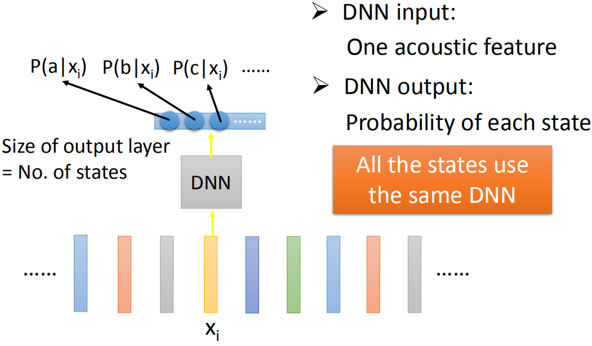

如果是deep learning的話，那你就是去learn一個neural network，這個neural network的input就是一個acoustic feature，output就是這個feature屬於每一個state的機率。就是一個很單純classification probably跟作業上做的影像是沒有差別的。 learn一個DNN，input是一個acoustic feature，然後output就是告訴你說，acoustic feature屬於每個state的機率，那最關鍵的一點是所有的state都共用同一個DNN，在這整個辨識裡面就做一個DNN而已，你沒有每一個state都有一個DNN。

所以就有人說，有些人是沒有想清楚的這個deep learning到底是power在哪裡，從GMM到deep learning厲害的地方就是本來GMM通常也就64Gauusian matrix，那DNN有10層，每層都有1000個neural，參數很多，參數變多performance就會變好，這是一種暴力碾壓的方法。

其實DNN不是暴力碾壓的方法，你仔細想想看，在做HMM-GMM的時候，你說GMM有64個matrix覺得很簡單，那其實是每一個state都有一個Gauusian matrix，真正合起來那參數是多的不得了的。如果你仔細去算一下GMM用的參數和DNN用的參數，在不同的test去測這件事情，他們的參數你就會發現幾乎是差不多多的。 DNN幾乎是一個很大的model，GMM是很多很小的model，但將這兩個比較參數量是差不多多的。但是DNN是將所有的state通通用同一個model來做分類，會使有效率的方法。

## 兩種方法的對比 GMM v.s. DNN

舉例來說，如果你今天把一個DNN它的某一個hidden layer拿出來，然後把那個hidden layer假設有1000個neural你沒有辦法分析它，但是你可以把那1000個layer的output降維降到二維。所以在這個圖上面呢，一個點代表一個acoustic feature，然後它通過DNN以後，把這個output降到二維，可以發現它的分佈是這樣的。

在這個圖上的顏色代表什麼意思呢？這邊顏色其實就是a,e,i,o,u這樣，特別把這五個母音跟左邊這個圖用相同的顏色框起來。那你會神奇的發現，左邊這五個母音的分佈跟右邊的圖幾乎是一樣的。所以你可以發現DNN做的事情比較low layer的事情它其實是在它並不是真的要馬上去偵測這個發音是屬於哪個state。它的做事是它先觀察說，當你聽到這個發音的時候，人是用什麼方式在發這個聲音的，它的石頭的位置在哪裡(舌頭的位置是高還是低呢，舌頭位置是在前還是後呢等等)。然後lower layer比較靠近input layer先知道發音的方式以後，接下來的layer在根據這個結果去說現在的發音是屬於哪個state/phone。所以所有的phone會用同一組detector。也就是這些lower layer是人類發音方式的detector，而所有phone的偵測都用是同一組detector完成的，所有phone的偵測都share(承擔)同一組的參數，所以這邊就做到模組化這件事情。當你做模組化的事情，你是要有效率的方式來使用你的參數。

## 普遍性定理

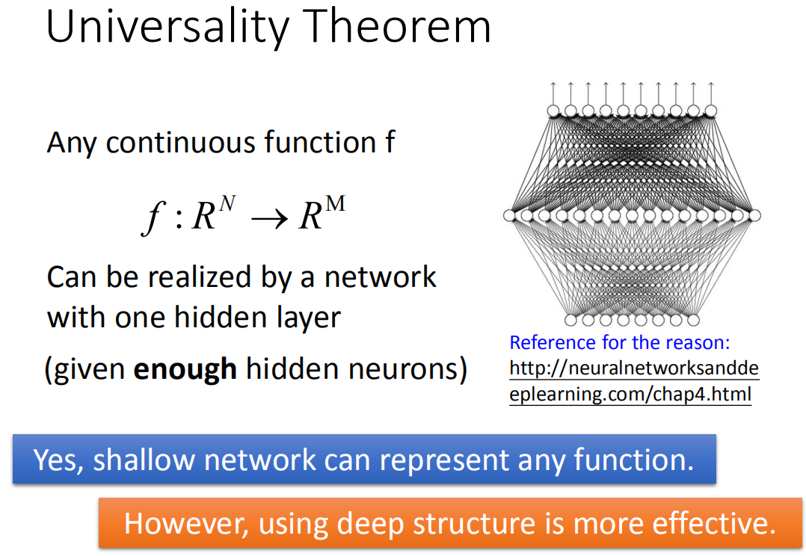

過去有一個理論告訴我們說，任何continuous function，它都可以用一層neural network來完成(只要那一層只要夠寬的話)。這是90年代，很多人放棄做deep learning的原因，只要一層hidden layer就可以完成所有的function(一層hidden layer就可以做所有的function)，那做deep learning的意義何在呢？ ，所以很多人說做deep是很沒有必要的，我們只要一個hidden layer就好了。

但是這個理論沒有告訴我們的是，它只告訴我們可能性，但是它沒有告訴我們說要做到這件事情到底有多有效率。沒錯，你只要有夠多的參數，hidden layer夠寬，你就可以描述任何的function。但是這個理論沒有告訴我們的是，當我們用這一件事(我們只用一個hidde layer來描述function的時候)它其實是沒有效率的。當你有more layer(high structure)你用這種方式來描述你的function的時候，它是比較有效率的。

## 舉例

### 使用邏輯電路舉例

Analogy(當你剛才模組化的事情沒有聽明白的話，這時候舉個例子)

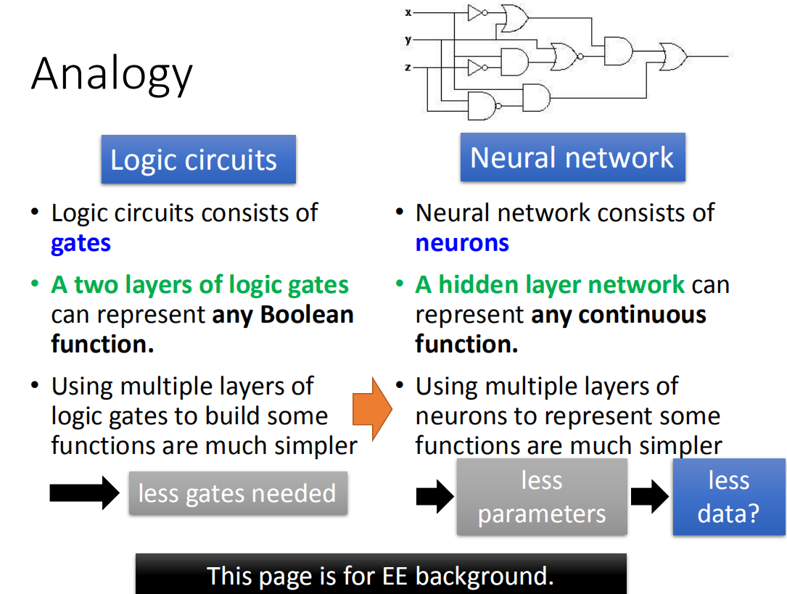
邏輯電路(logistic circuits)跟neural network可以類比。在邏輯電路里面是有一堆邏輯閘所構成的在neural network裡面，neural是有一堆神經元所構成的。若你有修過邏輯電路的話，你會說其實只要兩層邏輯閘你就可以表示任何的Boolean function，那有一個hidden layer的neural network(一個neural network其實是兩層，input，output)可以表示任何的continue function。

雖然我們用兩層邏輯閘就描述任何的Boolean function，但實際上你在做電路設計的時候，你根本不可能會這樣做。當你不是用兩層邏輯閘而是用很多層的時候，你拿來設計的電路是比較有效率的(雖然兩層邏輯閘可以做到同樣的事情，但是這樣是沒有效率的)。若如果類比到neural network的話，其實是一樣的，你用一個hidden layer可以做到任何事情，但是用多個hidden layer是比較有效率的。你用多層的neural network，你就可以用比較少的neural就完成同樣的function，所以你就會需要比較少的參數，比較少的參數意味著不容易overfitting或者你其實是需要比較少的data ，完成你現在要train的任務。 (很多人的認知是deep learning就是很多data硬碾壓過去，其實不是這樣子的，當我們用deep learning的時候，其實我們可以用比較時少的data就可以達到同樣的任務)

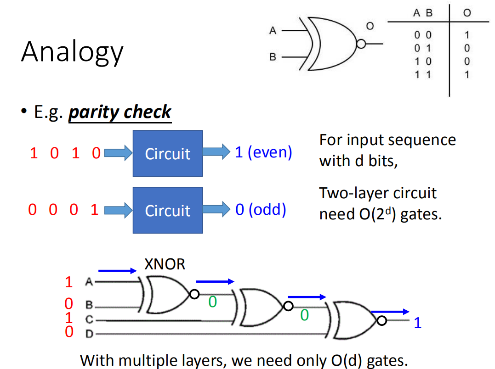
那我們再從邏輯閘舉一個實際的例子，假設我們要做parity check(奇偶性校驗檢查)(你希望input一串數字，若如果裡面出現1的數字是偶數的話，它的output就是1；如果是奇數的話，output就是0).假設你input sequence的長度總共有d個bits，用兩層邏輯閘，理論可以保證你要$O(2^d)$次方的gates才能描述這樣的電路。但是你用多層次的架構的話，你就可以需要比較少的邏輯閘就可以做到parity check這件事情，

舉例來說，你可以把好幾個XNOR接在一起(input和output真值表在右上角)做parity check這件事。當你用多層次的架構時，你只需要$O(d)$gates你就可以完成你現在要做的這個任務，對neural network來說也是一樣的，可以用比較的neural就能描述同樣的function。

### 使用剪窗花舉例

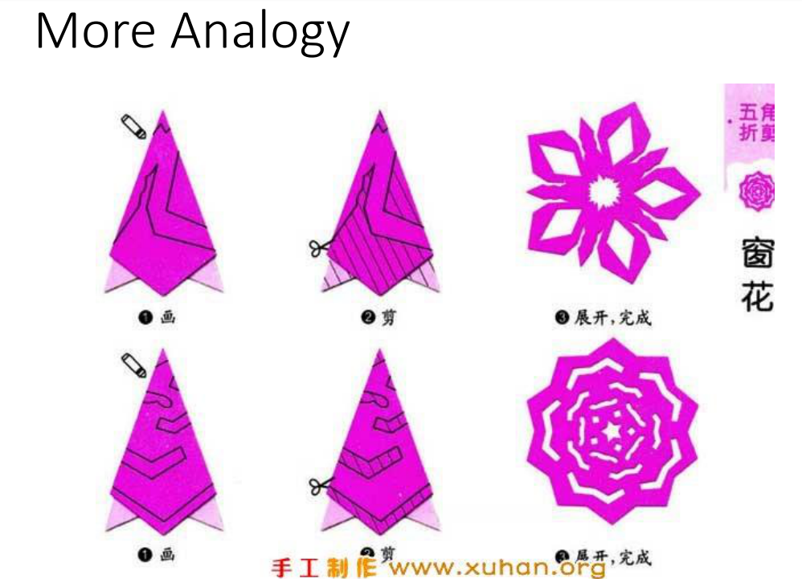
一個日常生活中的例子，這個例子是剪窗花(折起來才去剪，而不是真的去把這個形狀的花樣去剪出來，這樣就太麻煩了)，這個跟deep learning有什麼關係呢？

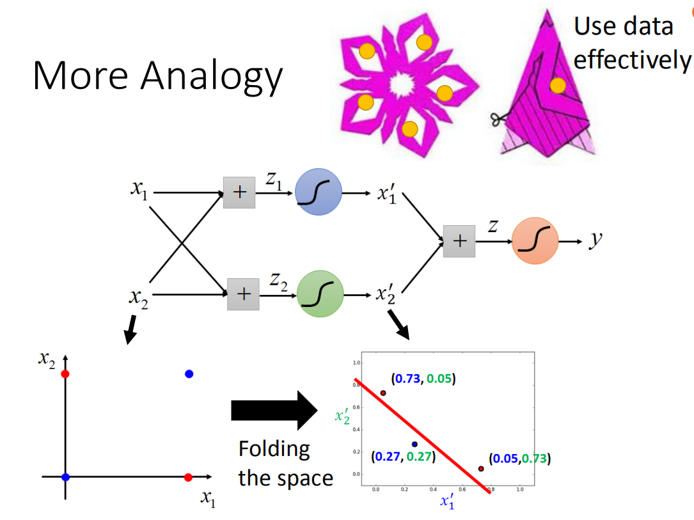

這個跟deep learning 有什麼關係呢，我們用之前講的例子來做比喻，假設我們現在input的點有四個(紅色的點是一類，藍色的點是一類)。我們之前說，如果你沒有hidden layer的話，如果你是linear model，你怎麼做都沒有辦法把藍色的點和紅色的點分來開，當你加上hidden layer會發生怎樣的事呢？當你加hidde layeer的時候，你就做了features transformation。你把原來的$x_1$,$x_2$轉換到另外一個平面$x_1$plane,$x_2$plane(藍色的兩個點是重合在一起的，如右圖所示)，當你從左下角的圖通過hidden layer變到右下角圖的時候，其實你就好像把原來這個平面對折了一樣，所以兩個藍色的點重合在了一起。這就好像是說剪窗花的時候對折一樣，如果你在圖上戳一個洞，那麼當你展開的時候，它在這些地方都會有一些洞(看你對折幾疊)。如果你把剪窗花的事情想成training。你把這件事想成是根據我們的training data，training data告訴我們說有畫斜線的部分是positive，沒畫斜線的部分是negative。假設我們已經把這個已經折起來的時候，這時候training data只要告訴我們說，在這個範圍之內(有斜線)是positive，在這個區間(無斜線)展開之後就是複雜的圖樣。 training data告訴我們比較簡單的東西，但是現在有因為對折的關係，展開以後你就可以有復雜的圖案(或者說你在這上面戳個洞，在就等同於在其他地方戳了個洞)。

所以從這個例子來看，一筆data，就可以發揮五筆data效果。所以，你在做deep learning的時候，你其實是在用比較有效率的方式來使用你的data。你可能很想說真的是這樣子嗎？我在文件上沒有太好的例子。所以我做了一個來展示這個例子。

### 使用二位坐標舉例

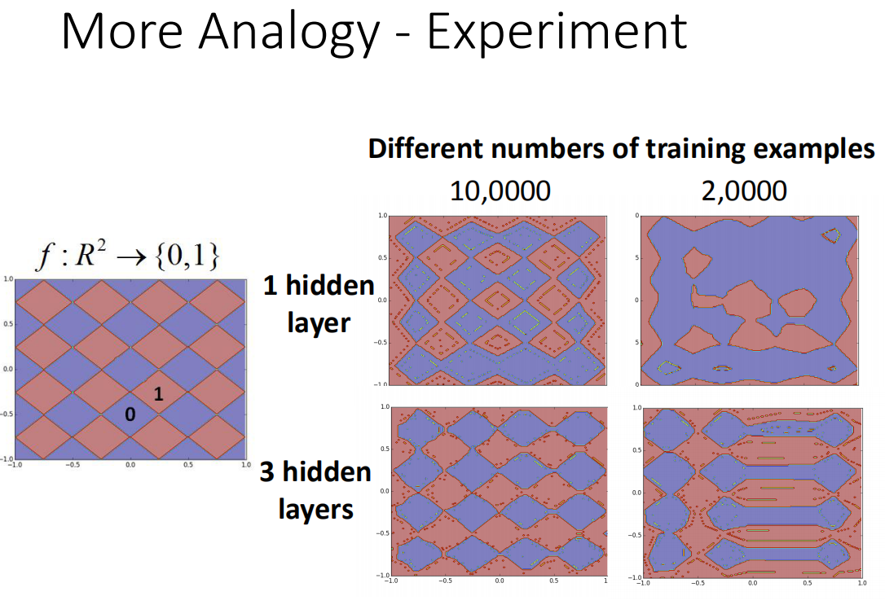

我們有一個function，它的input是二維$R^2$(坐標)，它的output是{0，1}，這個function是一個地毯形式的function(紅色菱形的output就要是1，藍色菱形output就要是0)。那現在我們要考慮如果我們用了不同量的training example在1個hidden layer跟3個hidden layer的時候。我們看到了什麼的情形，這邊要注意的是，我們要特別調整一個hidden layer和3個hidden layer的參數，所以並不是說當我是3個hidden layer的時候，是一個hidden layer的network。 (這1個neural network是一個很胖的neural network，3個hidden layer是一個很瘦的neural network，他們的參數是要調整到接近的)

那現在這邊是要有10萬筆data的時候，這兩個neural都可以learn出這樣的train data(從這個train data sample 10萬筆data然後去給它學，它學出來就是右邊這樣的)

那現在我們減小參數的量，減少到只用2萬筆來做train，這時候你會發現說，你用一個hidden lyaer的時候你的結果的就崩掉了，但如果是3個hidden layer的時候，你的結果變得只是比較差(比train data多的時候要差)，但是你會發現說你用3個hidden layer的時候是有次序的崩壞。這個結果(最右下角)就像是你今天要剪窗花的時候，折起來最後剪壞了，展開以後成這個樣子。你會發現說在使用比較少的train data的時候，你有比較多的hidden layer最後得到的結果其實是比較好的。

## 端到端的學習

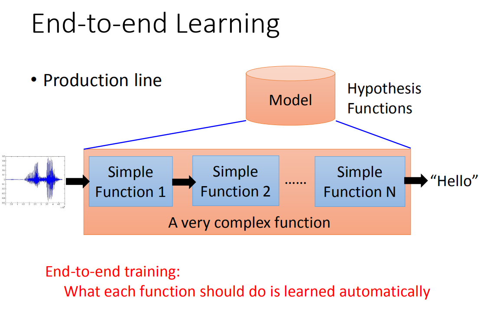

當我們用deep learning的時候，另外的一個好處是我們可以做End-to-end learning。

所謂的End-to-end learning的意思是這樣，有時候我們要處理的問題是非常的複雜，比如說語音辨識就是一個非常複雜的問題。那麼說我們要解一個machine problem我們要做的事情就是，先把一個Hypothesis funuctions(也就是找一個model)，當你要處理1的問題是很複雜的時候，你這個model裡面它會是需要是一個生產線(由許多簡單的function串接在一起)。比如說，你要做語音辨識，你要把語音送進來再到通過一層一層的轉化，最後變成文字。當你多End-to-end learning的時候，意思就是說你只給你的model input跟output，你不告訴它說中間每一個function要咋樣分工(只給input跟output，讓它自己去學)，讓它自己去學中間每一個function(生產線的每一個點)應該要做什麼事情。

那在deep learning裡面要做這件事的時候，你就是疊一個很深的neural network，每一層就是生產線的每一個點(每一層就會學到說自己要做什麼樣的事情)

### 語音識別

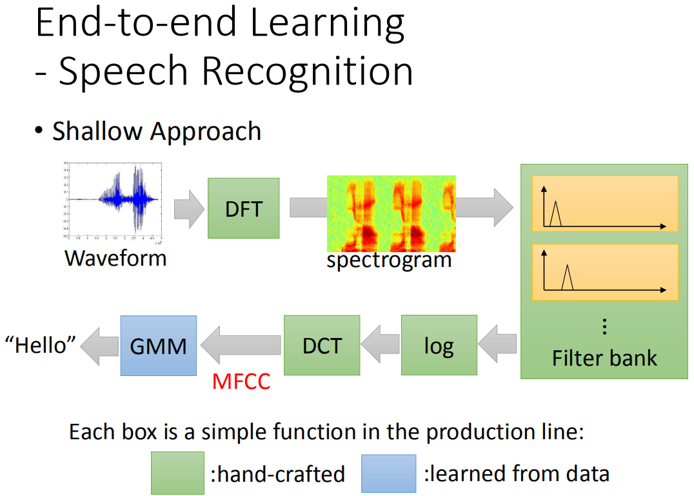
比如說，在語音辨識裡面。還沒有用deep learning的時候，我們怎麼來做語音辨識呢，我們可能是這樣做的。

先有一段聲音訊號(要把聲音對應成文字),你要先做DF，你不知道這是什麼也沒有關係，反正就是一個function，變成spectogram，這個spectogram通過filter bank(不知道filter bank是什麼，沒有關係，就是生產線的另外一個點)，最後得到output，然後再去log(取log是非常有道理的)，然後做DCT得到MFCC,把MFCC丟到GMM裡面，最後你得到語音辨識的結果。

只有最後藍色的這個bank是用訓練數據學出來的，前面這些綠色的這些都是人手定(研究人的生理定出了這些function)。但是後來有了deep learning以後，這些東西可以用neural network把它取代掉。你就把你的deep network多加幾層就可以把DCT拿掉。現在你可以從spectogram開始做，你這這些都拿掉，通通都拿deep neural network取代掉，也可以得到更好的結果。 deep learning它要做的事情，你會發現他會自動學到要做filter bank(模擬人類聽覺器官所製定的filter)這件事情

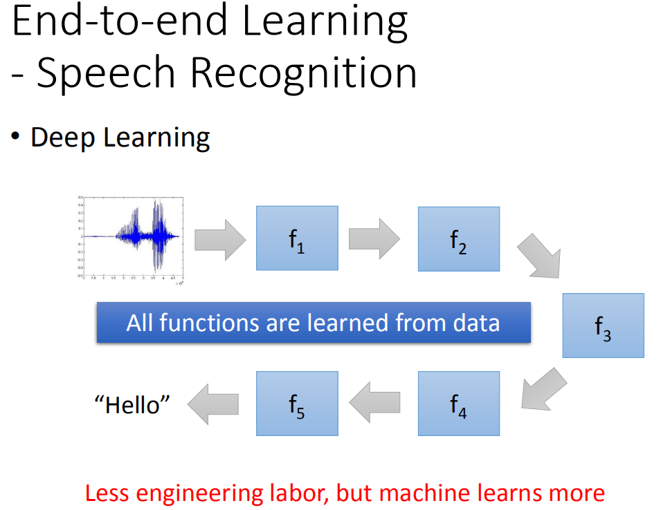
接下來就有人挑戰說我們可不可以疊一個很深很深的neural network，直接input就是target main聲音訊號，output直接就是文字，中間完全就不用做，那就不需要學信號與系統

Google 有一篇paper是這樣子，它最後的結果是這樣子的，它拼死去learn了一個很大neural network，input就是聲音訊號，完全不做其它的任何事情，它最後可以做到跟有Fourier transform的事情打平，也僅次於打平而已。我目前還沒看到input一個聲音訊號，比Fourier transform結果比這要好的。

### 圖像識別

剛剛都是講語音的例子，影像也是差不多的。大家也都知道，我們就跳過去(過去影像也是疊很多很多的graph在最後一層用比較簡單的classifier)

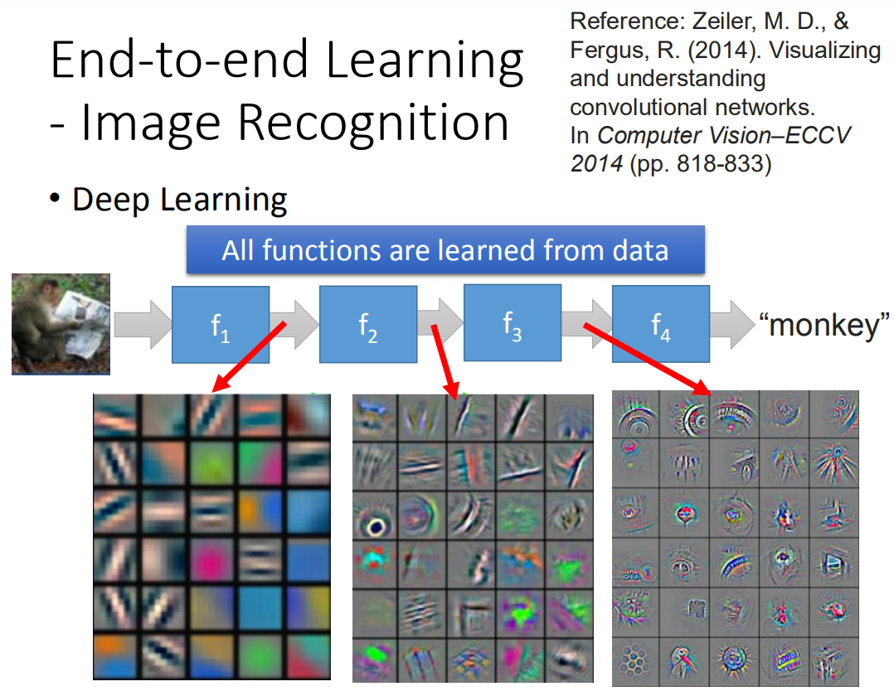
那現在用一個很深的neural，input直接是piexel，output裡面是影像是什麼
### 更複雜的任務

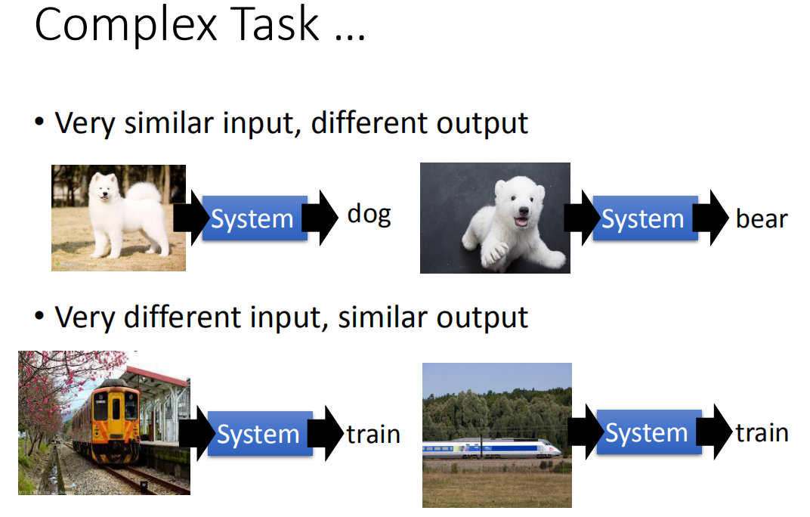
那deep learning還有什麼好處呢。通常我們在意的task是非常複雜的，在這非常複雜的task裡面，有非常像的input，會有很不同的output。舉例來說，在做影視辨識的時候，白色的狗跟北極熊看起來很像，但是你的machine左邊要outp dog，右邊要output bear。有時候很不一樣的東西，其實是一樣的，橫著看火車和側面看火車，他們其實是不一樣，但是output告訴我說一樣的。

今天的neural只有一層的話(簡單的transform)，你沒有辦法把一樣的東西變成很不一樣，把不一樣的東西變的很像，原來input很像的東西結果看起來很不像，你要做很多層次的轉換。

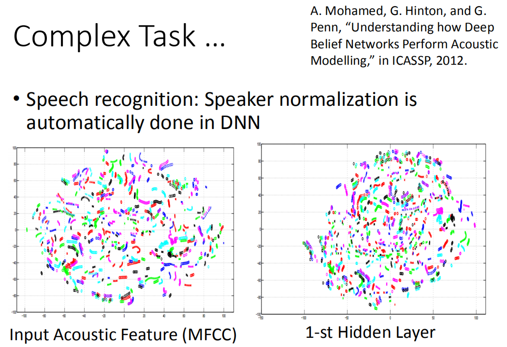
舉例來說，看這個例子(這個是語言的例子)。在這個圖上，把MFCC投影到二維上，不同顏色代表的是不同的人說的話。在語音上你會發現說，同樣的句子，不同人的說，它的聲音訊號，看起來是不一樣的(這個紅色看起來跟藍色看起來沒關係，藍色跟綠色沒有關係)。有人看這個圖，語音辨識不能做呀。不同的人說話太不一樣了。

如果你今天learn 一個neural network，如果你只要第一層的hidden layer的output，你會發現說，不同的人講的同樣的句子還是很不一樣的。

但是你看第8個hidden layer output的時候， 你會發現說，不同的人說著同樣的句子，它自動的被line在一起了，也就是說這個DNN在經過很多hidden layer轉換的時候，它把本來看起來很不像的東西，它知道應該是一樣的(map在一起了)。在右邊的這個圖上，你會看到一條一條的線，在這些線中你會看到不同顏色的聲音訊號。也就是說不同的人說著同樣的話經過8個hidden layer的轉換以後，對neural network來說，它就變得很像。

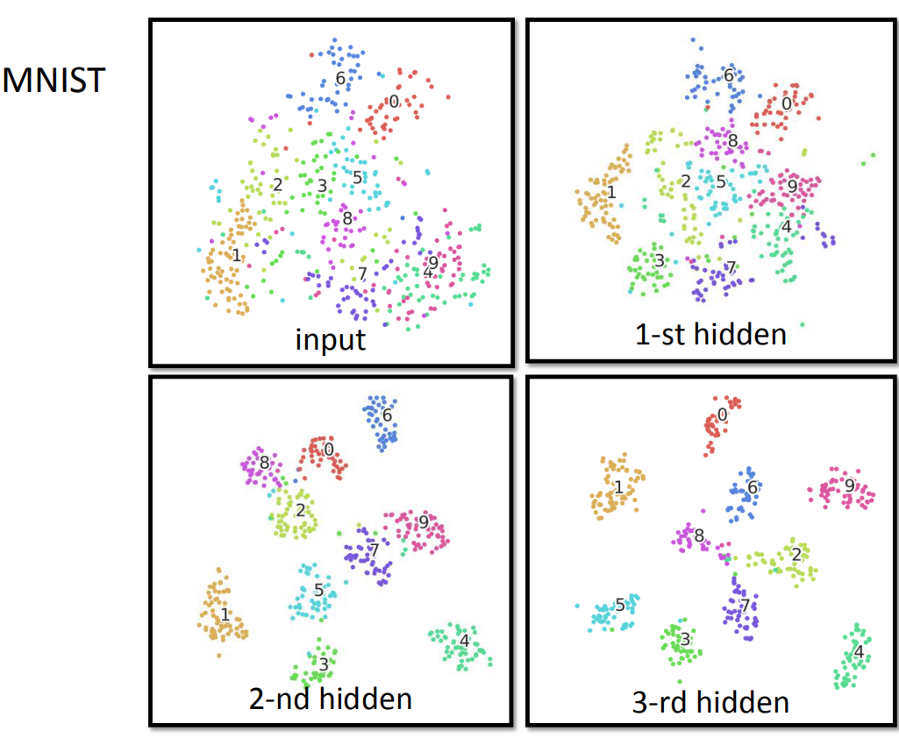
手寫數字辨識的例子，input feature是左上角這張圖(28*28 pixel，把28 *28pixel project到二維平面的話就是左上角的圖)，在這張圖上，4跟9幾乎是疊在一起的(4跟9很像，幾乎沒有辦法把它分開)。但是我們看hidden layer的output，這時候4跟9還是很像(離的很近)，我們看第2個hidden layer的output(4,7,9)逐漸被分開了，到第三個hidden layer ，他們會被分的更開。所以你今天要原來很像的input 最後要分的很開，那你就需要好多hidden layer才能辦到這件事情

