## 監督學習和半監督學習

在 supervised 裡面，你就是有一大推的 training data，這些 training data 的組成是一個 function 的 input 跟 output，假設你有 R 筆 train data，每一筆 train data 有 x^r, \hat{y}^r 。假設 x^r 是一張 image，\hat{y} 是class label。 semi-supervised learning 是在 label 上面，是有另外一組unlabel 的data，這組 data 記做 x^u ,這組 data 只有 input，沒有 output( U 筆data)。在做semi-superised learning 時，U 遠遠大於R(unlabel的數量遠遠大於label data的數量)。 semi-surprised learning 可以分成兩種，一種是 transductive learning，一種是 inductive learning。這兩種最簡單的分法是：在做 transductive 的時候，你的 unlabel data 就是你的 testing data，inductive learning 就是說：不把 unlabel data 考慮進來。

為什麼做 semi-supervised learning，因為有人常會說，我們缺 data，**其實我們不是缺 data，其實我們缺的是與 label 的 data。** 比如說，你收集 image 很容易(在街上一直照就行了)，但是這些 image是沒有的 label。 label data 是很少的，unlabel 是非常多的。**所以semi-surprvised learning 如果可以利用這些u nlabel data來做某些事是會很有價值的。**

我們人類可能一直是在 semi-supervised learning，比如說，小孩子會從父母那邊得到一點點的 supervised(小孩子在街上，問爸爸媽媽這是什麼，爸爸媽媽說：這是狗。在以後的日子裡，小孩子會看到很多奇奇怪怪的東西，也沒有人在告訴這是什麼動物，但小孩子依然還是會判別出狗)

### 半監督學習的好處

為什麼 semi-supervised learning 有可能會帶來幫助呢？假設我們現在要做分類的 task，建一個貓跟狗的 classifier，我們同時有一大堆貓跟狗的圖片。這些圖片是沒有 label 的，並不知道哪些是貓哪些是狗。

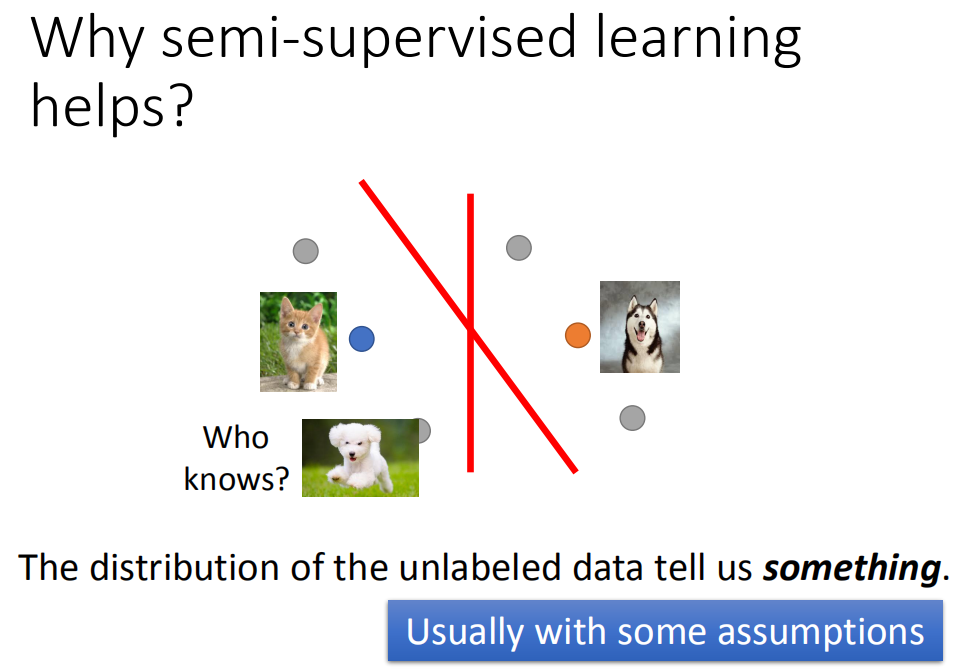

那今天我們只考慮有label 的貓跟狗的 data，畫一個 boundary，將貓跟狗的 train data 分開的話，你可能就會畫在中間(垂直)。那如果 unlabel 的分佈長的像灰色的點這個樣子的話，這可能會影響你的決定。雖然 unlabel data 只告訴我們了 input，但**unlabeled data的分佈**可以告訴我們一些事。那你可能會把 boundary 變為這樣(斜線)。但是 semi-supervised learning 使用 unlabel 的方式往往伴隨著一些假設，其實 semi-supervised learning 有沒有用，是取決於你這個假設符不符合實際/精不精確。

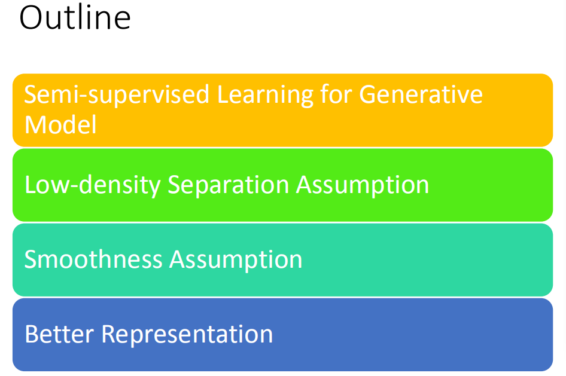

這邊要講四件事，第一個是在 generative model 的時候，怎麼用 semi-supervised learning。還要講兩個還蠻通用的假設，一個是 Low-density Separation Assumption,另一個是 Smoothness Assumption，最後還有 Better Representation

## 監督生成模型和半監督生成模型
### 監督生成模型

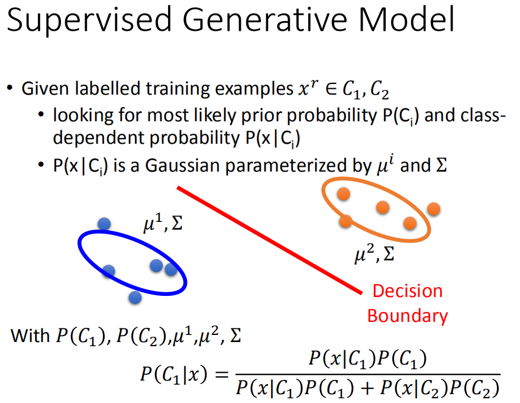

我們都已經看過，supervised generative model，在supervised learning裡面有一堆 train example，你知道分別是屬於 class1，class2。你會去估測class1，class2的 probability

假設每一個 class 它的分佈都是一個 Gaussion distribution，那你會估測說 class1 是從 μ 是 μ^1，covariance是 \Sigma 的 Gaussion 估測出來的，class2 是從 μ 是 μ ^2，covariance是 \Sigma 的Gaussion 估測出來的。

那現在有了這些 probability，有了這些 μ、covariance，你就可以估測 given 一個新的 data 做 classification，然後你就會決定 boundary 的位置在哪裡。

### 半監督生成模型

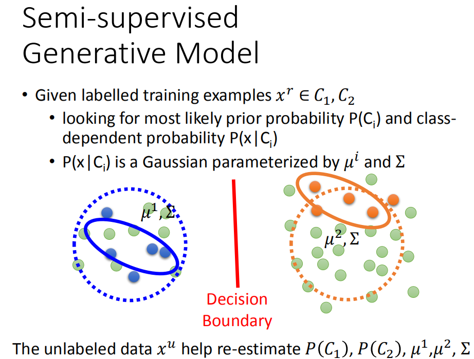

但是今天給了我們一些 unlabel data，它就會影響你的決定。舉例來說，我們看左邊這筆data，我們假設綠色這些使unlabel data，那如果你的 \mu 跟 variance 是 \mu ^1,\mu ^2,\Sigma 顯然是不合理的。今天這個 \Sigma 應該比較接近圓圈，或者說你在 sample 的時候有點問題，所以你 sample 出比較奇怪的 distribution。比如說，這兩個class label data是比較多的(可能class2是比較多的，所以這邊 probability是比較大的)，總之看這些unlabel data以後，會影響你對probability，\mu, \Sigma的估測，就影響你的 probability 的式子，就影響了你的decision boundary。

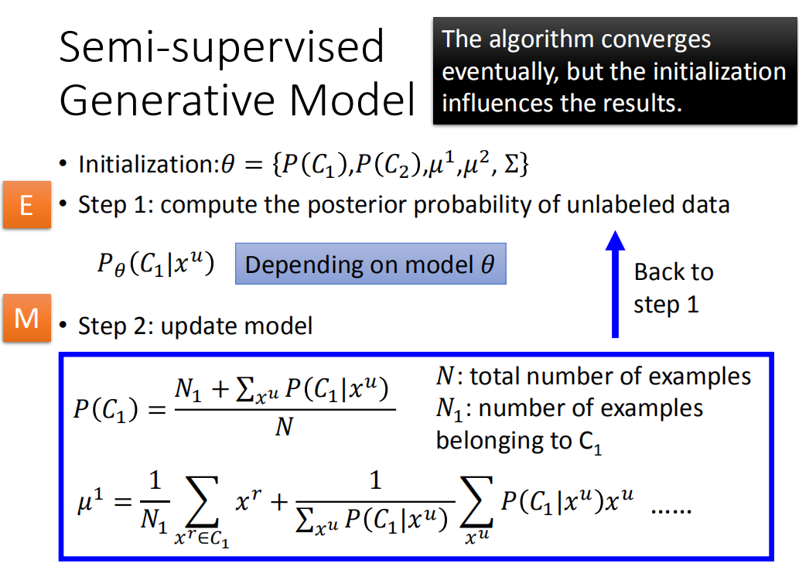

對於實際過程中的做法，我們先講操作方式，再講原理。先初始化參數(class1,class2的機率，\mu ^1,\mu ^2,\Sigma，這些值，你可以用已經有 label data先估測一個值，得到一組初始化的參數，這些參數統稱\theta

- Step1 先計算每一筆 unlabel data 的 posterior probability，根據現有的 \theta 計算每一筆 unlabel data屬於class1的機率，那這個機率算出來是怎麼樣的是和你的 model 的值有關的。

- Step2 算出這個機率以後呢，你就可以 update 你的 model，這個 update 的式子是非常的直覺，這個 C_1 的probability 是怎麼算呢，原來的沒有 unlabel data 的時候，你的計算方法可能是：這個 N 是所有的 example,N_1 是被標註的 C_1example，如果你要算 C_1 的probability，這件事情太直覺了，如果不考慮 unlabel data 的話(感覺就是 N_1 除以 N)。但是現在我們要考慮 unlabel data，那根據 unlabel 告訴我們的諮詢，C_1 是出現次數就是所有 unlabel data 它是 C_1 posterior probability 的和。所有 unlabel data 而是根據它的 posterior probability 決定它有百分之多少是屬於 C_1 ,有多少是屬於C_2，\mu^1怎麼算呢，原來不考慮 unlabel data時，\ mu^1就是把所有C_1的label data都平均起來就結束了。如果今天加上 unlabel data的話，其實就是把 unlabel data 的每一筆datax^u根據它的posterior probability做相乘。如果這個x^u比較偏向 class1C^1 的話，它對 class1的影響就大一點，反之就小一點。 (不用解釋這是為什麼這樣，因為這太直覺了)C_2的probability就是這樣的做的\mu^1,\mu^2,\sum也都是這樣做的，有了新的 model ，你就會做 step1，有了新的model以後，這個機率就不一樣了，這個機率不一樣了，在做 step2，你的 model就不一樣了。這樣 update 你的機率，然後就反復反复的下去。理論上這個方法會保證收斂，但是它的初始值跟GD會影響你收斂的結果。

這裡的 Step1 就是 Estep，而 Step2 就是 Mstep（也就是熟悉的EM算法）

我們現在來解釋下為什麼這樣做的：想法是這樣子的。假設我們**有原來的label data的時候，我們要做的事情是 maximum likehood，每一筆 train data 它的 likehood 是可以算出來的**。把所有的 log likehood加起來就是log total loss。然後去 maximum。那今天是 unlabel data 的話今天是不一樣的。 unlabel data 我們並不知道它是來自哪一個 class，我們怎樣去估測它的機率呢。那我們說**一筆unlabel datax^u 出現的機率(我不知道它是從 claas1 還是 class2 來的，所以class1，class2都有可能) 就是它在 C_1 的posterior probability 跟 C_1 這個 class 產生這筆 unlabel data 的機率加上 C_2 的posterior probability 乘以 C_2 這個 class 產生這筆 unlabel data的機率。把他們通通合起來，就是這筆unlabel data 產生的機率。**

接下來要做事情就是 maximum 這件事情。但是由於不是凸函數，所以你要去 iteratively solve 這個函數

## 假設一：Low-density Separation

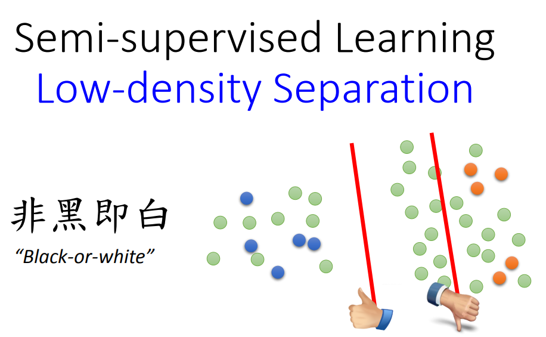

那接下來我們講一個 general 的方式，這邊基於的假設是 Low-density Separation，也就是說：這個世界非黑即白的。什麼是非黑即白呢？非黑即白意思就是說：假設我們現在有一大堆的 data (有 label data，也有 unlabel data)，在兩個 class 之間會有一個非常明顯的紅色 boundary。比如說：現在兩邊都是 label data，boundary 的話這兩條直線都是可以的，就可以把這兩個 class 分開，在 train data 上都是 100%。但是你考慮 unlabel data 的話，左邊的 boundary是比較好的，右邊的 boundary是不好的。因為這個假設是基於這個世界是一個非黑即白的世界，這兩個類之間會有一個很明顯的界限。 Low-density separation 意思就是說，在這兩個 class 交界處，density 是比較低的。

### Self-training

Low-density separation 最簡單的方法是 self-training。 **self-training 就是說，我們有一些label data 並且還有一些 unlabel data。接下來從 label data 中去 train一個 model，這個model叫做 f^\ast ,根據這個 f^\ast 去 label 你的 unlabel data。你就把 x^u 丟進 f^\ast,看它吐出來的 y^u 是什麼，那就是你的 label data。那這個叫做 pseudo-label。那接下來你要從你的 unlabel data set 中拿出一些data，把它加到 labeled data set 裡面。然後再回頭去 train 你的f^\ast**

**在做 regression 時是不能用這一招的，主要因為把 unlabeled data 加入到訓練數據中，f^\ast 並不會受影響**

你可能會覺得 slef-training 它很像是我們剛才 generative model 裡面用的那個方法。他們唯一的差別就是在做 self-training的時候，你用的是hard label；你在做generative mode 時，你用的是 soft model。在做 self-training 的時候我們會強制一筆 train data 是屬於某一個 class，但是在 generative model 的時候，根據它的posterior probability 它有一部分是屬於 class1 一部分是屬於 class2。那到底哪一個比較好呢？那如果我們今天考慮的 neural network 的話，你可以比較看看哪一個方法比較好。

假設我們用 neural network，你從你的 label data得到一筆 network parameter(\theta^\ast )。現在有一筆 unlabel datax^u，根據參數 \theta^\ast 分為兩類(0.7 的機率是 class1, 0.3的機率是 class2)。如果**是hard label的話，你就把它直接label 成 class1**，所以 x^u 新的 target 第一維是 1 第二維是 0 (拿 x^utrain neural network)。如果**去做 soft 的話。 70% 是屬於class1, 30% 是屬於class2，那新的 target 是0 7 跟 0.3**。在 neural network 中，這兩個方法你覺得哪個是有用的呢，**soft 這個方法是沒有用的，一定要用 hard label。** 因為本來輸出就是0.7 和 0.3 ，目標又設成 0.7 和 0.3，相當於自己證明自己，所以沒用。但我們用 hard label 是什麼意思呢？我們用 hard label 的時候，就是用 low-density separation 的概念。也就是說：今天我們看 x^u 它屬於 class1 的機率只是比較高而已，我們沒有很確定它一定是屬於 class1 的，但這是一個非黑即白的世界，如果你看起來有點像 class1，那就一定是 cla​​ss1。本來根據我的 model 說：0.7 是class1 0.3 是 class2，那用 hard label(low-density-separation) 就改成它屬於 class1 的機率是1 (完全就不可能是 class2)。 soft 是不會work的。

### 基於熵的正則化

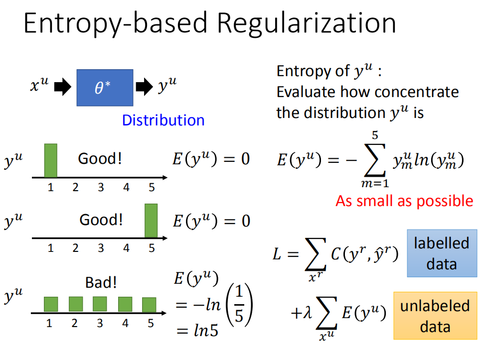

剛才那一招有進階版是**Entropy-based Regularization**。如果你用 neural network，你的 output 是一個 distribution，那我們不要限制說這個 output 一定要是 class1、class2，但是我們做的假設是這樣的，這個 output distribution一定要是很集中，因為這是一個非黑即白的世界。假設我們現在做五個 class 的分類，在 class1的機率很大，在其他 class 的機率很小，這個是好的。在 class5 的機率很大，在其他class 上機率很小，這也是好的。如果今天分佈很平均的話，這樣是不好的(因為這是一個非黑即白的世界)，這不是符合 low-density separation 的假設。

但是現在的問題是怎樣用數值的方法 evaluate 這個 distribution 是好的還是不好的。這邊用的是 entropy，算一個 distribution 的 entropy，這個 distribution entropy 告訴你說：這個 distribution 到底是集中的還是不集中的。我們用一個值來表示 distribution 是集中的還是分散的，某一個 distribution 的 entropy 就是負的它對每一個 class 的機率乘以 log class 的機率。所以我們今天把第一個distribution 的機率帶到這個公式裡面去，只有一個是 1 其他都是 0，你得到的entropy 會是 0 (E(y^u)=-\sum_{m=1 }^{5}y^u_m(lny^u)), 第二個也是 0。第三個entropy 是 ln5​。散的比較開(不集中) entropy 比較大，散的比較窄(集中) entropy比較小。

所以我們需要做的事情是，這個 model 的 output 在 label data 上分類整確，但**在unlabel data 上的 entropy 越小越好。** 所以根據這個假設，你就可以去重新設計你的 loss function。我們 **原來的 loss function 是說：我希望找一個參數，讓我現在在label data 上 model 的 output 跟正確的 model output 越小越好**，你可以cross entropy evaluate它們之間的距離，這個是label data的部分。**在 unlabel data 的部分，你會加上每一筆 unlabel data 的 output distributio n的entropy，那你會希望這些 unlabel data 的 entropy 越小越好**。那麼在這兩個中間，你可以乘以一個 weight(ln5) 來考慮說：你要偏向 unlabel data 多一點還是少一點

在 train 的時候，用 GD 來一直 minimize 這件事情，沒有什麼問題的。 unlabel data 的角色就很像 regularization，所以它被稱之為 entropy-based regulariztion。之前我們說 regularization 是在原來的 loss function 後面加一個懲罰項(L2,L1)，讓它不要 overfitting；現在加上根據 unlabel data得到的 entropy 來讓它不要 overfitting。

### 半監督SVM

那還有其他 semi-supervised 的方式，叫做 semi-supervised SVM。 SVM 精神是這樣的：SVM 做的事情就是：給你兩個 class 的 data，找一個 boundary，這個 boundary一方面要做有最大的 margin(最大margin就是讓這兩個class分的越開越好)同時也要有最小的分類的錯誤。現在假設有一些 unlabel data，semi-supervised SVM 會怎樣處理這個問題呢？**它會窮舉所有可能的 label**，就是這邊有 4 筆 unlabel data，每一筆它都可以是屬於 class1，也可以是屬於 class2，窮舉它所有可能的 label (如右圖所示)。對每一個可能的結果都去做一個 SVM，然後再去說哪一個 unlabel data 的可能性能夠讓你的 margin 最大同時又 minimize error。

問題：窮舉所有的 unlabel data label，這是非常多的事情。這篇 paper 提出了一個approximate 的方法，**基本精神是：一開始得到一些 label，然後你每次看一筆unlabel data 可不可以讓 margin 變大，變大了就改一下。**

## 假設二：Smoothness Assumption

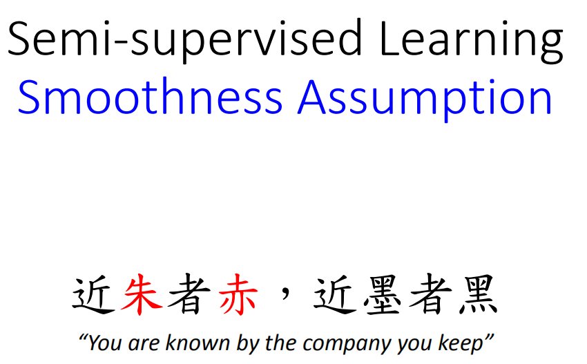

接下來，我們要講的方法是 Smoothness Assumption。近朱者赤，近墨者黑

它的假設是這樣子的，**如果 x 是相似的，那 label y 就要相似**。光講這個假設是不精確的，因為正常的 model，你給它一個 input，如果不是很 deep 的話，output 就很像，這樣講是不夠精確的。

真正假設是下面所要說的*x 的分佈是不平均的，它在某些地方是很集中，某些地方又很分散。 **如果今天 x_1,x_2 它們在 high density region 很 close 的話，y^1,y^2才會是是很像的。**

high density region 這句話就是說：可以用 high density path 做 connection，可以還不知道在說什麼。舉個例子，假設圖中是 data 的分佈，分佈就像是寫輪眼一樣，那現在假設我們有三筆 data(x_1,x_2,x_3)。如果我們今天考慮的是比較粗略的假設(相似的 x，那麼 output 就很像，那感覺 x_2,x_3 的 label 比較像，但 x_1,x_2的label是比較不像)，其實 Smoothness Assumption 更精確的假設是這樣的，你的相似是要透過一個 high density region。比如說，x_1,x_2 它們中間有一個high density region(x_1,x_2中間有很多很多的data，他們兩個相連的地方是通過high density path相連的)。根據真正 Smoothness Assumption的假設，它要告訴我們的意思就是說：x_1,x_2 是可能會有一樣的 label，x_2,x_3 可能會有比較不一樣的label(他們中間沒有high density path) 。

**那為什麼會有Smoothness Assumption這樣的假設呢？因為在真實的情況下是很多可能成立的**

比如說，我們考慮這個例子(手寫數字辨識的例子)。看到兩個 2 跟一個 3，單純算它們peixel 相似度的話，搞不好，兩個 2 是比較不像的，右邊兩個是比較像的(右邊的 2 和3 )。如果你把你的 data 都通通倒出來的話，你會發現這個最左邊的 2 跟這個右邊的 2 中間有很多連續的形態(中間有很多不直接相連的相似，但是有很多 stepping stones可以直接跳過去)。所以根據 smoothness Assumption 的話，左邊的 2 跟右邊的 2 是比較像的，右邊的 2 跟 3 中間沒有過渡的形態，它們兩個之間是不像的。如果看人臉辨識的是，也是一樣的。如果從一個人的左臉照一張相跟右臉照一張相，這是差很多的。如果你拿另外一個人眼睛朝左的相片來比較的話，會比較像這個跟眼睛朝右相比的話。如果你收集更多 unlabel data 的話，在這一張臉之間有很多過渡的形態，眼睛朝左的臉跟眼睛朝向右的臉是同一個臉。

這一招在文件分類上也是非常有用的，這是為什麼呢？假設你現在要分天文學跟旅遊類的文章，那天文學有一個固定的 word distribution ，比如會出現 asteroid,bright 那旅遊的文章會出現 yellowstone,zion 等等。那如果今天你的 unlabel data 跟你的label data 是有 overlap 的話，你就很輕易處理這個問題。但是在真是的情況下，你的 unlabel data 跟 label data 中間沒有 overlap word。為什麼呢？一篇文章可能詞彙不是很多，但是 word 多，所以你拿到兩篇，有重複的 word 比例其實是沒有那麼多的。所以很有可能你的 unlabel data 跟 label data 之間是沒有任何關係的。

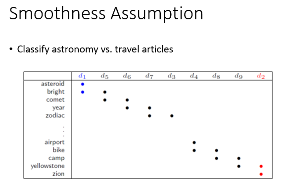

但是如果能收集到夠多的 unlabeled data的話，就能得到 d1 和 d5 比較像，d5 和 d6 比較像，這個像就可以一直傳播過去，得到 d1 和 d3 像，同樣的 d4 可以和 d2 一類。

### 聚類和標記

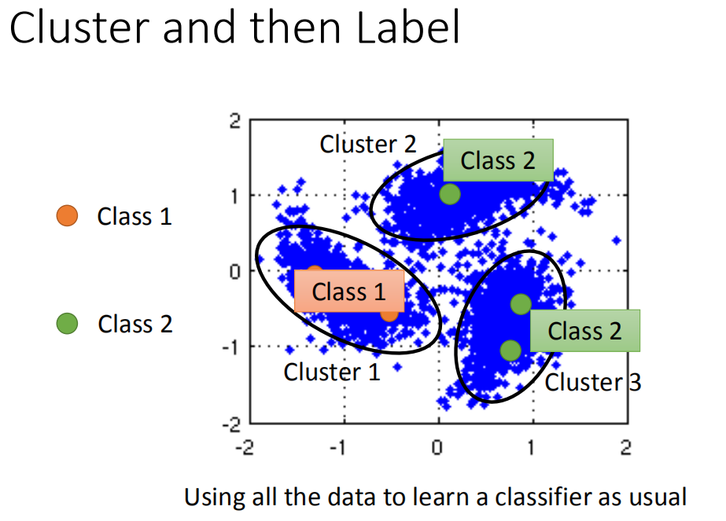

如何實踐這個 smoothness assumption，最簡單的方法是 cluster and then label。現在 distribution 長這麼樣子，橙色是 class1，綠色是 class2，藍色是 unlabel data。接下來你就做一下 cluster，你可能分成三個 cluster，然後你看 cluster1 裡面 class1 的 label data 最多，所以 cluster1 裡面所有的 data 都算是 class1，cluster2，cluster3 都算是 class2、class3，然後把這些 data 拿去 learn 就結束了，但是這個方法不一定有用。如果你今天要做 cluster label，cluster 要很強，因為這一招 work 的假設就是不同 class cluster 在一起。可是在 image 裡面，把不同class cluster 在一起是沒有那麼容易的。我們之前講過說，為什麼要用 deep learning，不同 class 可能會長的很像，也有可能長的不像，你單純只有 pixel 來做class，你結果是會壞掉的。如果你要讓 class and then label 這個方法有用，你的class 要很強。你要用很好的方法來描述 image，我們自己試的時候我們會用 deep autoendcoder，用這個來提取特徵，然後再進行聚類。

### 基於圖的方法

剛才講的是很直覺的方法，另外一個方法是 Graph-based Approach，我們用Graph-based approach 來表達這個通過高密度路徑連接這件事情。就說我們現在把所有的 data points都建成一個 graph，每一筆 data points 都是這個 graph 上一個點，要想把他們之間的 range 建出來。有了這個 graph 以後，你就可以說：high density path 的意思就是說，如果今天有兩個點，他們在這個 graph 上面是像的(走的到)，那麼他們這就是同一個 class，如果沒有相連，就算實際的距離也不是很遠，那也不是同一個class。

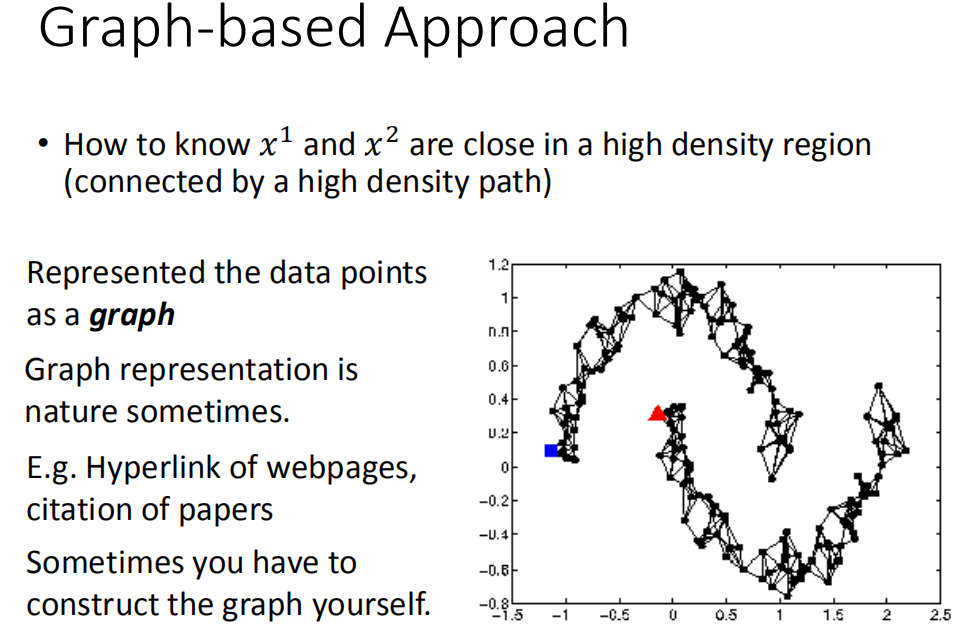

建一個 graph：有些時候這個 graph representation 是很自然就得到了。舉例來說：假設你現在要做的是網頁的分類，而你有記錄網頁之間的 Hyperlink，那 Hyperlink 就很自然的告訴你網頁之間是如何連接的。假設現在做的是論文的分類，論文和論文之間有引用之間的關係，這個引用也是 graph，可以很自然地把圖畫出來給你。

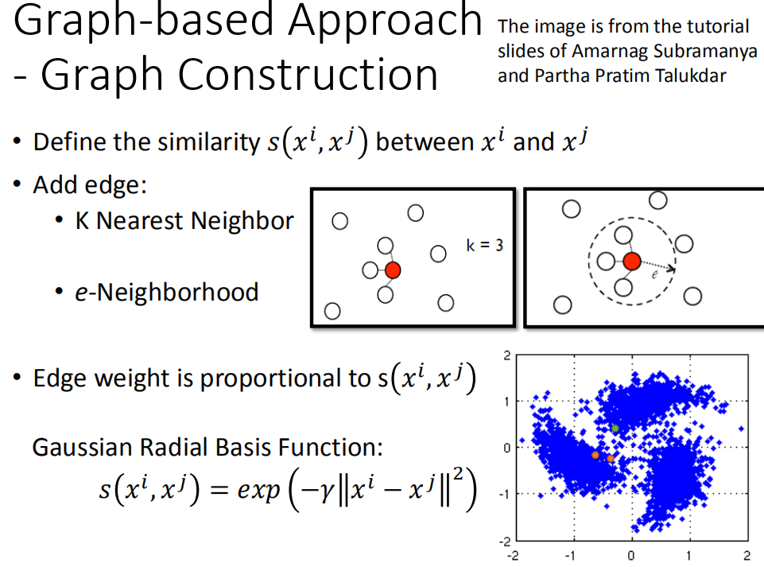

但有時候你要想辦法來建這個 graph。通常是這樣做的：你要定義 x^i,x^j 來算它們的相似度。**影像的話可以用 pixel 來算相似度，但是 performance 不太好。**用auto-encoder 算相似度可能表現就會比較好。算完相似度你就可以建 graph，graph 有很多種：比如說可以建 K Nearest Neighbor，K Nearest Neighbor 意思就是說，我現在有一大堆的 data，data 和 data 之間，我都可以算出它們的相似度，那我 K=3(K Nearest Neighbor)，每一個 point 跟他最近的三個 point 做標記。或者也可以做e-Neighborhood:意思就是說，每個點只有跟它相似度超過某一個 threshold ,跟它相似度大於的 1 點才會連起來。所謂的 edge 也不是只有相連不相連這樣 boundary 的選擇而已，你可以給 edge 一些 weight，你可以讓你的 edge 跟你的要被連接起來的兩個data points 的相似度是成正比的。怎麼定義這個相似度呢？我會建議比較好的選擇就是Gaussian Radial Basis function 來定義這個相似度。

怎麼算這個 function 呢？你可以先算說：x^i,x^j 你都把它們用 vector 來描述的話，算他們的 distance 乘以一個參數，再取負號，然後再算 exponentiation。其實exponential 這件事在經驗上還是會給你比較好的 performance。為什麼用這樣的方式會給你比較好的 performance 呢？如果你現在看這個 function(Gaussian Radial Basis function) 它的下降速度是非常快的。你用這個 Gaussian Radial Basis function 的話，你能製造出像這個圖(有兩個橙色距離很近，綠色這個點離橙色也蠻近，如果你用 exponential 的話，每一個點只能與非常近的點離,它跟稍微遠一點就不連了。你要有這樣的機制，你才能避免跨海溝的 link，所以你用 exponential 通常效果比較好。

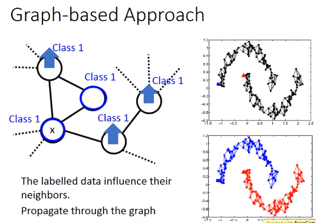

如果我們現在在 graph 上有一些 label data，在這個 graph 上我們說這筆 data1 是屬於class1，那跟它有相連的 data points 屬於class1 的機率也會上升，所以每筆data 會影響它的鄰居。光是會影響它的鄰居是不夠的，如果你只考慮光是影響它的鄰居的話可能幫助是不會太大。為什麼呢？如果說相連的本來就很像，**你 train 一個 model，input 很像 output 馬上就很像的話，幫助不會太大。**那 graph-based approach 真正幫助的是：它的 class 是會傳遞的，本來這個點有跟 class1 相連所以它會變得比較像 class1。但是這件事會像傳染病一樣傳遞過去，雖然這個點真正沒有跟class1 相連，因為像 class1 這件事情是會感染，所以這件事情會通過 graph link 傳遞過來。

舉例來說看這個例子，你把你的 data points 建成graph，這個如果是理想的例子的話，一筆 label 是屬於 class1(藍色)，一筆 label 是屬於 class2(紅色)。經過garph-based approach，你的 graph 建的這麼漂亮的話(上面都是藍色的，下面都是紅色的)

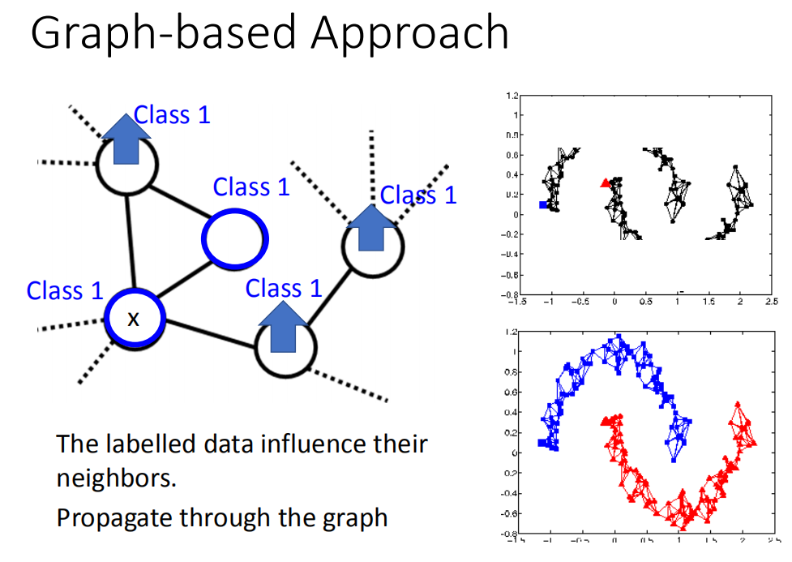

這樣的 semi-supervise d有用，你的 data 要足夠多，如果 data 不夠多的話，這個地方沒收集到 data，那這個點就斷掉了，那這個 information 就傳不過去了，比如右上圖就出現四個小的 cluster。

剛才是定性的說使用這個 graph，接下來說怎麼定量使用這個 graph。那這個定量的使用是在這個 graph structure 上面定義一個東西叫做：label 的 smoothness，我們會定義說 label 有多符合我們剛才說的 smoothness assumption 的假設。

現在看這兩個例子，在這兩個例子都有四個 data points，data point跟data point連接的數字代表了 weight。在左邊這個例子中，你給它的 label 是 (1,1,1，0)，在右邊的例子中，給的 labe l是 (0,1,1,0)。左邊的這個例子是比較 smothness 的，但是我們需要一個數字定量的描述它說：它有多 smothness。常見的做法是這樣子的：這個式子是我們考慮兩兩有相連的 point，兩兩拿出來(summation over 所有 data i,j)，然後計算 i,j 之間的 weight 跟 y 的 label 減去 j 的 label 的平方(這個是 summation 所有 data，不管他現在是有 label 還是沒有 label)。所以你看左邊這個case，在 summation over 所有的 data 的時候，你只需要考慮,s=0.5(只是在計算時比較方便而已，沒有真正的效用)，右邊的 class s=3，這個值(s)越小越 smothness，你會希望你得出的 label smothness 的定義算出來越小越好。

現在看這兩個例子，在這兩個例子都有四個 data points，data point 跟 data point連接的數字代表了weight。在左邊這個例子中，你給它的 label 是 (1,1,1，0)，在右邊的例子中，給的 label 是 (0,1,1,0)。左邊的這個例子是比較smothness的，但是我們需要一個數字定量的描述它說：它有多smothness。常見的做法是這樣子的：S=\frac{1}{2}\sum_{ij}w_{i,j}(y^i-y^j)^2。這個式子是我們考慮兩兩有相連的 point，兩兩拿出來(summation over所有data i,j)，然後計算 i,j 之間的 weight 跟 y 的label 減去 j 的 label 的平方(這個是 summation 所有data，不管他現在是有 label 還是沒有 label )。所以你看左邊這個 case，在 summation over 所有的 data 的時候，你只需要考慮x_3,x_4,s=0.5(只是在計算時比較方便而已，沒有真正的效用)，右邊的 class s=3 ，這個值(s)越小越smothness，你會希望你得出的 label smothness 的定義算出來越小越好。

這個算式可以稍微整理整理一下，可以寫成一個簡潔的式子。我們把 y 串成一個 vector(現在 y 包括 label data，也包括 unlabel data)，每一個筆 label data 和 label data 都賦一個值給你，現在你有 R+U 個 dimension vector，可以寫成 y。如果你這樣寫的話，s 這​​個式子可以寫成 y(vector) 的 transform 乘以 L(matrix) 再乘以 y，L 是屬於(R+U)*(R+U)matrix，這個 L 被叫做 Graph Laplacian。

這個L的定義是：兩個 matrix相減(L=D-W)。 W 就是你把這些 data point 兩兩之間weight connection 建成一個 matrix，這個 matrix 的四個 row 個四個 columns 分別代表 datax^1 到 x^4 , D是你把 w 的每組 row 合起來。

現在我們可以用 y^TLy 去評估我們現在得到的 label有多 smothness。在這個式子裡面我們會看到有 y，這個 y 是 label，這個 label 的值也就是 neural network output的值是取決於 neural parameters。這一項其實是 neural 的 depending，所以你要把 graph 的 information 考慮到 neural network 的 train 的時候，你要做的事情其實就是在原來的loss function 裡面加一項。假設你原來的loss function 是 cross entropy，你就加另外一項，你加的這一項是 smoothness 的值乘以某一個你想要調的參數，後面這一項\lambdaS 其實就是像徵了regulization term。你不只要調整參數讓你那些 label data的 output 跟真正的 label 越接近越好，你同時還要做到說：output 這些 label，不管是在label data 還是在 unlabel data 上面，它都符合 smothness assuption 的假設是由這個s所衡量出來的。所以你要 minimize 前一項還要 minimize後一項(用梯度下降)

其實你要算 smothness 時不一定要放在 output 的地方，如果你今天是 deep neural network 的話，你可以把你的 smothness 放在 network 任何地方。你可以假設你的output 是 smooth，你也可以同時說：我把某一個 hidden layer接出來再乘上別的一些transform，它也要是 smooth，也可以說每一個 hidden layer 的 output 都是 smooth

## Better Representation

最後一個方法是：Better Representation，這個方法的精神是：“去無存青，化繁為簡”，等到 unsupervised的時候再講。
它的精神是這樣子的：我們觀察到的世界其實是很複雜的，我們在我們觀察到的世界背後其實是有一些比較簡單的東西在操控著我們這個複雜的世界，所以你只要能看透這個世界的假象，直指它的核心的話就可以讓訓練變得容易。

