## 監督學習和半監督學習
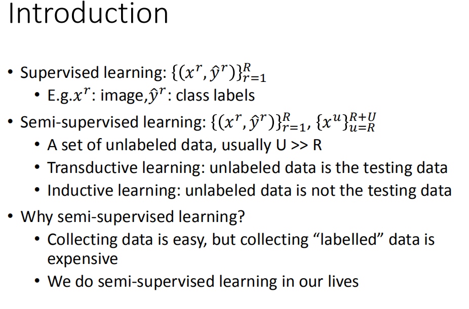
在supervised裡面，你就是有一大推的training data，這些training data的組成是一個function的input跟output，假設你有R筆train data，每一筆train data有$x^r$,$\hat{ y}^r $。假設$x^r$是一張image，$\hat{y}$是class label。 semi-supervised learning是在label上面，是有另外一組unlabel的data，這組data記做$x^u$,這組data只有input，沒有output(U筆data)。在做semi-superised learning時，U遠遠大於R(unlabel的數量遠遠大於label data的數量)。 semi-surprised learning可以分成兩種，一種是transductive learning，一種是inductive learning。這兩種最簡單的分法是：在做transductive的時候，你的unlabel data就是你的testing data，inductive learning 就是說：不把unlabel data考慮進來。

為什麼做semi-supervised learning，因為有人常會說，我們缺data，其實我們不是缺data，其實我們缺的是與label的data。比如說，你收集image很容易(在街上一直照就行了)，但是這些image是沒有的label。 label data 是很少的，unlabel是非常多的。所以semi-surprvised learning如果可以利用這些unlabel data來做某些事是會很有價值的。

我們人類可能一直是在semi-supervised learning，比如說，小孩子會從父母那邊得到一點點的supervised(小孩子在街上，問爸爸媽媽這是什麼，爸爸媽媽說：這是狗。在以後的日子裡，小孩子會看到很多奇奇怪怪的東西，也沒有人在告訴這是什麼動物，但小孩子依然還是會判別出狗)

### 半監督學習的好處
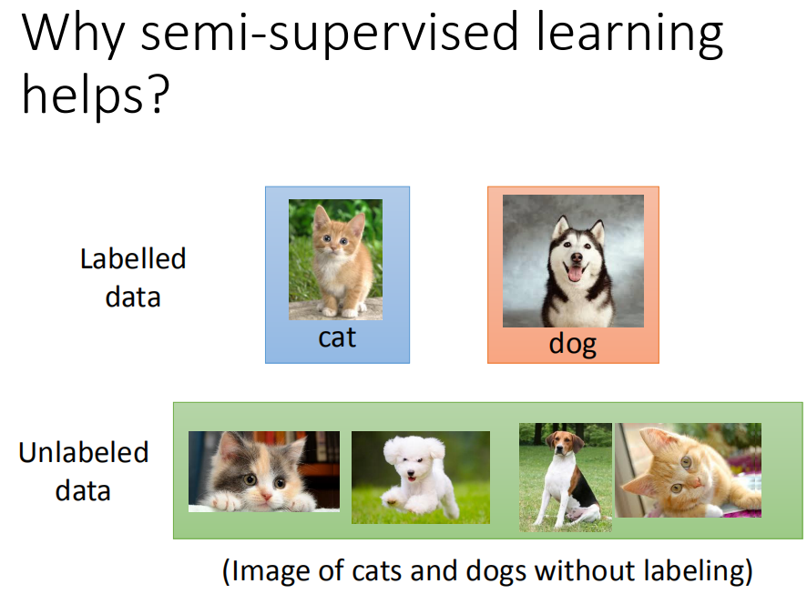
為什麼semi-supervised learning有可能會帶來幫助呢？假設我們現在要做分類的task，建一個貓跟狗的classifier，我們同時有一大堆貓跟狗的圖片。這些圖片是沒有label的，並不知道哪些是貓哪些是狗。

那今天我們只考慮有label的貓跟狗的data，畫一個boundary，將貓跟狗的train data分開的話，你可能就會畫在中間(垂直)。那如果unlabel的分佈長的像灰色的點這個樣子的話，這可能會影響你的決定。雖然unlabel data只告訴我們了input，但**unlabeled data的分佈**可以告訴我們一些事。那你可能會把boundary變為這樣(斜線)。但是semi-supervised learning使用unlabel的方式往往伴隨著一些假設，其實semi-supervised learning有沒有用，是取決於你這個假設符不符合實際/精不精確。

這邊要講四件事，第一個是在generative model的時候，怎麼用semi-supervised learning。還要講兩個還蠻通用的假設，一個是Low-density Separation Assumption,另一個是Smoothness Assumption，最後還有Better Representation

## 監督生成模型和半監督生成模型
### 監督生成模型

我們都已經看過，supervised generative model，在supervised learning裡面有一堆train example，你知道分別是屬於class1，class2。你會去估測class1，class2的probability($P(X|C_i)$)

假設每一個class它的分佈都是一個Gaussion distribution，那你會估測說class1是從μ是$μ^1$，covariance是$\Sigma$的Gaussion估測出來的，class2是從μ是$μ ^2$，covariance是$\Sigma$的Gaussion估測出來的。

那現在有了這些probability，有了這些$μ$、covariance，你就可以估測given一個新的data做classification，然後你就會決定boundary的位置在哪裡。
### 半監督生成模型

但是今天給了我們一些unlabel data，它就會影響你的決定。舉例來說，我們看左邊這筆data，我們假設綠色這些使unlabel data，那如果你的$\mu $跟variance是$\mu ^1$,$\mu ^2,\Sigma$顯然是不合理的。今天這個$\Sigma$應該比較接近圓圈，或者說你在sample的時候有點問題，所以你sample出比較奇怪的distribution。比如說，這兩個class label data是比較多的(可能class2是比較多的，所以這邊probability是比較大的)，總之看這些unlabel data以後，會影響你對probability，$\mu$,$ \Sigma$的估測，就影響你的probability的式子，就影響了你的decision boundary。

對於實際過程中的做法，我們先講操作方式，再講原理。先初始化參數(class1,class2的機率，$\mu ^1$,$\mu ^2,\Sigma$，這些值，你可以用已經有label data先估測一個值，得到一組初始化的參數，這些參數統稱$\theta$

- Step1 先計算每一筆unlabel data的posterior probability，根據現有的$\theta$計算每一筆unlabel data屬於class1的機率，那這個機率算出來是怎麼樣的是和你的model的值有關的。

- Step2 算出這個機率以後呢，你就可以update你的model，這個update的式子是非常的直覺，這個$C_1$的probability是怎麼算呢，原來的沒有unlabel data的時候，你的計算方法可能是：這個N是所有的example,$N_1$是被標註的$C_1$example，如果你要算$C_1$的probability，這件事情太直覺了，如果不考慮unlabel data的話(感覺就是$N_1$除以N)。但是現在我們要考慮unlabel data，那根據unlabel告訴我們的諮詢，$C_1$是出現次數就是所有unlabel data它是$C_1$posterior probability的和。所有unlabel data而是根據它的posterior probability決定它有百分之多少是屬於$C_1$,有多少是屬於$C_2$，$\mu^1$怎麼算呢，原來不考慮unlabel data時，$\ mu^1$就是把所有$C_1$的label data都平均起來就結束了。如果今天加上unlabel data的話，其實就是把unlabel data的每一筆data$x^u$根據它的posterior probability做相乘。如果這個$x^u$比較偏向class1$C^1$的話，它對class1的影響就大一點，反之就小一點。 (不用解釋這是為什麼這樣，因為這太直覺了)$C_2$的probability就是這樣的做的$\mu^1,\mu^2,\sum$也都是這樣做的，有了新的model ，你就會做step1，有了新的model以後，這個機率就不一樣了，這個機率不一樣了，在做step2，你的model就不一樣了。這樣update你的機率，然後就反復反复的下去。理論上這個方法會保證收斂，但是它的初始值跟GD會影響你收斂的結果。

這裡的Step1就是Estep，而Step2就是Mstep（也就是熟悉的EM算法）

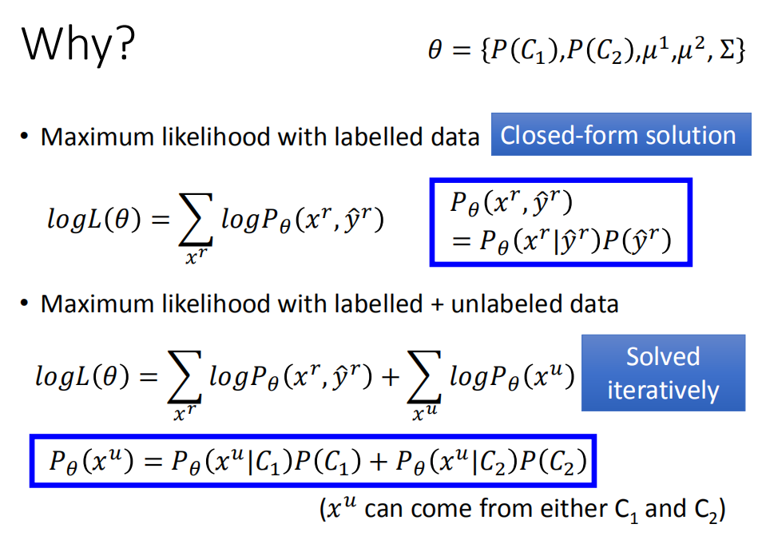

我們現在來解釋下為什麼這樣做的：想法是這樣子的。假設我們有原來的label data的時候，我們要做的事情是maximum likehood，每一筆train data 它的likehood是可以算出來的。把所有的 log likehood加起來就是log total loss。然後去maximum。那今天是unlabel data的話今天是不一樣的。 unlabel data我們並不知道它是來自哪一個class，我們咋樣去估測它的機率呢。那我們說一筆unlabel data$x^u$出現的機率(我不知道它是從claas1還是class2來的，所以class1，class2都有可能)就是它在$C_1$的posterior probability跟$C_1$這個class產生這筆unlabel data的機率加上$C_2$的posterior probability乘以$C_2$這個class產生這筆unlabel data的機率。把他們通通合起來，就是這筆unlabel data產生的機率。

接下來要做事情就是maximum這件事情。但是由於不是凸函數，所以你要去iteratively solve這個函數

## 假設一：Low-density Separation

那接下來我們講一個general的方式，這邊基於的假設是Low-density Separation，也就是說：這個世界非黑即白的。什麼是非黑即白呢？非黑即白意思就是說：假設我們現在有一大堆的data(有label data，也有unlabel data)，在兩個class之間會有一個非常明顯的紅色boundary。比如說：現在兩邊都是label data，boundary 的話這兩條直線都是可以的，就可以把這兩個class分開，在train data上都是100%。但是你考慮unlabel data的話，左邊的boundary是比較好的，右邊的boundary是不好的。因為這個假設是基於這個世界是一個非黑即白的世界，這兩個類之間會有一個很明顯的界限。 Low-density separation意思就是說，在這兩個class交界處，density是比較低的。

### Self-training

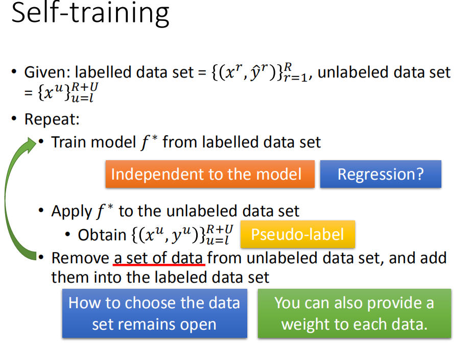
Low-density separation最簡單的方法是self-training。 self-training就是說，我們有一些label data並且還有一些unlabel data。接下來從label data中去train一個model，這個model叫做$f^\ast $,根據這個$f^\ast$去label你的unlabel data。你就把$x^u$丟進$f^\ast$,看它吐出來的$y^u$是什麼，那就是你的label data。那這個叫做pseudo-label。那接下來你要從你的unlabel data set中拿出一些data，把它加到labeled data set裡面。然後再回頭去train你的$f^\ast$

在做regression時是不能用這一招的，主要因為把unlabeled data加入到訓練數據中，$f^\ast$並不會受影響

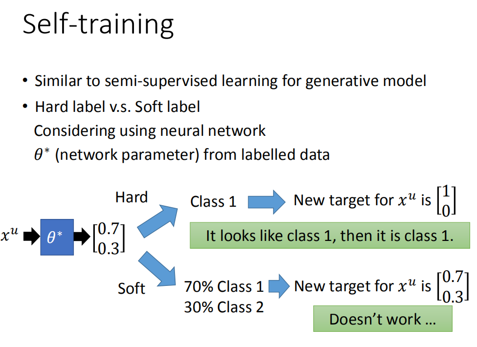

你可能會覺得slef-training它很像是我們剛才generative model裡面用的那個方法。他們唯一的差別就是在做self-training的時候，你用的是hard label；你在做generative mode時，你用的是soft model。在做self-training的時候我們會強制一筆train data是屬於某一個class，但是在generative model的時候，根據它的posterior probability 它有一部分是屬於class1一部分是屬於class2。那到底哪一個比較好呢？那如果我們今天考慮的neural network的話，你可以比較看看哪一個方法比較好。

假設我們用neural network，你從你的 label data得到一筆network parameter($\theta^\ast $)。現在有一筆unlabel data$x^u$，根據參數$\theta^\ast $分為兩類(0.7的機率是class1,0.3的機率是class2)。如果是hard label的話，你就把它直接label成class1，所以$x^u$新的target第一維是1第二維是0(拿$x^u$train neural network)。如果去做soft的話。 70 percent是屬於class1,30percent是屬於class2，那新的target是0.7跟0.3。在neural network中，這兩個方法你覺得哪個是有用的呢，soft這個方法是沒有用的，一定要用hard label。因為本來輸出就是0.7和0.3，目標又設成0.7和0.3，相當於自己證明自己，所以沒用。但我們用hard label 是什麼意思呢？我們用hard label的時候，就是用low-density separation的概念。也就是說：今天我們看$x^u$它屬於class1的機率只是比較高而已，我們沒有很確定它一定是屬於class1的，但這是一個非黑即白的世界，如果你看起來有點像class1，那就一定是cla​​ss1。本來根據我的model說：0.7是class1 0.3是class2，那用hard label(low-density-separation)就改成它屬於class1的機率是1(完全就不可能是class2)。 soft是不會work的。

### 基於熵的正則化

剛才那一招有進階版是“Entropy-based Regularization”。如果你用neural network，你的output是一個distribution，那我們不要限制說這個output一定要是class1、class2，但是我們做的假設是這樣的，這個output distribution一定要是很集中，因為這是一個非黑即白的世界。假設我們現在做五個class的分類，在class1的機率很大，在其他class的機率很小，這個是好的。在class5的機率很大，在其他class上機率很小，這也是好的。如果今天分佈很平均的話，這樣是不好的(因為這是一個非黑即白的世界)，這不是符合low-density separation的假設。

但是現在的問題是咋樣用數值的方法evaluate這個distribution是好的還是不好的。這邊用的是entropy，算一個distribution的entropy，這個distribution entropy告訴你說：這個distribution到底是集中的還是不集中的。我們用一個值來表示distribution是集中的還是分散的，某一個distribution的entropy就是負的它對每一個class的機率乘以log class的機率。所以我們今天把第一個distribution的機率帶到這個公式裡面去，只有一個是1其他都是0，你得到的entropy會得到是0($E(y^u)=-\sum_{m=1 }^{5}y^u_m(lny^u)$),第二個也是0。第三個entropy是$ln5​$。散的比較開(不集中)entropy比較大，散的比較窄(集中)entropy比較小。

所以我們需要做的事情是，這個model的output在label data上分類整確，但在unlabel data上的entropy越小越好。所以根據這個假設，你就可以去重新設計你的loss function。我們原來的loss function是說：我希望找一個參數，讓我現在在label data上model的output跟正確的model output越小越好，你可以cross entropy evaluate它們之間的距離，這個是label data的部分。在unlabel data的部分，你會加上每一筆unlabel data的output distribution的entropy，那你會希望這些unlabel data的entropy 越小越好。那麼在這兩個中間，你可以乘以一個weight($ln5$)來考慮說：你要偏向unlabel data多一點還是少一點

在train的時候，用GD來一直minimize這件事情，沒有什麼問題的。 unlabel data的角色就很像regularization，所以它被稱之為 entropy-based regulariztion。之前我們說regularization是在原來的loss function後面加一個懲罰項(L2,L1)，讓它不要overfitting；現在加上根據unlabel data得到的entropy 來讓它不要overfitting。

### 半監督SVM
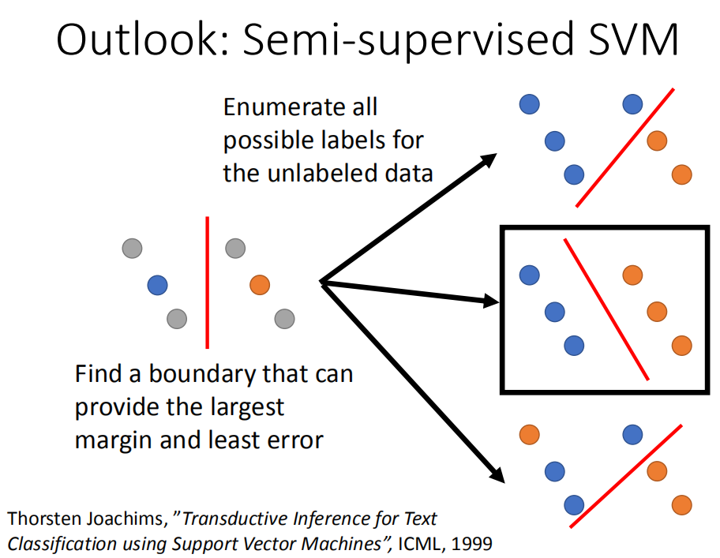

那還有其他semi-supervised的方式，叫做semi-supervised SVM。 SVM精神是這樣的：SVM做的事情就是：給你兩個class的data，找一個boundary，這個boundary一方面要做有最大的margin(最大margin就是讓這兩個class分的越開越好)同時也要有最小的分類的錯誤。現在假設有一些unlabel data，semi-supervised SVM會咋樣處理這個問題呢？它會窮舉所有可能的label，就是這邊有4筆unlabel data，每一筆它都可以是屬於class1，也可以是屬於class2，窮舉它所有可能的label(如右圖所示)。對每一個可能的結果都去做一個SVM，然後再去說哪一個unlabel data的可能性能夠讓你的margin最大同時又minimize error。

問題：窮舉所有的unlabel data label，這是非常多的事情。這篇paper提出了一個approximate的方法，基本精神是：一開始得到一些label，然後你每次該一筆unlabel data看可不可以讓margin變大，變大了就改一下。
## 假設二：Smoothness Assumption

接下來，我們要講的方法是Smoothness Assumption。近朱者赤，近墨者黑

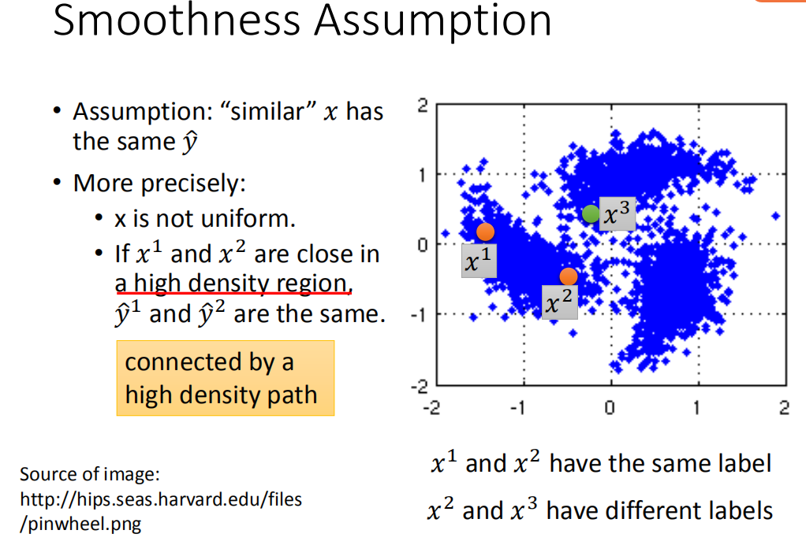
它的假設是這樣子的，如果x是相似的，那label y就要相似。光講這個假設是不精確的，因為正常的model，你給它一個input，如果不是很deep的話，output就很像，這樣講是不夠精確的。

真正假設是下面所要說的，x的分佈是不平均的，它在某些地方是很集中，某些地方又很分散。如果今天$x_1,x_2$它們在high density region很close的話，$y^1,y^2$才會是是很像的。
high density region這句話就是說：可以用high density path做connection，可以還不知道在說什麼。舉個例子，假設圖中是data的分佈，分佈就像是寫輪眼一樣，那現在假設我們有三筆data($x_1,x_2,x_3$)。如果我們今天考慮的是比較粗略的假設(相似的x，那麼output就很像，那感覺$x_2,x_3$的label比較像，但$x_1,x_2$的label是比較不像)，其實Smoothness Assumption更精確的假設是這樣的，你的相似是要透過一個high density region。比如說，$x_1,x_2$它們中間有一個high density region($x_1,x_2$中間有很多很多的data，他們兩個相連的地方是通過high density path相連的)。根據真正Smoothness Assumption的假設，它要告訴我們的意思就是說：$x_1,x_2$是可能會有一樣的label，$x_2,x_3$可能會有比較不一樣的label(他們中間沒有high density path) 。

那為什麼會有Smoothness Assumption這樣的假設呢？因為在真實的情況下是很多可能成立的

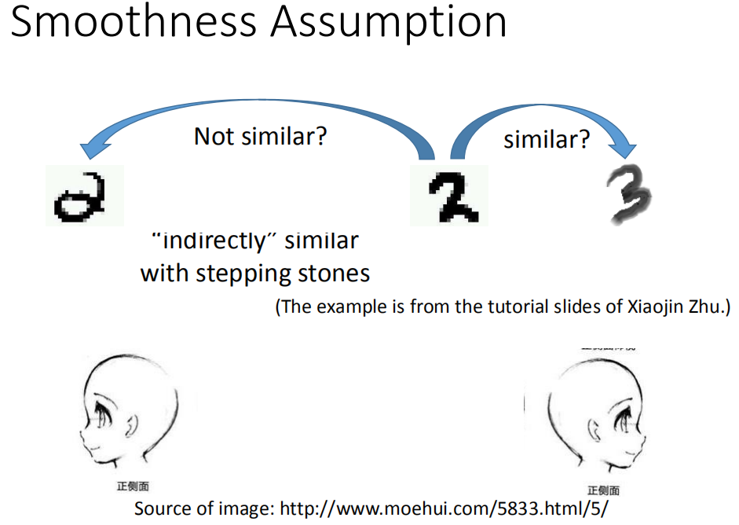
比如說，我們考慮這個例子(手寫數字辨識的例子)。看到這變有兩個2有一個3，單純算它們peixel相似度的話，搞不好，兩個2是比較不像的，右邊兩個是比較像的(右邊的2和3)。如果你把你的data都通通倒出來的話，你會發現這個2(最左邊)跟這個2(右邊)中間有很多連續的形態(中間有很多不直接相連的相似，但是有很多stepping stones可以直接跳過去)。所以根據smoothness Assumption的話，左邊的2跟右邊的2是比較像的，右邊的2跟3中間沒有過渡的形態，它們兩個之間是不像的。如果看人臉辨識的是，也是一樣的。如果從一個人的左臉照一張相跟右臉照一張相，這是差很多的。如果你拿另外一個人眼睛朝左的相片來比較的話，會比較像這個跟眼睛朝右相比的話。如果你收集更多unlabel data的話，在這一張臉之間有很多過渡的形態，眼睛朝左的臉跟眼睛朝向右的臉是同一個臉。

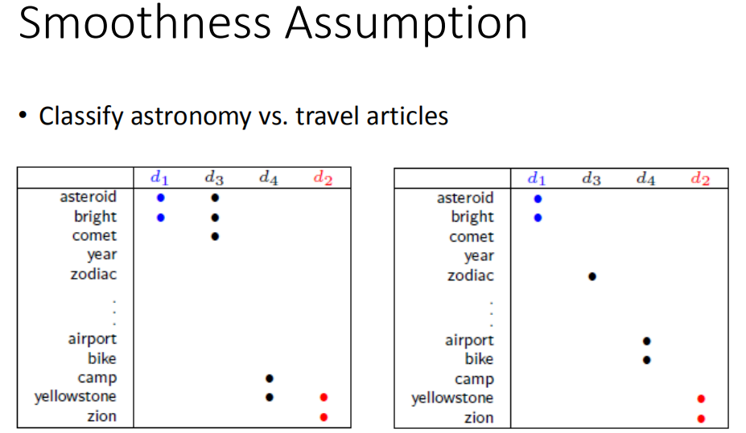
這一招在文件分類上也是非常有用的，這是為什麼呢？假設你現在要分天文學跟旅遊類的文章，那天文學有一個固定的word distribution，比如會出現“asteroid,bright”.那旅遊的文章會出現“yellowstone,zion等等”。那如果今天你的unlabel data跟你的label data是有overlap的話，你就很輕易處理這個問題。但是在真是的情況下，你的unlabel data跟label data中間沒有overlap word。為什麼呢？一篇文章可能詞彙不是很多，但是word多，所以你拿到兩篇，有重複的word比例其實是沒有那麼多的。所以很有可能你的unlabel data跟label data之間是沒有任何關係的。

但是如果能收集到夠多的unlabeled data的話，就能得到d1和d5比較像，d5和d6比較像，這個像就可以一直傳播過去，得到d1和d3像，同樣的d4可以和d2一類。

### 聚類和標記

如何實踐這個smoothness assumption，最簡單的方法是cluster and then label。現在distribution長這麼樣子，橙色是class1，綠色是class2，藍色是unlabel data。接下來你就做一下cluster，你可能分成三個cluster，然後你看cluster1裡面class1的label data最多，所以cluster1裡面所有的data都算是class1，cluster2，cluster3都算是class2、class3，然後把這些data拿去learn就結束了，但是這個方法不一定有用。如果你今天要做cluster label，cluster要很強，因為這一招work的假設就是不同class cluster在一起。可是在image裡面，把不同class cluster在一起是沒有那麼容易的。我們之前講過說，為什麼要用deep learning，不同class可能會長的很像，也有可能長的不像，你單純只有pixel來做class，你結果是會壞掉的。如果你要讓class and then label這個方法有用，你的class要很強。你要用很好的方法來描述image，我們自己試的時候我們會用deep autoendcoder，用這個來提取特徵，然後再進行聚類。

### 基於圖的方法

剛才講的是很直覺的方法，另外一個方法是Graph-based Approach，我們用Graph-based approach來表達這個通過高密度路徑連接這件事情。就說我們現在把所有的data points都建成一個graph，每一筆data points都是這個graph上一個點，要想把他們之間的range建出來。有了這個graph以後，你就可以說：high density path的意思就是說，如果今天有兩個點，他們在這個graph上面是相的(走的到)，那麼他們這就是同一個class，如果沒有相連，就算實際的距離也不是很遠，那也不是同一個class。

建一個graph：有些時候這個graph representation是很自然就得到了。舉例來說：假設你現在要做的是網頁的分類，而你有記錄網頁之間的Hyperlink，那Hyperlink就很自然的告訴你網頁之間是如何連接的。假設現在做的是論文的分類，論文和論文之間有引用之間的關係，這個引用也是graph，可以很自然地把圖畫出來給你。

但有時候你要想辦法來建這個graph。通常是這樣做的：你要定義$x^i,x^j$咋樣來算它們的相似度。影像的話可以用pixel來算相似度，但是performance不太好。用auto-encoder算相似度可能表現就會比較好。算完相似度你就可以建graph，graph有很多種：比如說可以建K Nearest Neighbor，K Nearest Neighbor意思就是說，我現在有一大堆的data，data和data之間，我都可以算出它們的相似度，那我K=3(K Nearest Neighbor)，每一個point跟他最近的三個point做標記。或者也可以做e-Neighborhood:意思就是說，每個點只有跟它相似度超過某一個threshold,跟它相似度大於的1點才會連起來。所謂的edge也不是只有相連不相連這樣boundary的選擇而已，你可以給edge一些weight，你可以讓你的edge跟你的要被連接起來的兩個data points的相似度是成正比的。怎麼定義這個相似度呢？我會建議比較好的選擇就是Gaussian Radial Basis function來定義這個相似度。

怎麼算這個function呢？你可以先算說：$x^i,x^j$你都把它們用vector來描述的話，算他們的distance乘以一個參數，再取負號，然後再算exponentiation。其實exponential這件事在經驗上還是會給你比較好的performance。為什麼用這樣的方式會給你比較好的performance呢？如果你現在看這個function(Gaussian Radial Basis function)它的下降速度是非常快的。你用這個Gaussian Radial Basis function的話，你能製造出像這個圖(有兩個橙色距離很近，綠色這個點離橙色也蠻近，如果你用exponential的話，每一個點只能與非常近的點離,它跟稍微遠一點就不連了。你要有這樣的機制，你才能避免跨海溝的link，所以你用exponential通常效果比較好。

如果我們現在在graph上有一些label data，在這個graph上我們說這筆data1是屬於class1，那跟它有相連的data points屬於class1的機率也會上升，所以每筆data會影響它的鄰居。光是會影響它的鄰居是不夠的，如果你只考慮光是影響它的鄰居的話可能幫助是不會太大。為什麼呢？如果說相連的本來就很像，你train一個model，input很像output馬上就很像的話，幫助不會太大。那graph-based approach真正幫助的是：它的class是會傳遞的，本來這個點有跟class1相連所以它會變得比較像class1。但是這件事會像傳染病一樣傳遞過去，雖然這個點真正沒有跟class1相連，因為像class1這件事情是會感染，所以這件事情會通過graph link傳遞過來。
舉例來說看這個例子，你把你的data points建成graph，這個如果是理想的例子的話，一筆label是屬於class1(藍色)，一筆label是屬於class2(紅色)。經過garph-based approach，你的graph建的這麼漂亮的話(上面都是藍色的，下面都是紅色的)

這樣的semi-supervised有用，你的data要足夠多，如果data不夠多的話，這個地方沒收集到data，那這個點就斷掉了，那這個information就傳不過去了，比如右上圖就出現四個小的cluster。

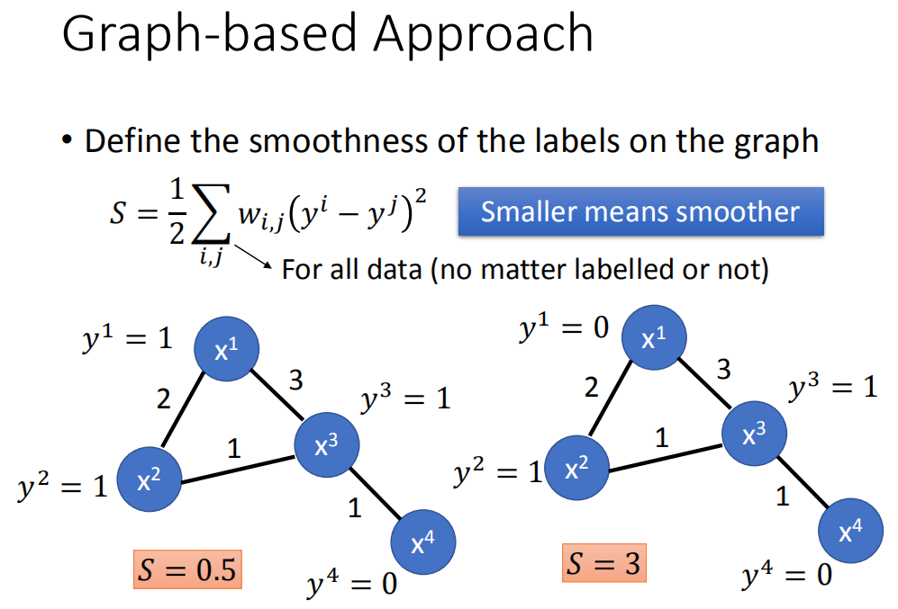
剛才是定性的說使用這個graph，接下來說怎麼定量使用這個graph。那這個定量的使用是在這個graph structure上面定義一個東西叫做：label的 smoothness，我們會定義說label有多符合我們剛才說的smoothness assumption 的假設。

現在看這兩個例子，在這兩個例子都有四個data points，data point跟data point連接的數字代表了weight。在左邊這個例子中，你給它的label是(1,1,1，0)，在右邊的例子中，給的label是(0,1,1,0)。左邊的這個例子是比較smothness的，但是我們需要一個數字定量的描述它說：它有多smothness。常見的做法是這樣子的：這個式子是我們考慮兩兩有相連的point，兩兩拿出來(summation over所有data i,j)，然後計算i,j之間的weight跟y的label減去j的label的平方(這個是summation 所有data，不管他現在是有label還是沒有label)。所以你看左邊這個case，在summation over所有的data的時候，你只需要考慮,s=0.5(只是在計算時比較方便而已，沒有真正的效用)，右邊的class s=3，這個值(s )越小越smothness，你會希望你得出的labelsmothness的定義算出來越小越好。

現在看這兩個例子，在這兩個例子都有四個data points，data point跟data point連接的數字代表了weight。在左邊這個例子中，你給它的label是(1,1,1，0)，在右邊的例子中，給的label是(0,1,1,0)。左邊的這個例子是比較smothness的，但是我們需要一個數字定量的描述它說：它有多smothness。常見的做法是這樣子的：$S=\frac{1}{2}\sum_{ij}w_{i,j}(y^i-y^j)^2$。這個式子是我們考慮兩兩有相連的point，兩兩拿出來(summation over所有data i,j)，然後計算i,j之間的weight跟y的label減去j的label的平方(這個是summation 所有data，不管他現在是有label還是沒有label)。所以你看左邊這個case，在summation over所有的data的時候，你只需要考慮$x_3,x_4$,s=0.5(只是在計算時比較方便而已，沒有真正的效用)，右邊的class s=3 ，這個值(s)越小越smothness，你會希望你得出的labelsmothness的定義算出來越小越好。

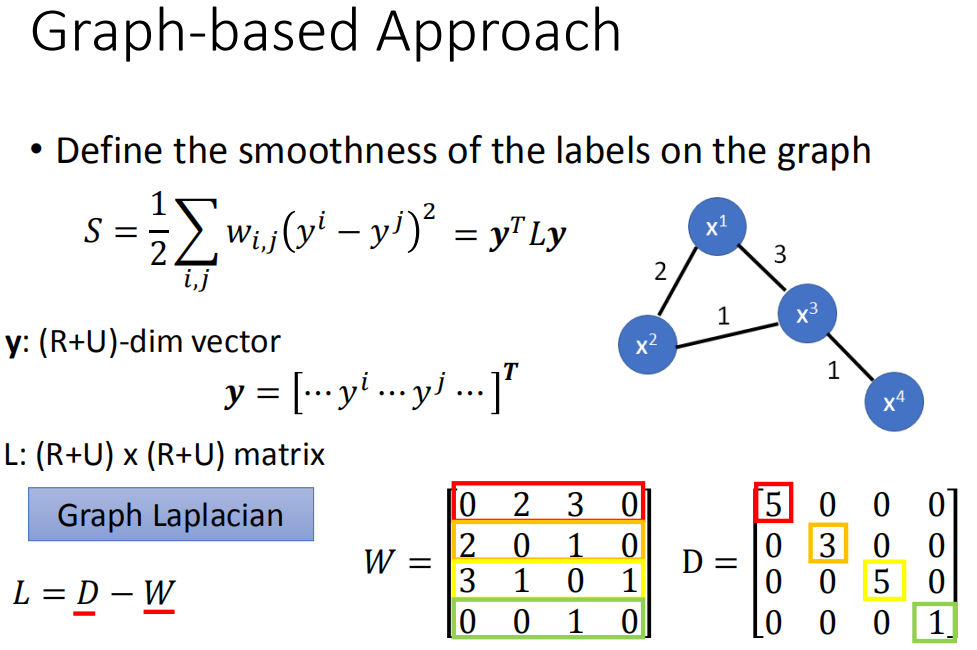
這個算式可以稍微整理整理一下，可以寫成一個簡潔的式子。我們把y串成一個vector(現在y包括label data，也包括unlabel data)，每一個筆label data和label data都賦一個值給你，現在你有R+U個dimension vector，可以寫成y。如果你這樣寫的話，s這​​個式子可以寫成y(vector)的transform乘以L(matrix)再乘以y，L是屬於(R+U)*(R+U)matrix，這個L被叫做“ Graph Laplacian”。

這個L的定義是：兩個matrix相減(L=D-W)。 W就是你把這些data point兩兩之間weight connection建成一個matrix，這個matrix的四個row個四個columns分別代表data$x^1$到$x^4$,D是你把w的每組row合起來。

現在我們可以用$y^TLy$去評估我們現在得到的label有多smothness。在這個式子裡面我們會看到有y，這個y是label，這個label的值也就是neural network output的值是取決於neural parameters。這一項其實是neural 的depending，所以你要把graph的information考慮到neural network的train的時候，你要做的事情其實就是在原來的loss function裡面加一項。假設你原來的loss function是cross entropy，你就加另外一項，你加的這一項是smoothness的值乘以某一個你想要調的參數，後面這一項$\lambda$S其實就是像徵了regulization term。你不只要調整參數讓你那些label data的output跟真正的label越接近越好，你同時還要做到說：output這些label，不管是在label data還是在unlabel data上面，它都符合smothness assuption的假設是由這個s所衡量出來的。所以你要minimize前一項還要minimize後一項(用梯度下降)

其實你要算smothness時不一定要放在output的地方，如果你今天是deep neural network的話，你可以把你的smothness放在network任何地方。你可以假設你的output是smooth，你也可以同時說：我把某一個hidden layer接出來再乘上別的一些transform，它也要是smooth，也可以說每一個hidden layer的output都是smooth

## Better Representation
最後一個方法是：Better Representation，這個方法的精神是：“去無存青，化繁為簡”，等到unsupervised的時候再講。
它的精神是這樣子的：我們觀察到的世界其實是很複雜的，我們在我們觀察到的世界背後其實是有一些比較簡單的東西在操控著我們這個複雜的世界，所以你只要能看透這個世界的假象，直指它的核心的話就可以讓訓練變得容易。

