## 回歸定義和應用例子
### 回歸定義
Regression 就是找到一個函數 $function$ ，通過輸入特徵 $x$，輸出一個數值 $Scalar$。
### 應用舉例
- 股市預測（Stock market forecast）

    輸入：過去10年股票的變動、新聞諮詢、公司併購諮詢等
    
    輸出：預測股市明天的平均值
    
- 自動駕駛（Self-driving Car）

    輸入：無人車上的各個sensor的數據，例如路況、測出的車距等
    
    輸出：方向盤的角度
    
- 商品推薦（Recommendation）

    輸入：商品A的特性，商品B的特性
    
    輸出：購買商品B的可能性
    
- Pokemon精靈攻擊力預測（Combat Power of a pokemon）：

    輸入：進化前的CP值、物種（Bulbasaur）、血量（HP）、重量（Weight）、高度（Height）
    
    輸出：進化後的CP值

## 模型步驟
- step1：模型假設，選擇模型框架（線性模型）
- step2：模型評估，如何判斷眾多模型的好壞（損失函數）
- step3：模型優化，如何篩選最優的模型（梯度下降）

### Step 1：模型假設 - 線性模型
#### 一元線性模型（單個特徵）

以一個特徵 $x_{cp}$ 為例，線性模型假設 $y = b + w·x_{cp}$ ，所以 $w$ 和 $b$ 可以猜測很多模型：
$$
f_1: y = 10.0 + 9.0·x_{cp} \\
f_2: y = 9.8 + 9.2·x_{cp} \\
f_3: y = - 0.8 - 1.2·x_{cp} \\
···
$$

雖然可以做出很多假設，但在這個例子中，顯然 $f_3: y = - 0.8 - 1.2·x_{cp}$ 的假設是不合理的，不能進化後CP值是個負值吧~~

#### 多元線性模型（多個特徵）
在實際應用中，輸入特徵肯定不止 $x_{cp}$ 這一個。例如，進化前的CP值、物種（Bulbasaur）、血量（HP）、重量（Weight）、高度（Height）等，特徵會有很多。

所以我們假設 **線性模型 Linear model**：$y = b + \sum w_ix_i$
- $x_i$：就是各種特徵(fetrure) $x_{cp},x_{hp},x_w,x_h,···$
- $w_i$：各個特徵的權重 $w_{cp},w_{hp},w_w,w_h,··$
- $b$：偏移量

注意：接下來的內容需要看清楚是【單個特徵】還是【多個特徵】的示例

### Step 2：模型評估 - 損失函數
【單個特徵】: $x_{cp}$

#### 收集和查看訓練數據
這裡定義 $x^1$ 是進化前的CP值，$\hat{y}^1$ 進化後的CP值，$\hat{}$ 所代表的是真實值

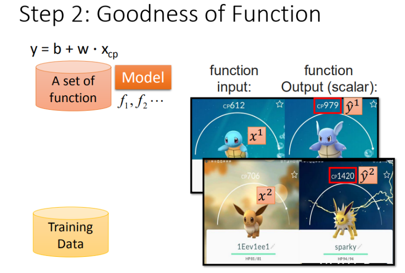

將10組原始數據在二維圖中展示，圖中的每一個點 $(x_{cp}^n,\hat{y}^n)$ 對應著 進化前的CP值 和 進化後的CP值。

#### 如何判斷眾多模型的好壞
有了這些真實的數據，那我們怎麼衡量模型的好壞呢？從數學的角度來講，我們使用距離。求【進化後的CP值】與【模型預測的CP值】差，來判定模型的好壞。也就是使用損失函數（Loss function） 來衡量模型的好壞，統計10組原始數據$\left ( \hat{y}^n - f(x_{cp}^n) \right )^2$ 的和，和越小模型越好。如下圖所示：

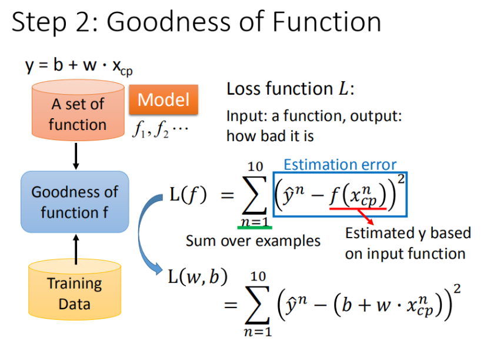

如果覺得看著這個圖會暈，忽略圖4，直接看公式推導的過程：

$$
\begin{aligned}
L(f) & = \sum_{n=1}^{10}\left ( \hat{y}^n - f(x_{cp}^n) \right )^2，將【f(x) = y】, 【y= b + w·x_{cp}】代入\\
& = \sum_{n=1}^{10}\left ( \hat{y}^n - (b + w·x_{cp}) \right )^2\\
\end{aligned}
$$

最終定義損失函數Loss function：$L(w,b)= \sum_{n=1}^{10}\left ( \hat{y}^n - (b + w·x_{cp}) \right ) ^2$

我們將 $w$, $b$ 在二維坐標圖中展示，如圖所示：

- 圖中每一個點代表著一個模型對應的 $w$ 和 $b$
- 顏色越深代表模型更優

可以與後面的圖11（等高線）進行對比

### Step 3：最佳模型 - 梯度下降

【單個特徵】: $x_{cp}$

#### 如何篩選最優的模型（參數w，b）
已知損失函數是$L(w,b)= \sum_{n=1}^{10}\left ( \hat{y}^n - (b + w·x_{cp}) \right )^2 $ ，需要找到一個令結果最小的$f^*$，在實際的場景中，我們遇到的參數肯定不止$w$, $b$。

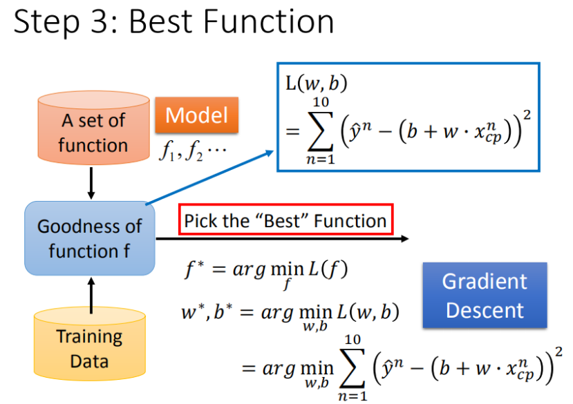

先從最簡單的只有一個參數$w$入手，定義$w^* = arg\ \underset{x}{\operatorname{\min}} L(w)$

首先在這裡引入一個概念 學習率 ：移動的步長，如圖7中 $\eta$

- 步驟1：隨機選取一個 $w^0$
- 步驟2：計算微分，也就是當前的斜率，根據斜率來判定移動的方向
- 大於0向右移動（增加$w$）
- 小於0向左移動（減少$w$）
- 步驟3：根據學習率移動
- 重複步驟2和步驟3，直到找到最低點

步驟1中，我們隨機選取一個 $w^0$，如圖8所示，我們有可能會找到當前的最小值，並不是全局的最小值，這裡我們保留這個疑問，後面解決。

解釋完單個模型參數$w$，引入2個模型參數$w$ 和$b$ ， 其實過程是類似的，需要做的是偏微分，過程如圖9所示，偏微分的求解結果文章後面會有解釋，詳細的求解過程自行Google。

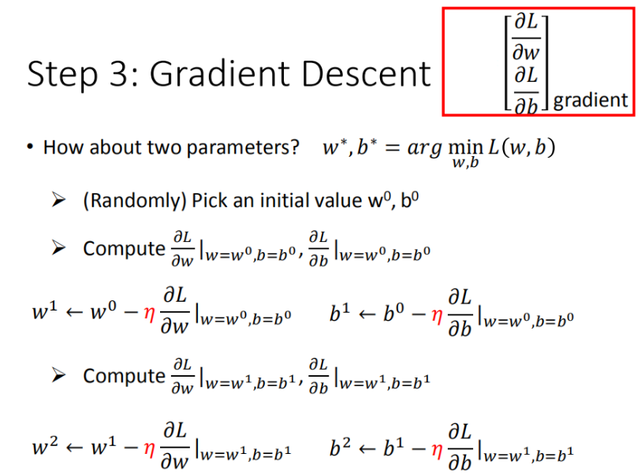

整理成一個更簡潔的公式：

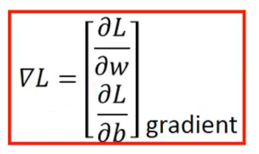

#### 梯度下降推演最優模型的過程

如果把 $w$ 和 $b$ 在圖形中展示：

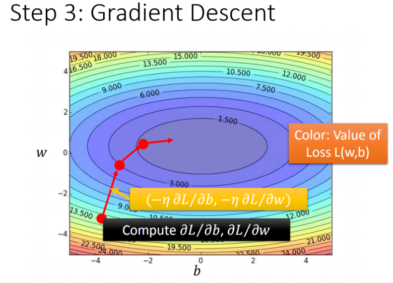

- 每一條線圍成的圈就是等高線，代表損失函數的值，顏色約深的區域代表的損失函數越小
- 紅色的箭頭代表等高線的法線方向

#### 梯度下降算法在現實世界中面臨的挑戰

我們通過梯度下降gradient descent不斷更新損失函數的結果，這個結果會越來越小，那這種方法找到的結果是否都是正確的呢？前面提到的當前最優問題外，還有沒有其他存在的問題呢？

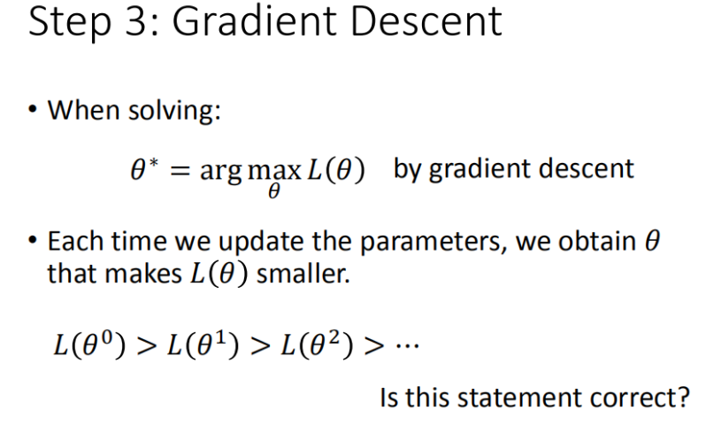

其實還會有其他的問題：
- 問題1：當前最優（Stuck at local minima）
- 問題2：等於0（Stuck at saddle point）
- 問題3：趨近於0（Very slow at the plateau）

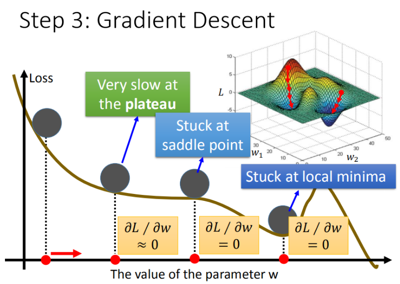

注意：其實在線性模型裡面都是一個碗的形狀（山谷形狀），梯度下降基本上都能找到最優點，但是再其他更複雜的模型裡面，就會遇到 問題2 和 問題3 了

#### w和b偏微分的計算方法

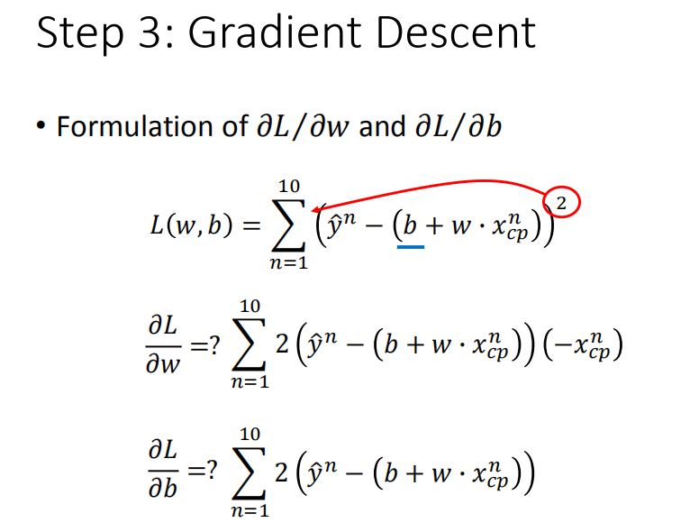

## 如何驗證訓練好的模型的好壞
使用訓練集和測試集的平均誤差來驗證模型的好壞
我們使用將10組原始數據，訓練集求得平均誤差為31.9，如圖所示：

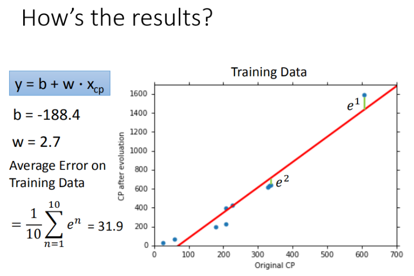

然後再使用10組Pokemons測試模型，測試集求得平均誤差為35.0 如圖所示：

## 更強大復雜的模型：1元N次線性模型

在模型上，我們還可以進一部優化，選擇更複雜的模型，使用1元2次方程舉例，如圖17，發現訓練集求得平均誤差為15.4，測試集的平均誤差為18.4

這裡我們又提出一個新的問題：是不是能畫出直線就是線性模型，各種複雜的曲線就是非線性模型？
其實還是線性模型，因為把$x_{cp}^1$ = $(x_{cp})^2$ 看作一個特徵，那麼$y = b + w_1·x_{cp} + w_2·x_{cp} ^1$ 其實就是線性模型。

## 過擬合問題出現
在模型上，我們再可以進一部優化，使用更給次方的模型，如圖所示
- 訓練集平均誤差【15.4】【15.3】【14.9】【12.8】
- 測試集平均誤差【18.4】【18.1】【28.8】【232.1】

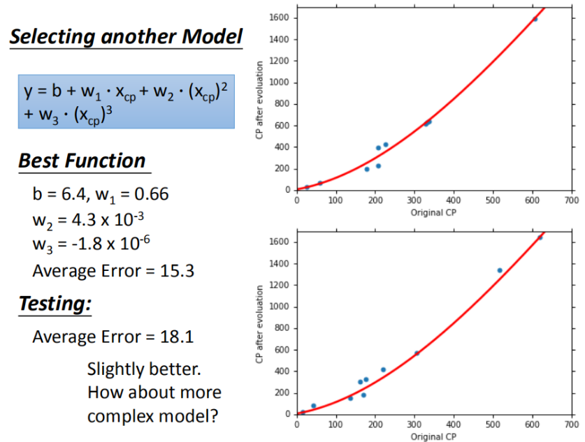

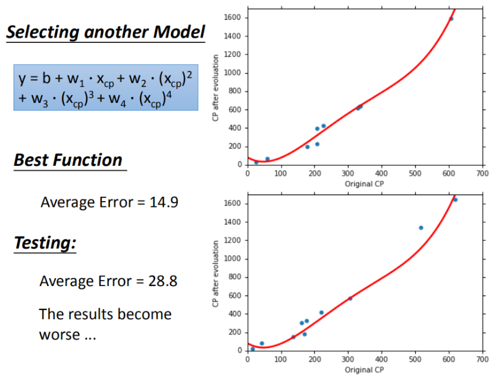

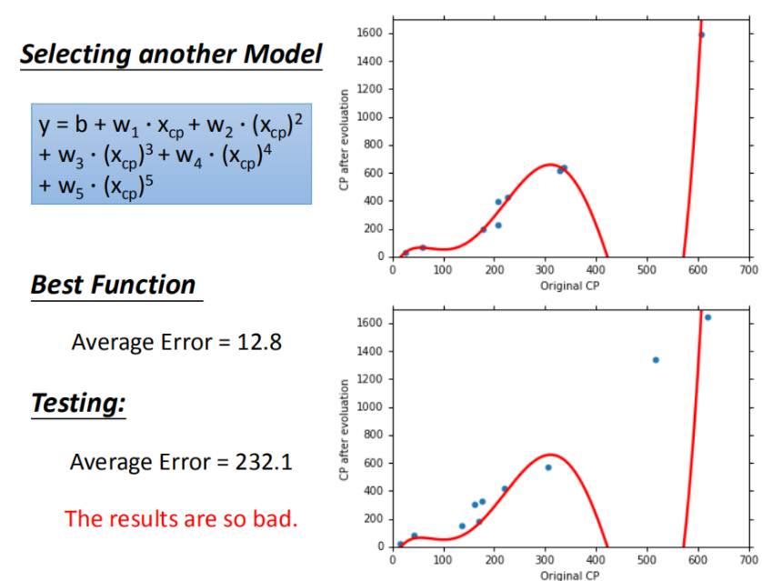

在訓練集上面表現更為優秀的模型，為什麼在測試集上效果反而變差了？這就是模型在訓練集上過擬合的問題。

如圖所示，每一個模型結果都是一個集合，$5次模型包 \supseteq 4次模型 \supseteq 3次模型$
所以在4次模型裡面找到的最佳模型，肯定不會比5次模型裡面找到更差

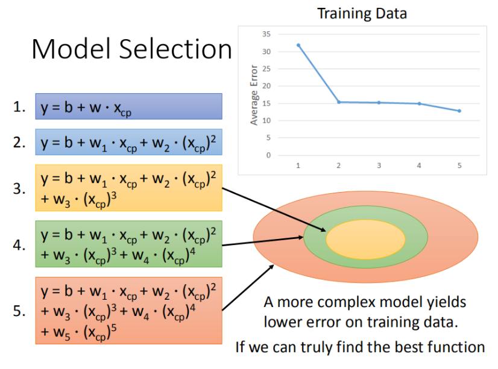

將錯誤率結果圖形化展示，發現3次方以上的模型，已經出現了過擬合的現象：

## 步驟優化

輸入更多Pokemons數據，相同的起始CP值，但進化後的CP差距竟然是2倍。如圖21，其實將Pokemons種類通過顏色區分，就會發現Pokemons種類是隱藏得比較深得特徵，不同Pokemons種類影響了進化後的CP值的結果。

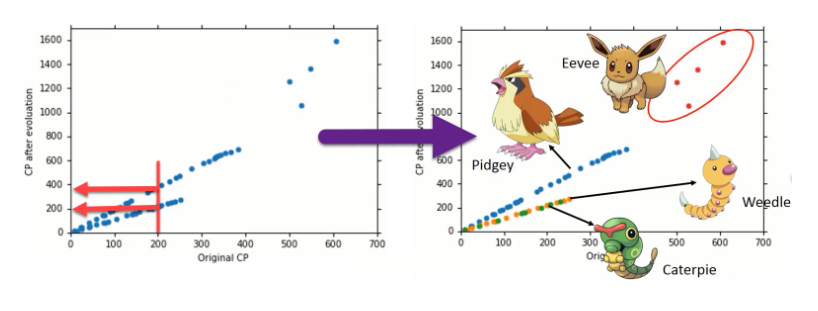

### Step1優化：2個input的四個線性模型是合併到一個線性模型中

通過對 Pokemons種類 判斷，將 4個線性模型 合併到一個線性模型中

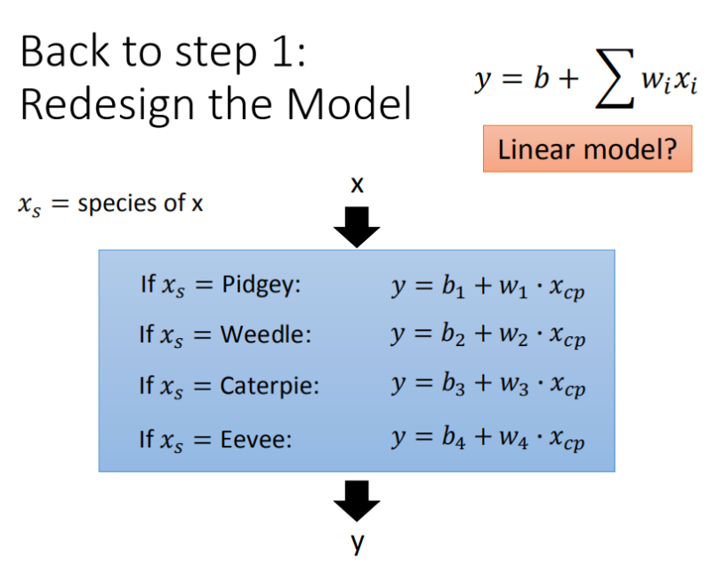

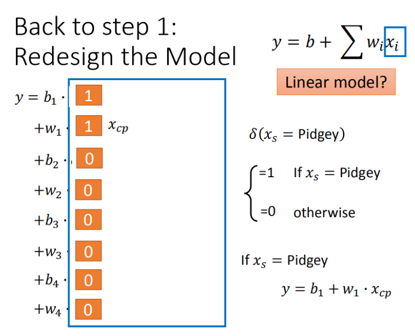

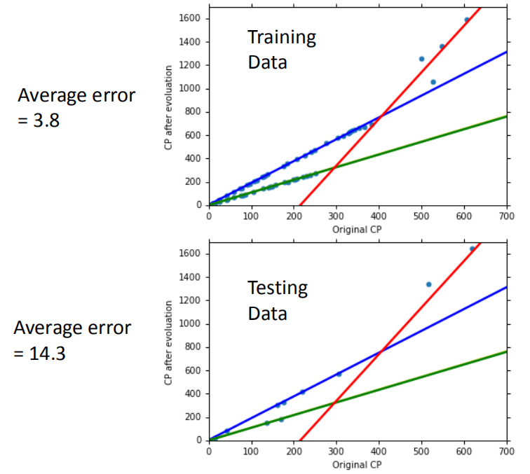

### Step2優化：如果希望模型更強大表現更好（更多參數，更多input）

在最開始我們有很多特徵，圖形化分析特徵，將血量（HP）、重量（Weight）、高度（Height）也加入到模型中

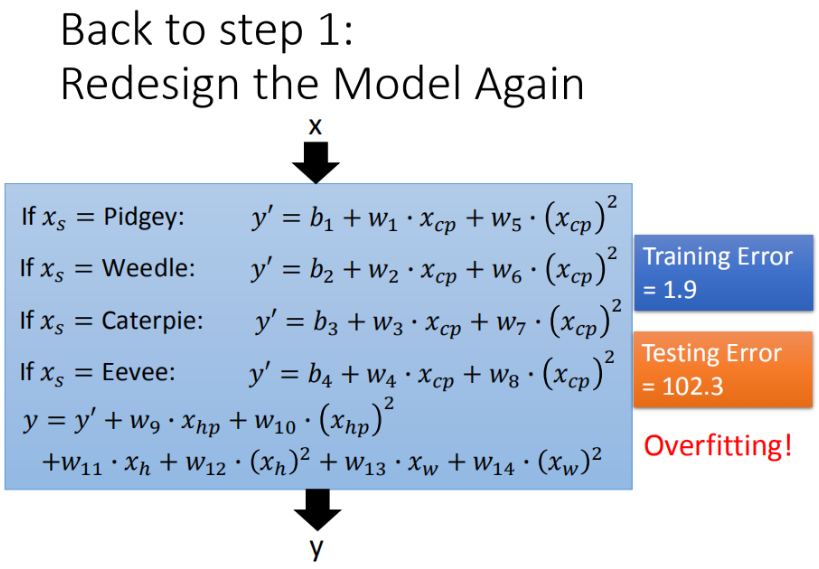

更多特徵，更多input，數據量沒有明顯增加，仍舊導致overfitting

### Step3優化：加入正則化

更多特徵，但是權重 $w$ 可能會使某些特徵權值過高，仍舊導致overfitting，所以加入正則化

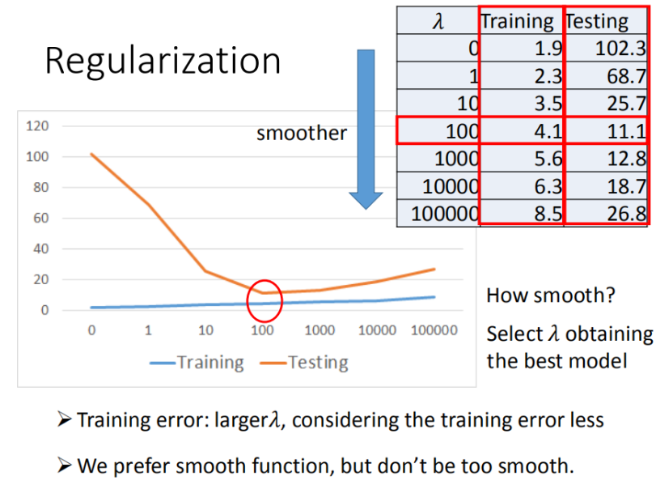

- $w$ 越小，表示 $function$ 較平滑的， $function$輸出值與輸入值相差不大
- 在很多應用場景中，並不是 $w$ 越小模型越平滑越好，但是經驗值告訴我們 $w$ 越小大部分情況下都是好的。
- $b$ 的值接近於0 ，對曲線平滑是沒有影響

## 總結

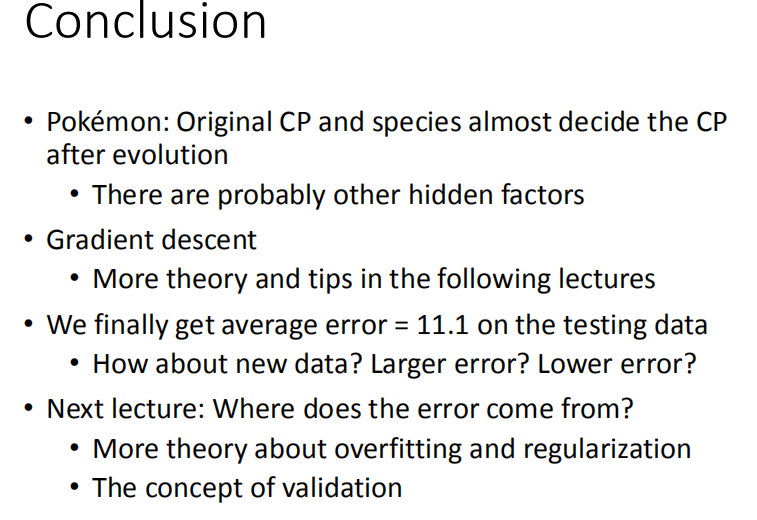

- **Pokemon**：原始的CP值極大程度
- **Gradient descent**：梯度下降的做法；後面會講到它的理論依據和要點。
- **Overfitting和Regularization**：過擬合和正則化，主要介紹了表象；後面會講到更多這方面的理論

