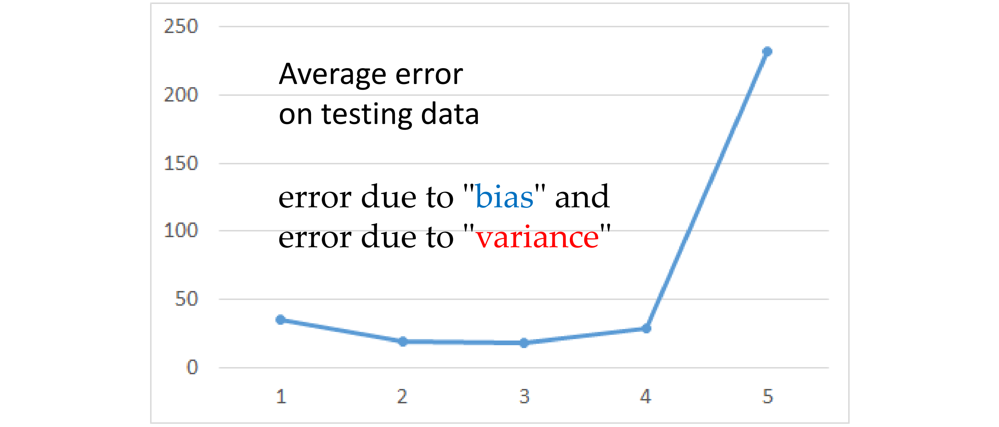
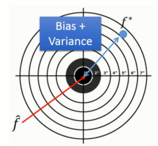
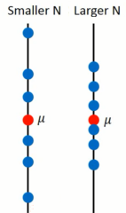
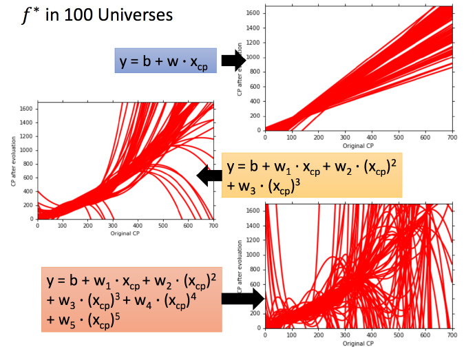
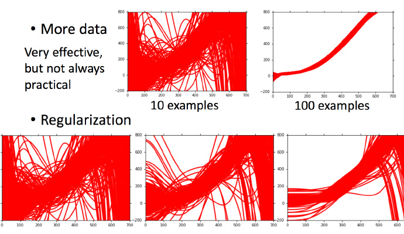

## Error的來源

從上節課測試集數據來看，$Average\ Error$ 隨著模型複雜增加呈指數上升趨勢。更複雜的模型並不能給測試集帶來更好的效果，而這些 $Error$ 的主要有兩個來源，分​​別是 $bias$ 和 $variance$ 。

然而 $bias$ 和 $variance$ 是什麼？可以查看 [機器學習中的Bias(偏差)，Error(誤差)，和Variance(方差)有什麼區別和聯繫？ ](https://www.zhihu.com/question/27068705)

## 估測

假設真實的模型為 $\hat f$ ， 如果我們知道 $\hat f$ 模型，那是最好不過了，但是 $\hat f$ 只有 Niamtic 公司才知道。

所以我們只能通過收集 Pokemon精靈 的數據，然後通過 step1~step3 訓練得到我們的理想模型 $f^*$，$f^*$ 其實是 $\hat f$ 的一個預估。

這個過程就像打靶，$\hat f$ 就是我們的靶心，$f^*$ 就是我們投擲的結果。如上圖所示，$\hat f$ 與 $f^*$ 之間藍色部分的差距就是偏差和方差導致的。

### 估測變量x的偏差和方差

我們先理解一下偏差和方差是怎樣計算的呢？ [偏差(Bias)和方差(Variance)——機器學習中的模型選擇](https://segmentfault.com/a/1190000016447144)

#### 評估x的偏差

 - 假設 $x$ 的平均值是 $\mu$，方差為 $\sigma^2$

評估平均值要怎麼做呢？

- 首先拿到 $N$ 個樣本點：$\{x^1,x^2,···,x^N\}$
- 計算平均值 $m$, 得到 $m=\frac{1}{N}\sum_n x^n \neq \mu$

但是如果計算很多組的 $m$ ，然後求 $m$ 的期望：

$$E[m]=E[\frac{1}{N}\sum x^n]=\frac{1}{N}\sum_nE[x^n]=\mu$$

這個估計呢是無偏估計（unbiased）。

然後 $m$ 分佈對於 $\mu$ 的離散程度（方差）：
$$Var[m]=\frac{\sigma^2}{N}$$

這個取決於 $N$，下圖看出 $N$ 越小越離散：

#### 估測變量x的方差

如何估算方差呢？

### 為什麼會有很多的模型?

討論系列02中的案例：這裡假設是在平行宇宙中，抓了不同的神奇寶貝

用同一個model，在不同的訓練集中找到的 $f^∗$ 就是不一樣的

這就像在靶心上射擊，進行了很多組（一組多次）。現在需要知道它的散佈是怎樣的，將100個宇宙中的model畫出來

不同的數據集之前什麼都有可能發生—||

#### 考慮不同模型的方差

一次模型的方差就比較小的，也就是是比較集中，離散程度較小。而5次模型的方差就比較大，同理散佈比較廣，離散程度較大。

所以用比較簡單的模型，方差是比較小的（就像射擊的時候每次的時候，每次射擊的設置都集中在一個比較小的區域內）。如果用了複雜的模型，方差就很大，散佈比較開。

這也是因為簡單的模型受到不同訓練集的影響是比較小的。

#### 考慮不同模型的偏差

這裡沒辦法知道真正的 $\hat{f}$，所以假設圖中的那條黑色曲線為真正的 $\hat{f}$

結果可視化，一次平均的 $\bar{f}$ 沒有5次的好，雖然5次的整體結果離散程度很高。

一次模型的偏差比較大，而復雜的5次模型，偏差就比較小。

直觀的解釋：簡單的模型函數集的space比較小，所以可能space裡面就沒有包含靶心，肯定射不中。而復雜的模型函數集的space比較大，可能就包含的靶心，只是沒有辦法找到確切的靶心在哪，但足夠多的，就可能得到真正的 f¯f¯。

#### 偏差v.s.方差

將系列02中的誤差拆分為偏差和方差。簡單模型（左邊）是偏差比較大造成的誤差，這種情況叫做欠擬合，而復雜模型（右邊）是方差過大造成的誤差，這種情況叫做過擬合。

## 怎麼判斷？

### 分析

如果模型沒有很好的訓練訓練集，就是偏差過大，也就是欠擬合
如果模型很好的訓練訓練集，即再訓練集上得到很小的錯誤，但在測試集上得到大的錯誤，這意味著模型可能是方差比較大，就是過擬合。
對於欠擬合和過擬合，是用不同的方式來處理的

#### 偏差大-欠擬合

此時應該重新設計模型。因為之前的函數集裡面可能根本沒有包含$f^*$。可以：

將更多的函數加進去，比如考慮高度重量，或者HP值等等。
或者考慮更多次冪、更複雜的模型。
如果此時強行再收集更多的data去訓練，這是沒有什麼幫助的，因為設計的函數集本身就不好，再找更多的訓練集也不會更好。

#### 方差大-過擬合

簡單粗暴的方法：更多的數據

但是很多時候不一定能做到收集更多的data。可以針對對問題的理解對數據集做調整。比如識別手寫數字的時候，偏轉角度的數據集不夠，那就將正常的數據集左轉15度，右轉15度，類似這樣的處理。

## 模型選擇

現在在偏差和方差之間就需要一個權衡
想選擇的模型，可以平衡偏差和方差產生的錯誤，使得總錯誤最小
但是下面這件事最好不要做：

用訓練集訓練不同的模型，然後在測試集上比較錯誤，模型3的錯誤比較小，就認為模型3好。但實際上這只是你手上的測試集，真正完整的測試集並沒有。比如在已有的測試集上錯誤是0.5，但有條件收集到更多的測試集後通常得到的錯誤都是大於0.5的。

### 交叉驗證

圖中public的測試集是已有的，private是沒有的，不知道的。交叉驗證 就是將訓練集再分為兩部分，一部分作為訓練集，一部分作為驗證集。用訓練集訓練模型，然後再驗證集上比較，確實出最好的模型之後（比如模型3），再用全部的訓練集訓練模型3，然後再用public的測試集進行測試，此時一般得到的錯誤都是大一些的。不過此時會比較想再回去調一下參數，調整模型，讓在public的測試集上更好，但不太推薦這樣。 （心裡難受啊，大學數模的時候就回去調，來回痛苦折騰）

上述方法可能會擔心將訓練集拆分的時候分的效果比較差怎麼辦，可以用下面的方法。

### N-折交叉驗證
將訓練集分成N份，比如分成3份。

比如在三份中訓練結果Average錯誤是模型1最好，再用全部訓練集訓練模型1。
