## 什麼是梯度下降法？

在第二篇文章中有介紹到梯度下降法的做法，傳送門：機器學習入門系列02，Regression 回歸：案例研究

### Review: 梯度下降法
在回歸問題的第三步中，需要解決下面的最優化問題：

$$\theta^∗= \underset{ \theta }{\operatorname{arg\ min}} L(\theta) \tag1$$
- $L$ :lossfunction（損失函數）
- $\theta$ :parameters（參數）

這裡的parameters是複數，即 $\theta$ 指代一堆參數，比如上篇說到的 $w$ 和 $b$ 。

我們要找一組參數 $\theta$ ，讓損失函數越小越好，這個問題可以用梯度下降法解決：

假設 $\theta$ 有里面有兩個參數 $\theta_1, \theta_2$
隨機選取初始值

$$
\theta^0 = \begin{bmatrix}
\theta_1^0 \\
\theta_2^0
\end{bmatrix} \tag2
$$

這裡可能某個平台不支持矩陣輸入，看下圖就好。

然後分別計算初始點處，兩個參數對 $L$ 的偏微分，然後 $\theta^0$ 減掉 $\eta$ 乘上偏微分的值，得到一組新的參數。同理反復進行這樣的計算。黃色部分為簡潔的寫法，$\triangledown L(\theta)$ 即為梯度。
 > $\eta$ 叫做Learning rates（學習速率）

上圖舉例將梯度下降法的計算過程進行可視化。

## Tip1：調整學習速率
### 小心翼翼地調整學習率

舉例：

上圖左邊黑色為損失函數的曲線，假設從左邊最高點開始，如果學習率調整的剛剛好，比如紅色的線，就能順利找到最低點。如果學習率調整的太小，比如藍色的線，就會走的太慢，雖然這種情況給足夠多的時間也可以找到最低點，實際情況可能會等不及出結果。如果 學習率調整的有點大，比如綠色的線，就會在上面震盪，走不下去，永遠無法到達最低點。還有可能非常大，比如黃色的線，直接就飛出去了，更新參數的時候只會發現損失函數越更新越大。

雖然這樣的可視化可以很直觀觀察，但可視化也只是能在參數是一維或者二維的時候進行，更高維的情況已經無法可視化了。

解決方法就是上圖右邊的方案，將參數改變對損失函數的影響進行可視化。比如學習率太小（藍色的線），損失函數下降的非常慢；學習率太大（綠色的線），損失函數下降很快，但馬上就卡住不下降了；學習率特別大（黃色的線），損失函數就飛出去了；紅色的就是差不多剛好，可以得到一個好的結果。

### 自適應學習率
舉一個簡單的思想：隨著次數的增加，通過一些因子來減少學習率
- 通常剛開始，初始點會距離最低點比較遠，所以使用大一點的學習率
- update好幾次參數之後呢，比較靠近最低點了，此時減少學習率

- 比如 $\eta^t =\frac{\eta^t}{\sqrt{t+1}}$，$t$ 是次數。隨著次數的增加，$\eta^t$ 減小

學習率不能是一個值通用所有特徵，不同的參數需要不同的學習率

### Adagrad 算法
#### Adagrad 是什麼？
每個參數的學習率都把它除上之前微分的均方根。解釋：

普通的梯度下降為：

$$w^{t+1} \leftarrow w^t -η^tg^t \tag3$$
$$\eta^t =\frac{\eta^t}{\sqrt{t+1}} \tag4$$

- $w$ 是一個參數

Adagrad 可以做的更好：
$$w^{t+1} \leftarrow w^t -\frac{η^t}{\sigma^t}g^t \tag5$$
$$g^t =\frac{\partial L(\theta^t)}{\partial w} \tag6$$
- $\sigma^t$ :之前參數的所有微分的均方根，對於每個參數都是不一樣的。

#### Adagrad舉例
下圖是一個參數的更新過程

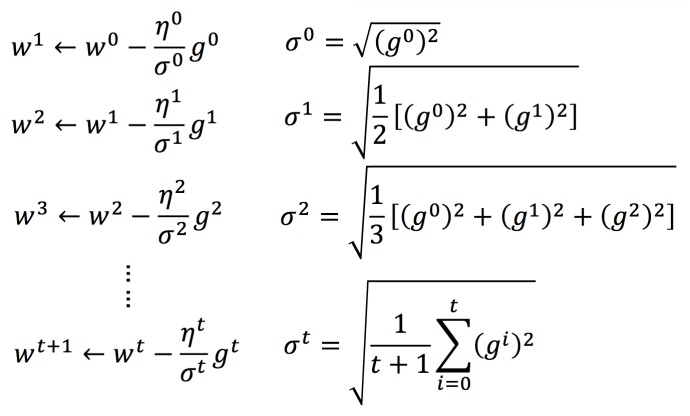

將 Adagrad 的式子進行化簡：
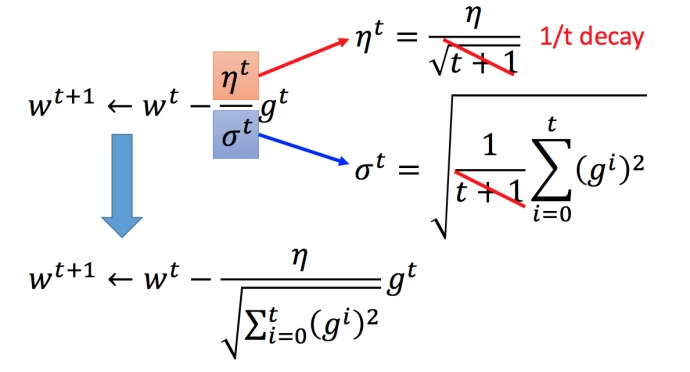

#### Adagrad 存在的矛盾？

在 Adagrad 中，當梯度越大的時候，步伐應該越大，但下面分母又導致當梯度越大的時候，步伐會越小。

下圖是一個直觀的解釋：

下面給一個正式的解釋：

比如初始點在$x_0$，最低點為$−\frac{b}{2a}$，最佳的步伐就是$x0$ 到最低點之間的距離$\left | x_0+\frac{b}{2a } \right |$，也可以寫成$\left | \frac{2ax_0+b}{2a} \right |$。而剛好 $|2ax_0+b|$ 就是方程絕對值在 $x_0$ 這一點的微分。

這樣可以認為如果算出來的微分越大，則距離最低點越遠。而且最好的步伐和微分的大小成正比。所以如果踏出去的步伐和微分成正比，它可能是比較好的。

結論1-1：梯度越大，就跟最低點的距離越遠。

這個結論在多個參數的時候就不一定成立了。

#### 多參數下結論不一定成立
對比不同的參數

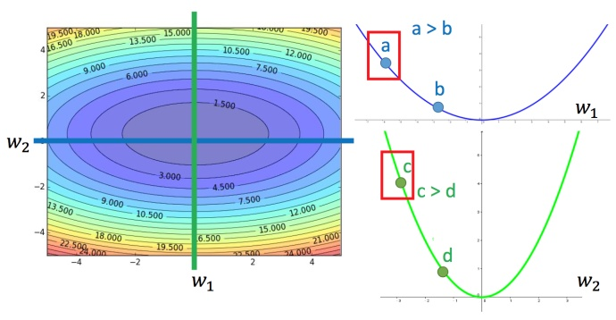

上圖左邊是兩個參數的損失函數，顏色代表損失函數的值。如果只考慮參數 $w_1$，就像圖中藍色的線，得到右邊上圖結果；如果只考慮參數 $w_2$，就像圖中綠色的線，得到右邊下圖的結果。確實對於 $a$ 和 $b$，結論1-1是成立的，同理 $c$ 和 $b$ 也成立。但是如果對比$a$ 和 $c$，就不成立了，$c$ 比 $a$ 大，但 $c$ 距離最低點是比較近的。

所以結論1-1是在沒有考慮跨參數對比的情況下，才能成立的。所以還不完善。

之前說到的最佳距離 $\left | \frac{2ax_0+b}{2a} \right |$，還有個分母 $2a$ 。對function進行二次微分剛好可以得到：
$$\frac{\partial ^2y}{\partial x^2} = 2a \tag7$$
所以最好的步伐應該是：
$$\frac{一次微分}{二次微分}$$
即不止和一次微分成正比，還和二次微分成反比。最好的step應該考慮到二次微分：

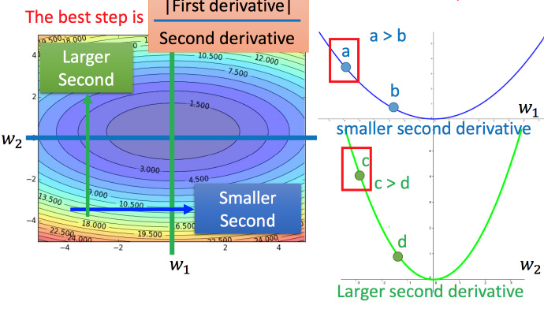

#### Adagrad 進一步的解釋
再回到之前的 Adagrad

對於 $\sqrt{\sum_{i=0}^t(g^i)^2}$ 就是希望再盡可能不增加過多運算的情況下模擬二次微分。 （如果計算二次微分，在實際情況中可能會增加很多的時間消耗）

## Tip2：隨機梯度下降法

之前的梯度下降：

$$L=\sum_n(\hat y^n-(b+\sum w_ix_i^n))^2 \tag8$$
$$\theta^i =\theta^{i-1}- \eta\triangledown L(\theta^{i-1}) \tag9$$

而隨機梯度下降法更快：

損失函數不需要處理訓練集所有的數據，選取一個例子 $x^n$

$$L=(\hat y^n-(b+\sum w_ix_i^n))^2 \tag{10}$$
$$\theta^i =\theta^{i-1}- \eta\triangledown L^n(\theta^{i-1}) \tag{11}$$

此時不需要像之前那樣對所有的數據進行處理，只需要計算某一個例子的損失函數Ln，就可以趕緊update 梯度。

對比：

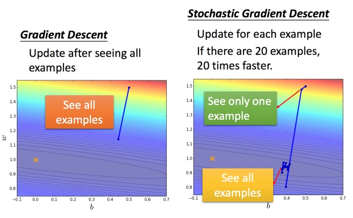

常規梯度下降法走一步要處理到所有二十個例子，但隨機算法此時已經走了二十步（每處理一個例子就更新）

## Tip3：特徵縮放
比如有個函數：

$$y=b+w_1x_1+w_2x_2 \tag{12}$$
兩個輸入的分佈的範圍很不一樣，建​​議把他們的範圍縮放，使得不同輸入的範圍是一樣的。

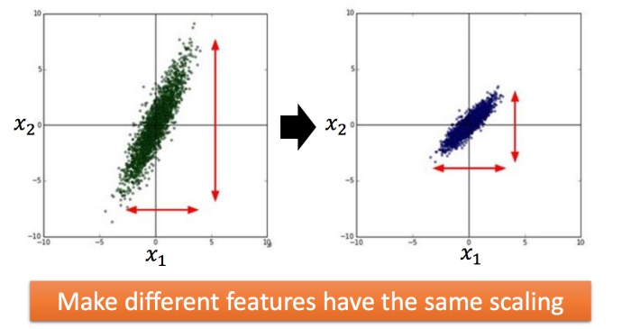

### 為什麼要這樣做？
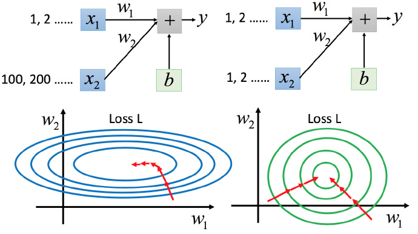

上圖左邊是$x_1$ 的scale比$x_2$ 要小很多，所以當$w_1$ 和$w_2$ 做同樣的變化時，$w_1$ 對$y$ 的變化影響是比較小的，$x_2$對$y$ 的變化影響是比較大的。

坐標系中是兩個參數的error surface（現在考慮左邊藍色），因為$w_1$ 對$y$ 的變化影響比較小，所以$w_1$ 對損失函數的影響比較小，$w_1$ 對損失函數有比較小的微分，所以$w_1$ 方向上是比較平滑的。同理 $x_2$ 對 $y$ 的影響比較大，所以 $x_2$ 對損失函數的影響比較大，所以在 $x_2$ 方向有比較尖的峽谷。

上圖右邊是兩個參數scaling比較接近，右邊的綠色圖就比較接近圓形。

對於左邊的情況，上面講過這種狹長的情形不過不用Adagrad的話是比較難處理的，兩個方向上需要不同的學習率，同一組學習率會搞不定它。而右邊情形更新參數就會變得比較容易。左邊的梯度下降並不是向著最低點方向走的，而是順著等高線切線法線方​​向走的。但綠色就可以向著圓心（最低點）走，這樣做參數更新也是比較有效率。

### 怎麼做縮放？

方法非常多，這裡舉例一種常見的做法：

上圖每一列都是一個例子，裡面都有一組特徵。

對每一個維度 $i$（綠色框）都計算平均數，記做 $m_i$；還要計算標準差，記做 $\sigma _i$。

然後用第$r$ 個例子中的第$i$ 個輸入，減掉平均數$m_i$，然後除以標準差$\sigma _i$，得到的結果是所有的維數都是$0$，所有的方差都是$1$

## 梯度下降的理論基礎
### 問題
當用梯度下降解決問題：

$$\theta^∗= \underset{ \theta }{\operatorname{arg\ max}} L(\theta) \tag1$$

每次更新參數 $\theta$，都得到一個新的 $\theta$，它都使得損失函數更小。即：

$$L(\theta^0) >L(\theta^1)>L(\theta^2)>···\tag{13}$$

上述結論正確嗎？

結論是不正確的。 。 。

## 數學理論
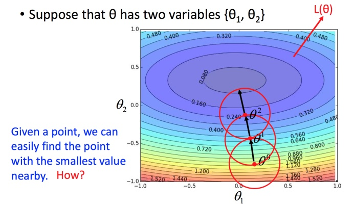

比如在 $\theta^0$ 處，可以在一個小範圍的圓圈內找到損失函數細小的 $\theta^1$，不斷的這樣去尋找。

接下來就是如果在小圓圈內快速的找到最小值？

### 泰勒展開式

先介紹一下泰勒展開式

#### 定義
若 $h(x)$ 在 $x=x_0$ 點的某個領域內有無限階導數（即無限可微分，infinitely differentiable），那麼在此領域內有：

$$
\begin{aligned}
h(x) &= \sum_{k=0}^{\infty }\frac{h^k(x_0)}{k!}(x-x_0)^k \\
& =h(x_0)+{h}'(x_0)(x−x_0)+\frac{h''(x_0)}{2!}(x−x_0)^2+⋯
\tag{14}
\end{aligned}
$$

當 $x$ 很接近 $x_0$ 時，有 $h(x)≈h(x_0)+{h}'(x_0)(x−x_0)$
式14 就是函數 $h(x)$ 在 $x=x_0$ 點附近關於 $x$ 的冪函數展開式，也叫泰勒展開式。

舉例：

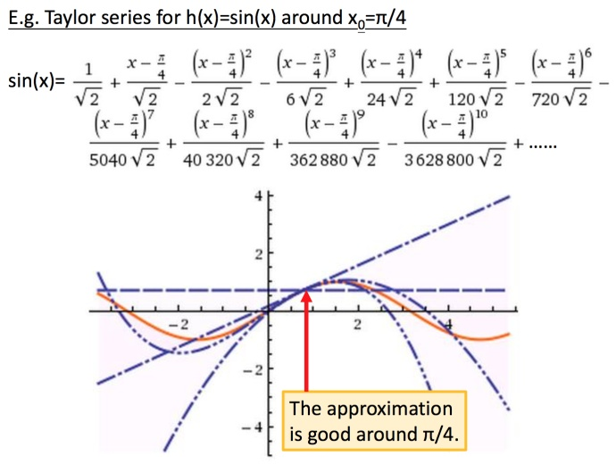

圖中3條藍色線是把前3項作圖，橙色線是 $sin(x)$。

#### 多變量泰勒展開式
下面是兩個變量的泰勒展開式

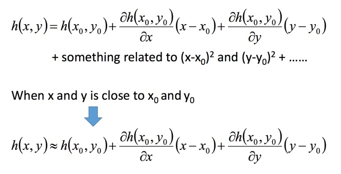

### 利用泰勒展開式簡化
回到之前如何快速在圓圈內找到最小值。基於泰勒展開式，在 $(a,b)$ 點的紅色圓圈範圍內，可以將損失函數用泰勒展開式進行簡化：

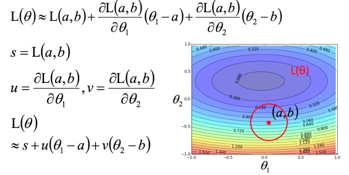

將問題進而簡化為下圖：

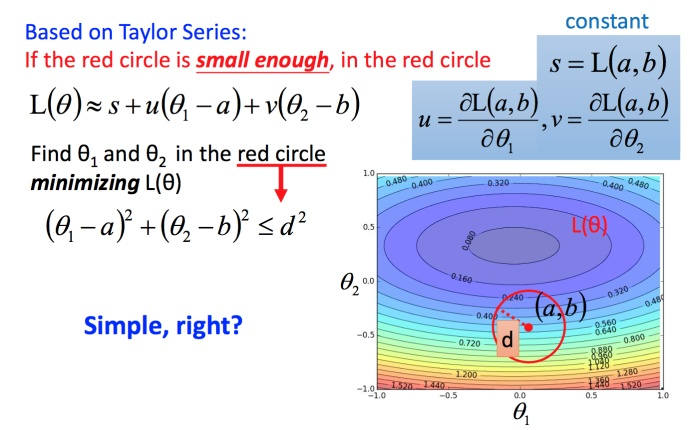

不考慮s的話，可以看出剩下的部分就是兩個向量$(\triangle \theta_1,\triangle \theta_2)$ 和$(u,v)$ 的內積，那怎樣讓它最小，就是和向量$(u,v)$ 方向相反的向量

然後將u和v帶入。

$$L(\theta)\approx s+u(\theta_1 - a)+v(\theta_2 - b) \tag{14}$$

發現最後的式子就是梯度下降的式子。但這裡用這種方法找到這個式子有個前提，泰勒展開式給的損失函數的估算值是要足夠精確的，而這需要紅色的圈圈足夠小（也就是學習率足夠小）來保證。所以理論上每次更新參數都想要損失函數減小的話，即保證式1-2 成立的話，就需要學習率足夠足夠小才可以。

所以實際中，當更新參數的時候，如果學習率沒有設好，是有可能式1-2是不成立的，所以導致做梯度下降的時候，損失函數沒有越來越小。

式1-2只考慮了泰勒展開式的一次項，如果考慮到二次項（比如牛頓法），在實際中不是特別好，會涉及到二次微分等，多很多的運算，性價比不好。

## 梯度下降的限制

容易陷入局部極值
還有可能卡在不是極值，但微分值是0的地方
還有可能實際中只是當微分值小於某一個數值就停下來了，但這裡只是比較平緩，並不是極值點

