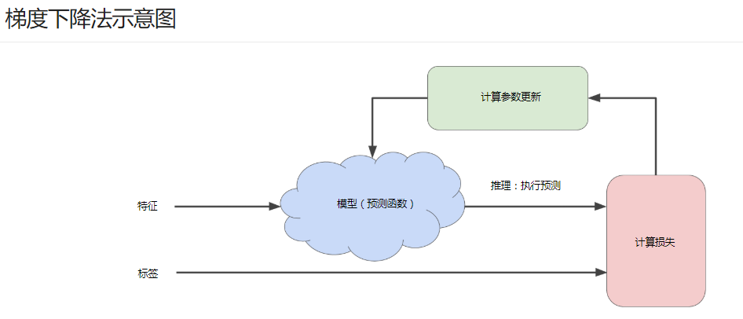

# 降低損失（Reducing Loss）

為了訓練模型，我們需要一種可降低模型損失的好方法。迭代方法是一種廣泛用於降低損失的方法，而且使用起來簡單有效。

## **學習目標**

- 了解如何使用迭代方法來訓練模型

- 全面了解梯度下降法和一些變體，包括：

  1. 小批量梯度下降法

  2. 隨機梯度下降法

  3. 嘗試不同的學習速率。

## 權重初始化

- 對於凸形問題，權重可以從任何位置開始（比如，所有值為 0 的位置）

  1. 凸形：想像一個碗的形狀（如下圖[1]所示）
  2. 只有一個最低點

- 預示：不適用於神經網絡

  1. 非凸形：想像一個蛋託的形狀（如下圖[2]所示）
  
  2. 有多個最低點
  
  3. 很大程度上取決於初始值
  
## 降低損失：迭代方法

[上一單元](深入了解機器學習.md)介紹了損​​失的概念。在本單元中，您將了解機器學習模型如何以迭代方式降低損失。

迭代學習可能會讓您想到“[Hot and Cold](http://www.howcast.com/videos/258352-how-to-play-hot-and-cold/)”這種尋找隱藏物品（如頂針）的兒童遊戲。在我們的遊戲中，“隱藏的物品”就是最佳模型。剛開始，您會胡亂猜測（“w1 的值為 0。”），等待系統告訴您損失是多少。然後，您再嘗試另一種猜測（“w1 的值為 0.5。”），看看損失是多少。哎呀，這次更接近目標了。實際上，如果您以正確方式玩這個遊戲，通常會越來越接近目標。這個遊戲真正棘手的地方在於盡可能高效地找到最佳模型。

下圖顯示了機器學習算法用於訓練模型的迭代試錯過程：



**圖 1. 用於訓練模型的迭代方法**

我們將在整個機器學習速成課程中使用相同的迭代方法詳細說明各種複雜情況，尤其是處於暴風雨中的藍雲區域。迭代策略在機器學習中的應用非常普遍，這主要是因為它們可以很好地擴展到大型數據集。

“模型”部分將一個或多個特徵作為輸入，然後返回一個預測 (y') 作為輸出。為了進行簡化，不妨考慮一種採用一個特徵並返回一個預測的模型：

y′=b+w1x1

我們應該為 b 和 w1 設置哪些初始值？對於線性回歸問題，事實證明初始值並不重要。我們可以隨機選擇值，不過我們還是選擇採用以下這些無關緊要的值：

- b = 0
- w1 = 0

假設第一個特徵值是 10。將該特徵值代入預測函數會得到以下結果：

```
  y' = 0 + 0(10)
  y' = 0

```

圖中的“計算損失”部分是模型將要使用的[損失函數](深入了解機器學習.md)。假設我們使用平方損失函數。損失函數將採用兩個輸入值：

- **y'：模型對特徵 x 的預測**
- **y：特徵 x 對應的正確標籤**

最後，我們來看圖的“計算參數更新”部分。機器學習系統就是在此部分檢查損失函數的值，並為 b 和 w1 生成新值。現在，假設這個神秘的綠色框會產生新值（綠色框如圖1所示），然後機器學習系統將根據所有標籤重新評估所有特徵，為損失函數生成一個新值，而該值又產生新的參數值。這種學習過程會持續迭代，直到該算法發現損失可能最低的模型參數。通常，您可以不斷迭代，直到總體損失不再變化或至少變化極其緩慢為止。這時候，我們可以說該模型已**收斂**。

**要點** 在訓練機器學習模型時，首先對權重和偏差進行初始猜測，然後反複調整這些猜測，直到獲得損失可能最低的權重和偏差為止。

**關鍵字詞**

[收斂](https://developers.google.com/machine-learning/crash-course/glossary#convergence)：通俗來說，收斂通常是指在訓練期間達到的一種狀態，即經過一定次數的迭代之後，訓練[損失](https://developers.google.com/machine-learning/crash-course/glossary#loss)和驗證損失在每次迭代中的變化都非常小或根本沒有變化。也就是說，如果採用當前數據進行額外的訓練將無法改進模型，模型即達到收斂狀態。在深度學習中，損失值有時會在最終下降之前的多次迭代中保持不變或幾乎保持不變，暫時形成收斂的假象。

  另請參閱[**早停法**](https://developers.google.com/machine-learning/crash-course/glossary#early_stopping)。

  另請參閱 Boyd 和 Vandenberghe 合著的 [Convex Optimization](https://web.stanford.edu/~boyd/cvxbook/bv_cvxbook.pdf)（《凸優化》）。

- [損失](https://developers.google.com/machine-learning/glossary#loss)：一種衡量指標，用於衡量模型的 [預測](https://developers.google.com/machine-learning/glossary#prediction) 偏離其[標籤](https://developers.google.com/machine-learning/glossary/#label)的程度。或者更悲觀地說是衡量模型有多差。要確定此值，模型必須定義損失函數。例如，線性回歸模型通常將[均方誤差](https://developers.google.com/machine-learning/glossary/#MSE)用於損失函數，而邏輯回歸模型則使用[對數損失函數](https://developers.google.com/machine-learning/glossary/#Log_Loss)。

- [訓練](https://developers.google.com/machine-learning/glossary#training)：確定構成模型的理想[參數](https://developers.google.com/machine-learning /glossary#parameter)的過程。

## 降低損失（Reducing Loss）：梯度下降法GD

梯度下降法：一種通過計算並且減小梯度將[損失](https://developers.google.com/machine-learning/crash-course/glossary#loss)降至最低的技術，它以訓練數據為條件，來計算損失相對於模型參數的梯度。通俗來說，梯度下降法以迭代方式調整參數，逐漸找到[權重](https://developers.google.com/machine-learning/crash-course/glossary#weight)和偏差的最佳組合，從而將損失降至最低。

迭代方法圖（[圖1](https://developers.google.com/machine-learning/crash-course/reducing-loss/an-iterative-approach#ml-block-diagram)）包含一個標題為“計算參數更新”的華而不實的綠框。現在，我們將用更實質的方法代替這種華而不實的算法。

假設我們有時間和計算資源來計算 w1 的所有可能值的損失。對於我們一直在研究的回歸問題，所產生的損失與 w1 的圖形始終是凸形。換言之，圖形始終是碗狀圖，如下所示：


**圖 2. 回歸問題產生的損失與權重圖為凸形。 **

 

凸形問題只有一個最低點；即只存在一個斜率正好為 0 的位置。這個最小值就是損失函數收斂之處。

通過計算整個數據集中 w1 每個可能值的損失函數來找到收斂點這種方法效率太低。我們來研究一種更好的機制，這種機制在機器學習領域非常熱門，稱為**梯度下降法**。

梯度下降法的第一個階段是為 w1 選擇一個起始值（起點）。起點並不重要；因此很多算法就直接將 w1 設為 0 或隨機選擇一個值。下圖顯示的是我們選擇了一個稍大於 0 的起點：


**圖 3. 梯度下降法的起點。 **

然後，梯度下降法算法會計算損失曲線在起點處的梯度。簡而言之，**梯度**是偏導數的矢量；它可以讓您了解哪個方向距離目標“更近”或“更遠”。請注意，損失相對於單個權重的梯度（如圖 3 所示）就等於導數。

▸詳細了解偏導數和梯度。

請注意，梯度是一個矢量，因此具有以下兩個特徵：

- 方向
- 大小

梯度始終指向損失函數中增長最為快速的方向。 **梯度下降法算法會沿著負梯度的方向走一步，以便盡快降低損失。 **


**圖 4. 梯度下降法依賴於負梯度。 **

為了確定損失函數曲線上的下一個點，梯度下降法算法會將梯度大小的一部分與起點相加（權重值的變化方式應該是與梯度方向相反，即沿著負梯度的方向，而當前點梯度為負數，所以負梯度方向即為正，權重w應該是增加的），如下圖所示：


**圖 5. 一個梯度步長將我們移動到損失曲線上的下一個點。 **

然后，梯度下降法会重复此过程，逐渐接近最低点。

**關鍵字詞**

- [梯度下降法](https://developers.google.com/machine-learning/crash-course/glossary#gradient_descent)：一種通過計算並且減小梯度將[**損失**](https:/ /developers.google.com/machine-learning/crash-course/glossary#loss)降至最低的技術，它以訓練數據為條件，來計算損失相對於模型參數的梯度。通俗來說，梯度下降法以迭代方式調整參數，逐漸找到[**權重**](https://developers.google.com/machine-learning/crash-course/glossary#weight)和偏差的最佳組合，從而將損失降至最低。
- [步長](https://developers.google.com/machine-learning/crash-course/glossary#step) ：是[**學習速率**](https://developers.google.com/machine -learning/crash-course/glossary#learning_rate)的同義詞。

## 降低損失 ​​(Reducing Loss)：學習速率LR

正如之前所述，梯度矢量具有方向和大小。梯度下降法算法用梯度乘以一個稱為**學習速率（learning rate）**（有時也稱為**步長**）的標量，以確定下一個點的位置。例如，如果梯度大小為 2.5，學習速率為 0.01，則梯度下降法算法會選擇距離前一個點 0.025 的位置作為下一個點。

**超參數**是編程人員在機器學習算法中用於調整的旋鈕。大多數機器學習編程人員會花費相當多的時間來調整學習速率（簡稱：調參）。 **如果您選擇的學習速率過小，就會花費太長的學習時間。 **為什麼學習速率小，花費的時間就長呢？因為學習速率小，梯度下降的值就小，使得權重值更新的變化小，因此收斂就會慢，時間耗時長。


**圖 6. 學習速率過小。 **

相反，如果您指定的學習速率過大，下一個點將永遠在 U 形曲線的底部隨意彈跳，就好像量子力學實驗出現了嚴重錯誤一樣：


**圖 7. 學習速率過大。 **

每個回歸問題都存在一個[金發姑娘](https://wikipedia.org/wiki/Goldilocks_principle)學習速率。 “金發姑娘”值與損失函數的平坦程度相關。如果您知道損失函數的梯度較小，則可以放心地試著採用較大的學習速率，以補償較小的梯度並獲得更大的步長。


**圖 8. 學習速率恰恰好。 **

**關鍵字詞**

| [超參數](https://developers.google.com/machine-learning/crash-course/glossary#hyperparameter) | [學習速率](https://developers.google.com/machine-learning/crash- course/glossary#learning_rate) |
| ---------------------------------------- | -------- -------------------------------- |
| [步長](https://developers.google.com/machine-learning/crash-course/glossary#step_size) | |

- **超參數（hyperparameter）：**在模型訓練的連續過程中，您調節的“旋鈕”。例如，[**學習速率**](https://developers.google.com/machine-learning/crash-course/glossary#learning_rate)就是一種超參數。與[**參數**](https://developers.google.com/machine-learning/crash-course/glossary#parameter)相對。
- **學習速率（learning rate）：**在訓練模型時用於梯度下降的一個變量。在每次迭代期間，[**梯度下降法**](https://developers.google.com/machine-learning/crash-course/glossary#gradient_descent)都會將學習速率與梯度相乘。得出的乘積稱為**梯度步長**。學習速率是一個重要的[**超參數**](https://developers.google.com/machine-learning/crash-course/glossary#hyperparameter)。
- **步長（step size）**：是[**學習速率**](https://developers.google.com/machine-learning/crash-course/glossary#learning_rate)的同義詞。

## 優化學習速率

[（練習題）舉個栗子](https://developers.google.com/machine-learning/crash-course/fitter/graph)：嘗試不同的學習速率，看看不同的學習速率對到達損失曲線最低點所需的步數有何影響。請嘗試進行圖表下方的練習。


當學習速率為0.7時，需要執行10步，模型的損失才會降到最低，如下圖所示：


但增大學習速率，比如設為1.80時，只需要執行3步，模型的損失才會降到最低，如下圖所示：


但要注意，學習率不能設置太大，一般在0~1之間。比如將學習速率設為4後，每次迭代後，損失會越來越大，永遠不會收斂。

## 降低損失 ​​(Reducing Loss)：隨機梯度下降法SGD

在梯度下降法中，**批量（batch）**指的是用於在單次迭代中計算梯度的**樣本總數**。到目前為止，我們一直假定批量是指整個數據集。就 Google 的規模而言，數據集通常包含數十億甚至數千億個樣本。此外，Google 數據集通常包含海量特徵。因此，一個批量可能相當巨大。如果是超大批量，則單次迭代就可能要花費很長時間進行計算。

包含隨機抽樣樣本的大型數據集可能包含冗餘數據。實際上，批量越大，出現冗餘的可能性就越高。一些冗餘可能有助於消除雜亂的梯度，但超大批量所具備的預測價值往往並不比大型批量高。

如果我們可以通過更少的計算量得出正確的平均梯度，會怎麼樣？通過從我們的數據集中隨機選擇樣本，我們可以通過小得多的數據集估算（儘管過程非常雜亂）出較大的平均值。 **隨機梯度下降法** (**SGD**) 將這種想法運用到極致，它每次迭代只使用**一個樣本（批量大小為 1）**。如果進行足夠的迭代，SGD 也可以發揮作用，但過程會非常雜亂。 “隨機”這一術語表示構成各個批量的一個樣本都是隨機選擇的。

**小批量隨機梯度下降法**（**Mini-Batch SGD**）是介於全批量迭代與 SGD 之間的折衷方案。小批量通常包含 10-1000 個隨機選擇的樣本。小批量 SGD 可以減少 SGD 中的雜亂樣本數量，但仍然比全批量更高效。

為了簡化說明，我們只針對單個特徵重點介紹了梯度下降法。請放心，梯度下降法也適用於包含多個特徵的特徵集。

**關鍵字詞**

| [批量](https://developers.google.com/machine-learning/crash-course/glossary#batch) | [批量大小](https://developers.google.com/machine-learning/crash-course /glossary#batch_size) |
| ---------------------------------------- | -------- -------------------------------- |
| [小批量](https://developers.google.com/machine-learning/crash-course/glossary#mini-batch) | [隨機梯度下降法](https://developers.google.com/machine- learning/crash-course/glossary#stochastic_gradient_descent_(SGD)) |

- **批量（batch）：**[**模型訓練**](https://developers.google.com/machine-learning/crash-course/glossary#model_training)的一次[**迭代**] (https://developers.google.com/machine-learning/crash-course/glossary#iteration)（即一次[**梯度**](https://developers.google.com/machine-learning/crash- course/glossary#gradient)更新）中使用的樣本集。另請參閱[**批次規模**](https://developers.google.com/machine-learning/crash-course/glossary#batch_size)。
- **批量大小（batch size）：**一個[**批次**](https://developers.google.com/machine-learning/crash-course/glossary#batch)中的樣本數。例如，[**SGD**](https://developers.google.com/machine-learning/crash-course/glossary#SGD) 的批次規模為1，而[**小批次**]( https://developers.google.com/machine-learning/crash-course/glossary#mini-batch)的規模通常介於10 到1000 之間。批次規模在訓練和推斷期間通常是固定的；不過，TensorFlow 允許使用動態批次規模。
- **小批量（mini-batch）：**從訓練或推斷過程的一次迭代中一起運行的整批[**樣本**](https://developers.google.com/machine-learning/crash -course/glossary#example)內隨機選擇的一小部分。小批次的[**規模**](https://developers.google.com/machine-learning/crash-course/glossary#batch_size)通常介於 10 到 1000 之間。與基於完整的訓練數據計算損失相比，基於小批次數據計算損失要高效得多。
- **隨機梯度下降法（SGD，stochastic gradient descent）：**批次規模為1 的一種[**梯度下降法**](https://developers.google.com/machine-learning/crash -course/glossary#gradient_descent)。換句話說，SGD 依賴於從數據集中隨機均勻選擇的單個樣本來計算每步的梯度估算值。

## 降低損失 ​​(Reducing Loss)：Playground 練習

### 學習速率和收斂

這是一系列 Playground 練習中的第一個練習。 [Playground](http://playground.tensorflow.org/) 是專為本課程開發的教程，旨在講解機器學習原理。

每個 Playground 練習都會生成一個數據集。此數據集的標籤具有兩個可能值。您可以將這兩個可能值設想成垃圾郵件與非垃圾郵件，或者設想成健康的樹與生病的樹。大部分練習的目標是調整各種超參數，以構建可成功劃分（分開或區分）一個標籤值和另一個標籤值的模型。請注意，大部分數據集都包含一定數量的雜亂樣本，導致無法成功劃分每個樣本。

每個 Playground 練習都會顯示模型當前狀態的直觀圖示。例如，以下就是一個模型的直觀圖示：


請注意以下關於模型直觀圖示的說明：

- 每個藍點表示一類數據的一個樣本（例如，一棵健康的樹）。
- 每個橙點表示另一類數據的一個樣本（例如，一棵生病的樹）。
- 背景顏色表示該模型對於應該在何處找到相應顏色樣本的預測。某個藍點周圍顯示藍色背景表示該模型正確地預測了該樣本。相反，某個藍點周圍顯示橙色背景則表示該模型錯誤地預測了該樣本。
- 背景的藍色和橙色部分色調會有深淺之分。例如，直觀圖示的左側是純藍色，但在直觀圖示的中心顏色則逐漸淡化為白色。您可以將顏色強度視為表明該模型對其猜測結果的自信程度。因此，純藍色表示該模型對其猜測結果非常自信，而淺藍色則表示該模型的自信程度稍低。 （圖中所示的模型直觀圖示在預測方面的表現非常糟糕。）

可以通過直觀圖示來判斷模型的進展。 （“非常棒 - 大多數藍點都有藍色背景”或者“糟糕！藍點有橙色背景。”）除了顏色之外，Playground 還會以數字形式顯示模型的當前損失。 （“糟糕！損失正在上升，而不是下降。”）

此練習的界面提供了 3 個按鈕：

| 圖標 | 名稱 | 用途 |
| ---------------------------------------- | -------- -------- | ---------------------------------------- |
|  | Reset（重置） | 將 `Iterations` 重置為 0。重置該模型已學習的所有權重。 |
|  | Step（步） | 展開一次新的迭代。對於每次迭代，模型都會發生變化，有時是細微變化，有時是巨大變化。 |
|  | Regenerate（重新生成） | 生成一個新數據集。不會重置 `Iterations`。 |

在這第一個 Playground 練習中，您將通過執行以下兩個任務來嘗試不同的學習速率。

**任務 1**：注意 Playgroud 右上角的**學習速率**菜單。指定學習速率為 3，這個值非常高。通過點擊“步”按鈕 10 或 20 次，觀察這種較高的學習速率會如何影響您的模型。在早期的每次迭代之後，請注意模型的直觀圖示如何急劇變化。模型似乎已收斂後，您甚至可能看到出現不穩定的情況。另請注意從 x1 和 x2 到模型直觀圖示之間的線。這些線的權重表示模型中相應特徵的權重。也就是說，線越粗，權重越高。

- 學習率為3，點擊10步後，loss為0.257，如下圖所示：


學習率為3，點擊20步後，loss為0.255，如下圖所示：


根據loss的變化曲線可知，在前2、3次迭代時，loss是逐漸下降的，但在後面幾次迭代時，loss逐漸上升。如第10次迭代和第20次迭代的loss是近似的。


**任務 2**：執行以下操作：

1. 按**重置**按鈕。
2. 降低`學習速率`。
3. 多次按“步”按鈕。

較低的學習速率對收斂有何影響？了解模型收斂所需的步數，並了解模型收斂的順滑平穩程度。嘗試較低的學習速率。能否發現因過慢而無用的學習速率？ （您將在練習的正下方找到相關討論。）

答：降低學習速率，loss會逐漸緩慢下降。

## 降低損失 ​​(Reducing Loss)：檢查您的理解情況

### 檢查您的理解情況：批量大小

問題：基於大型數據集執行梯度下降法時，以下哪個批量大小可能比較高效？

A. 小批量或甚至包含一個樣本的批量 (SGD)。

B. 全批量。

答：正確答案是A。小批量或甚至包含一個樣本的批量 (SGD)。

令人驚訝的是，在小批量或甚至包含一個樣本的批量上執行梯度下降法通常比全批量更高效。畢竟，計算一個樣本的梯度要比計算數百萬個樣本的梯度成本低的多。為確保獲得良好的代表性樣本，該算法在每次迭代時都會抽取另一個隨機小批量數據（或包含一個樣本的批量數據）。

**關鍵字詞**

[批量](https://developers.google.com/machine-learning/crash-course/glossary#batch)

[批量大小](https://developers.google.com/machine-learning/crash-course/glossary#batch_size)

[小批量](https://developers.google.com/machine-learning/crash-course/glossary#mini-batch)

[隨機梯度下降法](https://developers.google.com/machine-learning/crash-course/glossary#stochastic_gradient_descent_(SGD))

[降低損失](https://developers.google.com/machine-learning/crash-course/reducing-loss/video-lecture)


