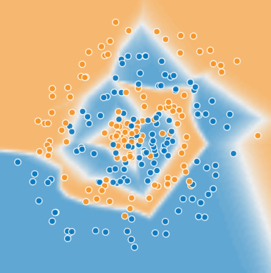
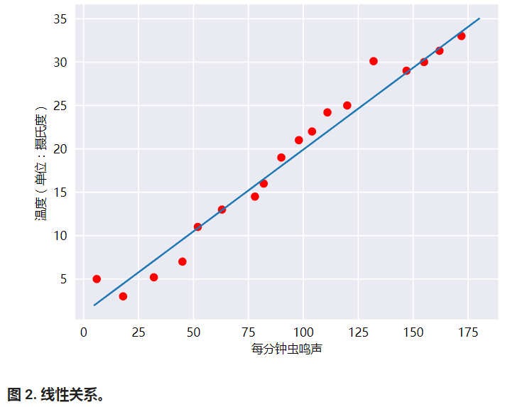
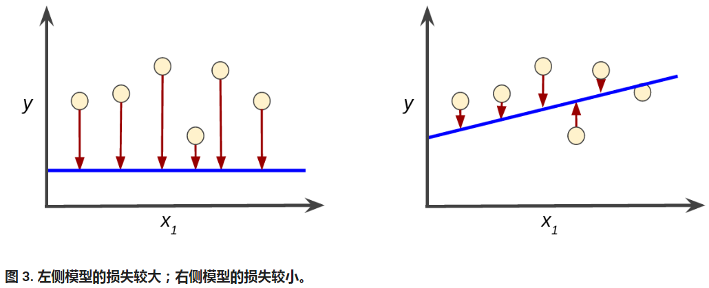

# 深入了解機器學習 (Descending into ML)

**線性回歸（linear regression）**是一種找到最適合一組點的直線或超平面的方法。本模塊會先直觀介紹線性回歸，為介紹線性回歸的機器學習方法奠定基礎。

## 學習目標

- 複習前面學過的直線擬合知識。
- 將機器學習中的權重和偏差與直線擬合中的斜率和偏移關聯起來。
- 大致了解“損失”（loss），詳細了解平方損失。

## 從數據中學習

- 您可以使用很多種複雜的方法從數據中學習
- 但我們可以從簡單且熟悉的內容入手
- 從簡單的內容入手可打開通往一些廣泛實用方法的大門




## 線性回歸示例：房價預測

x：房子面積

y：房價

圖中的藍色點表示輸入數據，我們需要根據當前數據擬合出一條直線：y'=wx+b


## 好用的回歸損失函數

給定樣本的 **L2 損失**也稱為平方誤差

= 預測值和標籤值之差的平方

= (標籤值 - 預測值)^2

= (y - y')^2

對於上述放假預測實例，我們可以通過 **L2損失** 來衡量擬合直線的好壞。

如上圖所示，紅色的線段數學意義為{預測值 - 標籤值} : {y' - y} ，這裡的{y' - y}就表示誤差。 (y - y')^2即表示 L2損失。


注：上圖中目標值就是標籤值。

## 定義數據集上的 L2 損失

$$(L_{2}Loss=\sum_{(x,y)\in D}(y-prediction(x))^{2})$$

∑: 我們對訓練集中的所有樣本進行求和。

D: 有時取平均值也會有用， 除以$$\frac{1}{\left \| N \right \|}$$

## 線性回歸

人們[早就知曉](https://wikipedia.org/wiki/Dolbear's_law)，相比涼爽的天氣，蟋蟀在較為炎熱的天氣裡鳴叫更為頻繁。數十年來，專業和業餘昆蟲學者已將每分鐘的鳴叫聲和溫度方面的數據編入目錄。 Ruth 阿姨將她喜愛的蟋蟀數據庫作為生日禮物送給您，並邀請您自己利用該數據庫訓練一個模型，從而預測鳴叫聲與溫度的關係。

首先建議您將數據繪製成圖表，了解下數據的分佈情況：


毫無疑問，此曲線圖表明溫度隨著鳴叫聲次數的增加而上升。鳴叫聲與溫度之間的關係是線性關係嗎？是的，您可以繪製一條直線來近似地表示這種關係，如下所示：



事實上，雖然該直線並未精確無誤地經過每個點，但針對我們擁有的數據，清楚地顯示了鳴叫聲與溫度之間的關係。只需運用一點代數知識，您就可以將這種關係​​寫下來：**y=mx+b**

其中：

- y 指的是溫度（以攝氏度表示），即我們試圖預測的值。
- m 指的是直線的斜率。
- x 指的是每分鐘的鳴叫聲次數，即輸入特徵的值。
- b 指的是 y 軸截距。

按照機器學習的慣例，您需要寫一個存在細微差別的模型方程式：**y′=b+w1x1**

其中：

- y′ 指的是預測[標籤](https://developers.google.com/machine-learning/crash-course/framing/ml-terminology#labels)（理想輸出值）。
- b 指的是偏差（y 軸截距）。而在一些機器學習文檔中，它稱為 w0。
- w1 指的是特徵 1 的權重。權重與上文中用 m 表示的“斜率”的概念相同。
- x1 指的是[特徵](https://developers.google.com/machine-learning/crash-course/framing/ml-terminology#features)（已知輸入項）。

要根據新的每分鐘的鳴叫聲值 x1 **推斷**（預測）溫度 y′，只需將 x1 值代入此模型即可。

下標（例如 w1 和 x1）預示著可以用多個特徵來表示更複雜的模型。例如，具有三個特徵的模型可以採用以下方程式：**y′=b+w1x1+w2x2+w3x3**

## 關鍵字詞

| [偏差](https://developers.google.com/machine-learning/glossary#bias) | [推斷](https://developers.google.com/machine-learning/glossary#inference) |
| ---------------------------------------- | -------- -------------------------------- |
| [線性回歸](https://developers.google.com/machine-learning/glossary#linear_regression) | [權重](https://developers.google.com/machine-learning/glossary#weight) |

## 訓練與損失

簡單來說，**訓練**模型表示通過**有標籤樣本**來學習（確定）所有權重和偏差的理想值。在監督式學習中，機器學習算法通過以下方式構建模型：檢查多個樣本並嘗試找出可最大限度地減少損失的模型；這一過程稱為**經驗風險最小化**。

損失是對糟糕預測的懲罰。也就是說，**損失**是一個數值，表示對於單個樣本而言模型預測的準確程度。如果模型的預測完全準確，則損失為零，否則損失會較大。 **訓練模型的目標是從所有樣本中找到一組平均損失“較小”的權重和偏差。 **例如，圖 3 左側顯示的是損失較大的模型，右側顯示的是損失較小的模型。關於此圖，請注意以下幾點：

- 紅色箭頭表示損失。
- 藍線表示預測。



 

請注意，左側曲線圖中的紅色箭頭比右側曲線圖中的對應紅色箭頭長得多。顯然，相較於左側曲線圖中的藍線，右側曲線圖中的藍線代表的是預測效果更好的模型。

您可能想知道自己能否創建一個數學函數（損失函數），以有意義的方式匯總各個損失。

### 平方損失：一種常見的損失函數

接下來我們要看的線性回歸模型使用的是一種稱為**平方損失**（又稱為 **L2 損失**）的損失函數。單個樣本的平方損失如下：

```
  = the square of the difference between the label and the prediction
  = (observation - prediction(x))^2
  = (y - y')^2
```

**均方誤差** (**MSE**) 指的是每個樣本的平均平方損失。要計算 MSE，請求出各個樣本的所有平方損失之和，然後除以樣本數量：

$$MSE = \frac{1}{N}\sum_{(x,y)\in D}(y-prediction(x))^{2}$$
其中：

- (x,y)指的是樣本，其中
  - x 指的是模型進行預測時使用的特徵集（例如，溫度、年齡和交配成功率）。
  - y 指的是樣本的標籤（例如，每分鐘的鳴叫次數）。
- prediction(x) 指的是權重和偏差與特徵集 x 結合的函數。
- D 指的是包含多個有標籤樣本（即 (x,y)）的數據集。
- N 指的是 D 中的樣本數量。

雖然 MSE 常用於機器學習，但它既不是唯一實用的損失函數，也不是適用於所有情形的最佳損失函數。

## 關鍵字詞

| [經驗風險最小化](https://developers.google.com/machine-learning/glossary#ERM) | [損失](https://developers.google.com/machine-learning/glossary#loss) |
| ---------------------------------------- | -------- -------------------------------- |
| [均方誤差](https://developers.google.com/machine-learning/glossary#MSE) | [平方損失](https://developers.google.com/machine-learning/glossary#squared_loss) |
| [訓練](https://developers.google.com/machine-learning/glossary#training) | |

## 練習題

### 均方誤差

請看以下兩個曲線圖：


**對於以上曲線圖中顯示的兩個數據集，哪個數據集的均方誤差 (MSE) 較高？ **

A.左側的數據集

B.右側的數據集

答案解析：正確答案是B。

左側曲線圖，線上的 6 個樣本產生的總損失為 0。不在線上的 4 個樣本離線並不遠（距離都為1），因此即使對偏移求平方值，產生的值仍然很小。根據MSE公式，求得左側數據集的均方誤差為：0.4。

線上的 8 個樣本產生的總損失為 0。不過，儘管只有兩個點在線外，但這兩個點的離線距離依然是左圖中離群點的 2 倍。平方損失進一步加大差異，因此兩個點的偏移量產生的損失是一個點的 4 倍。根據MSE公式，求得左側數據集的均方誤差為：0.8。

因此右側數據集的MSE值 = 0.8 > 左側數據集的MSE值 = 0.4，故選B。


# Reference

[深度了解機器學習（Descending into ML）](https://developers.google.com/machine-learning/crash-course/descending-into-ml)
